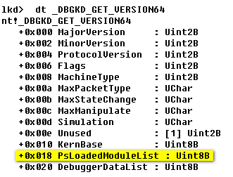
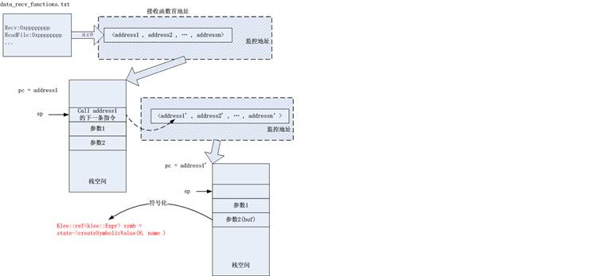

1.3                  WindowsMonitor插件
---------------------------------------

### 1.3.1 初识WindowsMonitor插件

WindowsMonitor插件实现了对模块和进程加载和卸载的监视，其他插件将它称为Interceptor。这个插件捕获特定内核函数的调用来监视这些事件。目前仅支持Windows
XP SP2和SP3。

### 1.3.2  WindowsMonitor插件的使用

配置文件：

   pluginsConfig.WindowsMonitor = {  
		--指明需要监视的操作系统版本
		version="XPSP3",
		--指明是否追踪用户模式下的事件，如DLL加载或卸载
		userMode=true,
		--指明是否追踪内核模式下的事件，如驱动的加载或卸载
		kernelMode=true,
		--以下三个选项都是为调试设置的，一般都设置为true
		monitorModuleLoad=true,
		monitorModuleUnload=true,
		monitorProcessUnload=true,
		--需要监视的模块列表
		modules={
			module_id1={
				...
			}
			module_id2={
				...
			}
		}
	}

WindowsMonitor 插件不需要依赖其他插件。

### 1.3.3  WindowsMonitor插件的分析

1.3.3.1    WindowsMonitor 插件的初始化

WindowsMonitor 插件首先初始化，做了如下几项工作：

1.读取配置文件中的参数；

2.获取系统基本相关信息，如内核起始地址、检查版本信息等；

3.创建两个Interceptor对象，一个是用户模式下的，一个是内核模式下的，用于处理不同模式下的模块或者驱动的加载或者卸载；

4.连接CorePlugin发出的信号：onTranslateInstructionStart信号和onPageDirectoryChange信号，并调用相关处理函数；

5.读取配置文件中的模块列表。[注：这里的模块列表用于内核模式下的一些处理]

在WindowsMonitor.cpp中实现，代码如下：

	void WindowsMonitor::initialize()
	{
		//读取配置文件中的内容
		string Version = s2e()->getConfig()->getString(getConfigKey() + ".version");
		m_UserMode = s2e()->getConfig()->getBool(getConfigKey() + ".userMode");
		m_KernelMode = s2e()->getConfig()->getBool(getConfigKey() + ".kernelMode");

		//For debug purposes
		m_MonitorModuleLoad = s2e()->getConfig()->getBool(getConfigKey() + ".monitorModuleLoad");
		m_MonitorModuleUnload = s2e()->getConfig()->getBool(getConfigKey() + ".monitorModuleUnload");
		m_MonitorProcessUnload = s2e()->getConfig()->getBool(getConfigKey() + ".monitorProcessUnload");
		m_monitorThreads = s2e()->getConfig()->getBool(getConfigKey() + ".monitorThreads", true);

		//读取内核起始地址，返回固定值0x80000000
		m_KernelBase = GetKernelStart();
		//标志是否是第一次调用插件的相关函数
		m_FirstTime = true;
		//XXX: do it only when resuming a snapshot.
		//具体作用有待进一步分析
		m_TrackPidSet = true;

		unsigned i;
		for (i=0; i<(unsigned)MAXVER; ++i) {
			if (Version == s_windowsKeys[i]) {
				m_Version = (EWinVer)i;
				break;
			}
		}

		if (i == (EWinVer)MAXVER) {
			s2e()->getWarningsStream() << "Invalid windows version: " << Version << std::endl;
			s2e()->getWarningsStream() << "Available versions are:" << std::endl;
			for (unsigned j=0; j<MAXVER; ++j) {
				s2e()->getWarningsStream() << s_windowsKeys[j] << ":\t" << s_windowsStrings[j] << std::endl;
			}
			exit(-1);
		}

		switch(m_Version) {
			case XPSP2_CHK:
			case XPSP3_CHK:
			s2e()->getWarningsStream() << "You specified a checked build of Windows XP." <<
			"Only kernel-mode interceptors are supported for now." << std::endl;
			break;
			default:
			break;
		}

		//XXX: Warn about some unsupported features
		if (m_Version != XPSP3 && m_monitorThreads) {
			s2e()->getWarningsStream() << "WindowsMonitor does not support threads for the chosen OS version.\n"
			<< "Please use monitorThreads=false in the configuration file\n"
			<< "Plugins that depend on this feature will not work.\n";
		}

		m_pKPCRAddr = 0;
		m_pKPRCBAddr = 0;

		m_UserModeInterceptor = NULL;
		m_KernelModeInterceptor = NULL;

		if (m_UserMode) {
			//定义一个用户模式的Interceptor对象
			m_UserModeInterceptor = new WindowsUmInterceptor(this);
		}

		if (m_KernelMode) {
			//定义一个内核模式的Interceptor对象
			m_KernelModeInterceptor = new WindowsKmInterceptor(this);
		}

		//在翻译每条指令之前，CorePlugin插件都会发送onTranlateInstructionStart信号，S2E会进行相应的处理
		s2e()->getCorePlugin()->onTranslateInstructionStart.connect(
		sigc::mem_fun(*this, &WindowsMonitor::slotTranslateInstructionStart));

		s2e()->getCorePlugin()->onPageDirectoryChange.connect(
		sigc::mem_fun(*this, &WindowsMonitor::onPageDirectoryChange));

		//读取配置文件中的模块列表
		readModuleCfg();
	}

1.3.3.2        对onTranslateInstructionStart信号的处理

S2E中的qemu在翻译每条指令之前，都会让CorePlugin插件发送onTranslateInstructionStart信号，WindowsMonitor插件连接onTranslateInstructionStart信号之后调用
slotTranslateInstructionStart函数进行相应的处理。
slotTranslateInstructionStart函数根据用户模式和内核模式，主要做了以下两方面的工作：

1.如果是用户模式：

如果是第一次调用此函数，则计算CPU相关数据结构的信息(这里主要获取KPCR结构)；并且通过读取进程的PEB结构枚举进程所加载的所有模块。

	InitializeAddresses(state);                         //计算CPU相关数据结构的信息[a]
	m_UserModeInterceptor->GetPids(state, m_PidSet);  //m_PidSet中存放的是当前进程的页目录表，在处理onPageDirectoryChange信号时会用到
	m_UserModeInterceptor->CatchModuleLoad(state);                  //列举进程所加载的模块，并且发送onModuleLoad信号
	m_PidSet.erase(state->getPid());

说明：

 [a] KPCR是处理器控制区(Processor Control
Region)的缩写，每一个CPU中都有一个KPCR结构，其中有一个域KPRCB(Kernel
Processor Control
Block)结构，这两个结构用来保存与线程切换相关的全局信息。KPCR是一个很大的数据结构，其中跟我们实际需求相关的比较重要的是KdVersionBlock指针，它指向了一个DBGKD\_GET\_VERSION64结构，这个结构中包含了PsLoadedModuleList信息，它是Windows加载的所有内核模块构成的链表的表头。还包括了内核加载地址、版本之类的重要信息。这个对用户模式下的模块追踪暂时看来没有很大的用处。

如果不是第一次调用此函数，则根据当前状态的pc进行以下处理：

	if (pc == GetLdrpCallInitRoutine() && m_MonitorModuleLoad) {    //[a]
		signal->connect(sigc::mem_fun(*this, &WindowsMonitor::slotUmCatchModuleLoad));
	}else if (pc == GetNtTerminateProcessEProcessPoint() && m_MonitorProcessUnload) {    //[b]
		signal->connect(sigc::mem_fun(*this, &WindowsMonitor::slotUmCatchProcessTermination));
	}else if (pc == GetDllUnloadPc() && m_MonitorModuleUnload) {    //[c]
		signal->connect(sigc::mem_fun(*this, &WindowsMonitor::slotUmCatchModuleUnload));
	}

说明：

[a]根据当前pc判断是否在装载dll。dll的装载和连接是通过ntdll中的一个函数LdrInitializeThunk实现的，这个函数实质上是ntdll.dll的入口函数，所以GetLdrpCallInitRoutine()函数中根据ntdll.dll的loadbase和nativebase计算此函数的地址，从而判断进程是否正在加载dll，并发送onModuleLoad信号。

[b]根据当前pc判断是否是进程结束，并发送onProcessUnload信号。

[c]根据当前pc判断是否是处在模块卸载，并发送onModuleUnload信号。

注：windows中一些相关的地址，如ntdll的加载地址、进程结束地址、模块卸载地址等都是固定的，以上实现都是通过写定windows中相关的地址（定义在WindowsMonitor.cpp中）计算得到的。

2.如果是内核模式(没有仔细看，留白)：

如果是第一次调用，则更新模块列表，通知所有线程模块的加载：
	slotKmUpdateModuleList(state, pc);
	notifyLoadForAllThreads(state);如果不是第一次调用，则根据当前状态的pc进行以下处理： 

	if (pc == GetDriverLoadPc()) {   //[a]
		signal->connect(sigc::mem_fun(*this, &WindowsMonitor::slotKmModuleLoad));
	}else if (pc == GetDeleteDriverPc()) {   //[b]
		signal->connect(sigc::mem_fun(*this, &WindowsMonitor::slotKmModuleUnload));
	}else if (m_monitorThreads && pc == GetKeInitThread()) {    [c]
		signal->connect(sigc::mem_fun(*this, &WindowsMonitor::slotKmThreadInit));
	}else if (m_monitorThreads && pc == GetKeTerminateThread()) {    [d]
		signal->connect(sigc::mem_fun(*this, &WindowsMonitor::slotKmThreadExit));
	}

说明：

[a]根据当前状态的pc判断是否在加载驱动，并发送onModuleLoad信号；

[b]根据当前状态的pc判断是否卸载驱动，并发送onModuleUnload信号。

[c]根据当前状态的pc判断是否在创建内核线程，并发送onThreadCreate信号；

[d]根据当前状态的pc判断是否结束线程，并发送onThreadExit信号。

1.3.3.3        关于WindowsMonitor插件的onModuleLoad信号

WindowsMonitor?
扫描当前进程所有加载的模块，每加载一个模块都会发送onModuleLoad信号。WindowsMonitor插件是通过PEB结构枚举进程内所有已经加载的模块，这个功能通过WindowsUmInterceptor::FindModules来实现。基本原理和步骤如下：

1.找到进程的PEB结构。

进程的PEB结构在用户空间，如果当前状态是运行在用户空间，则通过FS:[30h]获取当前进程的PEB结构，如果运行在内核空间，则通过读取当前进程的EPROCESS结构来获取PEB结构。EPROCESS是进程的执行进程体，包含了进程的各种属性，位于系统空间。
	if (state->getPc() < 0x80000000) {
		if(!state->readMemoryConcrete(fsBase + 0x18, &Peb, 4)) {//cdboot ask: why read 0x18 first?
			return false;
		}
		//通过fs:[30h]获取当前进程的PEB结构
		if(!state->readMemoryConcrete(Peb+0x30, &Peb, 4)) {
			return false;
		}
	}else {
		//We are in kernel mode, do it by reading kernel-mode struc
		uint32_t curProcess = -1;

		curProcess = m_Os->getCurrentProcess(state);
		if (!curProcess) {
			return false;
		}

		Peb = m_Os->getPeb(state, curProcess);
	}

2.通过PEB结构找到PEB\_LDR\_DATA结构。

进程的PEB（Process Environment
Block）结构中存放了进程的信息，每个进程都有自己的PEB信息。WindowsMonitor插件中的定义如下：

	typedef struct _PEB32 {
		uint8_t Unk1[0x8];
		uint32_t ImageBaseAddress;
		uint32_t Ldr; /* PEB_LDR_DATA */
	} __attribute__((packed))PEB32;

其中Ldr指向PEB\_LDR\_DATA结构。加载的模块列表主要就是从这个数据结构中获得。WindowsMonitor插件中的定义如下：

	typedef struct _PEB_LDR_DATA32
	{
		uint32_t Length;
		uint32_t Initialized;
		uint32_t SsHandle;
		LIST_ENTRY32 InLoadOrderModuleList;
		LIST_ENTRY32 InMemoryOrderModuleList;
		uint32_t EntryInProgress;
	}  __attribute__((packed))PEB_LDR_DATA32;

这里有两个模块列表，InLoadOrderModuleList和InMemoryOrderModuleList，分别表示按照加载顺序的模块列表和按照内存顺序的模块列表。WindowsMonitor插件实现的是按照InLoadOrderModuleList来查找模块。

3.根据PEB\_LDR\_DATA获取InLoadOrderModuleList.Flink，开始遍历循环列表，枚举每个加载的模块。

具体实现代码如下(UserModeInterceptor.cpp)：

	//通过进程的PEB结构枚举进程内所有已加载的模块
	bool WindowsUmInterceptor::FindModules(S2EExecutionState *state)
	{
		s2e::windows::LDR_DATA_TABLE_ENTRY32 LdrEntry;
		s2e::windows::PEB_LDR_DATA32 LdrData;

		if (!WaitForProcessInit(state)) {
			return false;
		}

		//读取PEB_LDR_DATA的内容，m_LdrAddr是由WaitForProcessInit得来的
		if (!state->readMemoryConcrete(m_LdrAddr, &LdrData, sizeof(s2e::windows::PEB_LDR_DATA32))) {
			return false;
		}

		//计算LDR_DATA_TABLE_ENTRY真正的起始地址
		uint32_t CurLib = CONTAINING_RECORD32(LdrData.InLoadOrderModuleList.Flink,
		s2e::windows::LDR_DATA_TABLE_ENTRY32, InLoadOrderLinks);

		uint32_t HeadOffset = m_LdrAddr + offsetof(s2e::windows::PEB_LDR_DATA32, InLoadOrderModuleList);
		if (LdrData.InLoadOrderModuleList.Flink == HeadOffset) {
			return false;
		}

		//枚举所有已经加载的dll
		do {
			if (!state->readMemoryConcrete(CurLib, &LdrEntry, sizeof(s2e::windows::LDR_DATA_TABLE_ENTRY32))) {
				return false;
			}

			std::string s;
			state->readUnicodeString(LdrEntry.BaseDllName.Buffer, s, LdrEntry.BaseDllName.Length);
			std::transform(s.begin(), s.end(), s.begin(), ::tolower);

			if (s.length() == 0) {
				if (LdrEntry.DllBase == 0x7c900000) {
					//XXX
					//ntdll.dll总是被加载在固定的地址
					s = "ntdll.dll";
				}else {
					s = "<unnamed>";
				}
			}

			//if (m_SearchedModules.find(s) != m_SearchedModules.end()) {
			//Update the information about the library
			ModuleDescriptor Desc;
			Desc.Pid = state->getPid();
			Desc.Name = s;PEB结构枚举进程内所有已加载的模块
			Desc.LoadBase = LdrEntry.DllBase;
			Desc.Size = LdrEntry.SizeOfImage;

			//XXX: this must be state-local
			if (m_LoadedLibraries.find(Desc) == m_LoadedLibraries.end()) {
				m_LoadedLibraries.insert(Desc);
				NotifyModuleLoad(state, Desc);
			}

			CurLib = CONTAINING_RECORD32(LdrEntry.InLoadOrderLinks.Flink,
			s2e::windows::LDR_DATA_TABLE_ENTRY32, InLoadOrderLinks);
		}while(LdrEntry.InLoadOrderLinks.Flink != HeadOffset);

		return true;
	}

通过以上三个步骤，可以枚举所有模块，每一个模块都由一个ModuleDescriptor类型来描述模块属性，如模块名称、加载地址、镜像大小等。每遇到一个模块，加入到集合中去，并且调用NotifyModuleLoad函数来发送onModuleLoad信号。

2.3                  总体插件
-----------------------------

### 2.3.1 插件作用

该插件用于将输入数据符号化，并在进行不安全操作（如拷贝、分配内存）时进行相应断言，以检测漏洞。该插件可以适用于整数溢出插件和缓冲区溢出插件。

### 2.3.2 整体思路

该插件对每一条指令进行监控，进行如下操作：

1.当运行到接收输入数据的函数时（如ReadFile、recv函数），对读入的缓冲区进行符号化，将缓冲区的每一个字节都标记为符号变量；

2.当运行到不安全操作函数时（如malloc、memcpy函数），对这些函数进行相应的断言，检测漏洞是否存在。

### 2.3.3 输入数据符号化

结合静态分析和动态分析，在实际测试之前将接收输入数据函数的第一条指令地址写入文件中（./data\_recv\_functions.txt）。文件中的组织结构如下：

	recvfrom:0x71a22ff7
	WSARecv:0x71a24cb5
	recv:0x71a2676f
	WSARecvFrom:0x71a2f66a
	ReadFile:0x7c801812
	RtlAllocateHeap:0x7c9300a4
	RtlReAllocateHeap:0x7c939b80

在插件初始化时，将其中的函数及其首地址读入定义好的向量中，对向量中的每个地址进行监控。当程序实际运行到这些地址时，根据函数调用时栈中的存储规则，函数相应参数依次压栈，此时的esp寄存器中存放的是函数的返回地址（及call的下一条指令），将返回地址也加入需监视的地址列表中。当程序运行到返回地址时，输入数据刚刚存入缓冲区中，此时将输入数据缓冲区进行符号化。过程示意图如图1.

### 2.3.4 不安全函数断言

结合静态分析和动态分析，在实际测试之前将接收输入数据函数的第一条指令地址写入文件中（./unsafe\_functions.txt）。文件中的组织结构如下：

	rep movsd:0x0038096b
	malloc:0x00401ab2
	_memcpy:0x004037a0

在插件初始化时，将其中的函数及其首地址读入定义好的向量中，对向量中的每个地址进行监控。当程序实际运行到这些地址时，根据不同检测策略进行相应的断言，检测是否存在漏洞。

 
