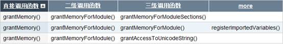

1 S2E中的插件(作者：曹鼎；邮箱：caoding8483@163.com)
=================================================

1.1                  S2E中插件的通信机制
----------------------------------------

在S2E构造函数中，会调用initPlugins()来初始化各个插件，其主要作用是这个函数主要是读取配置文件中的plugins域中设置的插件，并且检查这些插件是否依赖于其他插件。initPlugins()函数的实现如下：

~~~~ {style="background:ivory;mso-layout-grid-align:none"}
void S2E::initPlugins()
~~~~

~~~~ {style="background:ivory;mso-layout-grid-align:none"}
{
~~~~

~~~~ {style="background:ivory;mso-layout-grid-align:none"}
        m_pluginsFactory = new PluginsFactory();
~~~~

~~~~ {style="background:ivory;mso-layout-grid-align:none"}
        
~~~~

~~~~ {style="background:ivory;mso-layout-grid-align:none"}
        //CorePlugin必不可少
~~~~

~~~~ {style="background:ivory;mso-layout-grid-align:none"}
        m_corePlugin = dynamic_cast<CorePlugin*>(
~~~~

~~~~ {style="background:ivory;mso-layout-grid-align:none"}
        m_pluginsFactory->createPlugin(this, "CorePlugin"));
~~~~

~~~~ {style="background:ivory;mso-layout-grid-align:none"}
        assert(m_corePlugin);
~~~~

~~~~ {style="background:ivory;mso-layout-grid-align:none"}
        
~~~~

~~~~ {style="background:ivory;mso-layout-grid-align:none"}
        m_activePluginsList.push_back(m_corePlugin);
~~~~

~~~~ {style="background:ivory;mso-layout-grid-align:none"}
        m_activePluginsMap.insert(
~~~~

~~~~ {style="background:ivory;mso-layout-grid-align:none"}
        make_pair(m_corePlugin->getPluginInfo()->name, m_corePlugin));
~~~~

~~~~ {style="background:ivory;mso-layout-grid-align:none"}
        if(!m_corePlugin->getPluginInfo()->functionName.empty())
~~~~

~~~~ {style="background:ivory;mso-layout-grid-align:none"}
        m_activePluginsMap.insert(
~~~~

~~~~ {style="background:ivory;mso-layout-grid-align:none"}
        make_pair(m_corePlugin->getPluginInfo()->functionName, m_corePlugin));
~~~~

~~~~ {style="background:ivory;mso-layout-grid-align:none"}
        
~~~~

~~~~ {style="background:ivory;mso-layout-grid-align:none"}
        //读取配置文件中的plugins域
~~~~

~~~~ {style="background:ivory;mso-layout-grid-align:none"}
        vector<string> pluginNames = getConfig()->getStringList("plugins");
~~~~

~~~~ {style="background:ivory;mso-layout-grid-align:none"}
        
~~~~

~~~~ {style="background:ivory;mso-layout-grid-align:none"}
        //对每个插件进行检查和装载
~~~~

~~~~ {style="background:ivory;mso-layout-grid-align:none"}
        /* Check and load plugins */
~~~~

~~~~ {style="background:ivory;mso-layout-grid-align:none"}
        foreach(const string& pluginName, pluginNames) {
~~~~

~~~~ {style="background:ivory;mso-layout-grid-align:none"}
                const PluginInfo* pluginInfo = m_pluginsFactory->getPluginInfo(pluginName);
~~~~

~~~~ {style="background:ivory;mso-layout-grid-align:none"}
                if(!pluginInfo) {
~~~~

~~~~ {style="background:ivory;mso-layout-grid-align:none"}
                        std::cerr << "ERROR: plugin '" << pluginName
~~~~

~~~~ {style="background:ivory;mso-layout-grid-align:none"}
                        << "' does not exists in this S2E installation" << std::endl;
~~~~

~~~~ {style="background:ivory;mso-layout-grid-align:none"}
                        exit(1);
~~~~

~~~~ {style="background:ivory;mso-layout-grid-align:none"}
                } else if(getPlugin(pluginInfo->name)) {
~~~~

~~~~ {style="background:ivory;mso-layout-grid-align:none"}
                        std::cerr << "ERROR: plugin '" << pluginInfo->name
~~~~

~~~~ {style="background:ivory;mso-layout-grid-align:none"}
                        << "' was already loaded "
~~~~

~~~~ {style="background:ivory;mso-layout-grid-align:none"}
                        << "(is it enabled multiple times ?)" << std::endl;
~~~~

~~~~ {style="background:ivory;mso-layout-grid-align:none"}
                        exit(1);
~~~~

~~~~ {style="background:ivory;mso-layout-grid-align:none"}
                } else if(!pluginInfo->functionName.empty() &&
~~~~

~~~~ {style="background:ivory;mso-layout-grid-align:none"}
                getPlugin(pluginInfo->functionName)) {
~~~~

~~~~ {style="background:ivory;mso-layout-grid-align:none"}
                        std::cerr << "ERROR: plugin '" << pluginInfo->name
~~~~

~~~~ {style="background:ivory;mso-layout-grid-align:none"}
                        << "' with function '" << pluginInfo->functionName
~~~~

~~~~ {style="background:ivory;mso-layout-grid-align:none"}
                        << "' can not be loaded because" << std::endl
~~~~

~~~~ {style="background:ivory;mso-layout-grid-align:none"}
                        <<  "    this function is already provided by '"
~~~~

~~~~ {style="background:ivory;mso-layout-grid-align:none"}
                        << getPlugin(pluginInfo->functionName)->getPluginInfo()->name
~~~~

~~~~ {style="background:ivory;mso-layout-grid-align:none"}
                        << "' plugin" << std::endl;
~~~~

~~~~ {style="background:ivory;mso-layout-grid-align:none"}
                        exit(1);
~~~~

~~~~ {style="background:ivory;mso-layout-grid-align:none"}
                } else {
~~~~

~~~~ {style="background:
ivory;mso-layout-grid-align:none"}
                        Plugin* plugin = m_pluginsFactory->createPlugin(this, pluginName);
~~~~

~~~~ {style="background:ivory;mso-layout-grid-align:none"}
                        assert(plugin);
~~~~

~~~~ {style="background:ivory;mso-layout-grid-align:none"}
                        
~~~~

~~~~ {style="background:ivory;mso-layout-grid-align:none"}
                        m_activePluginsList.push_back(plugin);
~~~~

~~~~ {style="background:ivory;mso-layout-grid-align:none"}
                        m_activePluginsMap.insert(
~~~~

~~~~ {style="background:ivory;mso-layout-grid-align:none"}
                        make_pair(plugin->getPluginInfo()->name, plugin));
~~~~

~~~~ {style="background:ivory;mso-layout-grid-align:none"}
                        if(!plugin->getPluginInfo()->functionName.empty())
~~~~

~~~~ {style="background:ivory;mso-layout-grid-align:none"}
                        m_activePluginsMap.insert(
~~~~

~~~~ {style="background:ivory;mso-layout-grid-align:none"}
                        make_pair(plugin->getPluginInfo()->functionName, plugin));
~~~~

~~~~ {style="background:ivory;mso-layout-grid-align:none"}
                }
~~~~

~~~~ {style="background:ivory;mso-layout-grid-align:none"}
        }
~~~~

~~~~ {style="background:ivory;mso-layout-grid-align:none"}
        
~~~~

~~~~ {style="background:ivory;mso-layout-grid-align:none"}
        //检查插件是否有依赖
~~~~

~~~~ {style="background:ivory;mso-layout-grid-align:none"}
        /* Check dependencies */
~~~~

~~~~ {style="background:ivory;mso-layout-grid-align:none"}
        foreach(Plugin* p, m_activePluginsList) {
~~~~

~~~~ {style="background:ivory;mso-layout-grid-align:none"}
                foreach(const string& name, p->getPluginInfo()->dependencies) {
~~~~

~~~~ {style="background:ivory;mso-layout-grid-align:none"}
                        if(!getPlugin(name)) {
~~~~

~~~~ {style="background:ivory;mso-layout-grid-align:none"}
                                std::cerr << "ERROR: plugin '" << p->getPluginInfo()->name
~~~~

~~~~ {style="background:ivory;mso-layout-grid-align:none"}
                                << "' depends on plugin '" << name
~~~~

~~~~ {style="background:ivory;mso-layout-grid-align:none"}
                                << "' which is not enabled in config" << std::endl;
~~~~

~~~~ {style="background:ivory;mso-layout-grid-align:none"}
                                exit(1);
~~~~

~~~~ {style="background:ivory;mso-layout-grid-align:none"}
                        }
~~~~

~~~~ {style="background:ivory;mso-layout-grid-align:none"}
                }
~~~~

~~~~ {style="background:ivory;mso-layout-grid-align:none"}
        }
~~~~

~~~~ {style="background:ivory;mso-layout-grid-align:none"}
        
~~~~

~~~~ {style="background:ivory;mso-layout-grid-align:none"}
        //对每个插件进行初始化，这里的初始化函数initialize()是虚函数
~~~~

~~~~ {style="background:ivory;mso-layout-grid-align:none"}
        /* Initialize plugins */
~~~~

~~~~ {style="background:ivory;mso-layout-grid-align:none"}
        foreach(Plugin* p, m_activePluginsList) {
~~~~

~~~~ {style="background:ivory;mso-layout-grid-align:none"}
                p->initialize();
~~~~

~~~~ {style="background:ivory;mso-layout-grid-align:none"}
        }
~~~~

~~~~ {style="background:ivory;mso-layout-grid-align:none"}
}
~~~~

不可缺少的是CorePlugin插件，它是所有插件的基础。其中定义了一系列信号，用于在检测到指令时给插件们发送信号（emit），相应的插件会进行连接（connect）并且调用相应的函数。CorePlugin中定义的信号在CorePlugin.h中：

~~~~ {style="background:ivory;mso-layout-grid-align:none"}
/** Signal that is emitted on begining and end of code generation
~~~~

~~~~ {style="background:ivory;mso-layout-grid-align:none"}
for each QEMU translation block.
~~~~

~~~~ {style="background:ivory;mso-layout-grid-align:none"}
在qemu将每一个tb翻译为tcg的时候，都会发送这个信号
~~~~

~~~~ {style="background:ivory;mso-layout-grid-align:none"}
*/
~~~~

~~~~ {style="background:ivory;mso-layout-grid-align:none"}
sigc::signal<void, ExecutionSignal*, 
~~~~

~~~~ {style="background:ivory;mso-layout-grid-align:none"}
S2EExecutionState*,
~~~~

~~~~ {style="background:ivory;mso-layout-grid-align:none"}
TranslationBlock*,
~~~~

~~~~ {style="background:ivory;mso-layout-grid-align:none"}
uint64_t /* block PC */>
~~~~

~~~~ {style="background:ivory;mso-layout-grid-align:none"}
onTranslateBlockStart;
~~~~

~~~~ {style="background:ivory;mso-layout-grid-align:none"}
 
~~~~

~~~~ {style="background:ivory;mso-layout-grid-align:none"}
/** Signal that is emitted upon end of translation block 
~~~~

~~~~ {style="background:ivory;mso-layout-grid-align:none"}
在一个tb结束的时候（翻译跳转指令）的时候，发送这个信号
~~~~

~~~~ {style="background:ivory;mso-layout-grid-align:none"}
*/
~~~~

~~~~ {style="background:ivory;mso-layout-grid-align:none"}
sigc::signal<void, ExecutionSignal*, 
~~~~

~~~~ {style="background:ivory;mso-layout-grid-align:none"}
S2EExecutionState*,
~~~~

~~~~ {style="background:ivory;mso-layout-grid-align:none"}
TranslationBlock*,
~~~~

~~~~ {style="background:ivory;mso-layout-grid-align:none"}
uint64_t /* ending instruction pc */,
~~~~

~~~~ {style="background:ivory;mso-layout-grid-align:none"}
bool /* static target is valid */,
~~~~

~~~~ {style="background:ivory;mso-layout-grid-align:none"}
uint64_t /* static target pc */>
~~~~

~~~~ {style="background:ivory;mso-layout-grid-align:none"}
onTranslateBlockEnd;
~~~~

~~~~ {style="background:ivory;mso-layout-grid-align:none"}
 
~~~~

~~~~ {style="background:ivory;mso-layout-grid-align:none"}
 
~~~~

~~~~ {style="background:ivory;mso-layout-grid-align:none"}
/** Signal that is emitted on code generation for each instruction */
~~~~

~~~~ {style="background:ivory;mso-layout-grid-align:none"}
sigc::signal<void, ExecutionSignal*,
~~~~

~~~~ {style="background:ivory;mso-layout-grid-align:none"}
S2EExecutionState*,
~~~~

~~~~ {style="background:ivory;mso-layout-grid-align:none"}
TranslationBlock*,
~~~~

~~~~ {style="background:ivory;mso-layout-grid-align:none"}
uint64_t /* instruction PC */>
~~~~

~~~~ {style="background:ivory;mso-layout-grid-align:none"}
onTranslateInstructionStart, onTranslateInstructionEnd;
~~~~

~~~~ {style="background:ivory;mso-layout-grid-align:none"}
 
~~~~

~~~~ {style="background:ivory;mso-layout-grid-align:none"}
/**
~~~~

~~~~ {style="background:ivory;mso-layout-grid-align:none"}
*  Triggered *after* each instruction is translated to notify
~~~~

~~~~ {style="background:ivory;mso-layout-grid-align:none"}
*  plugins of which registers are used by the instruction.
~~~~

~~~~ {style="background:ivory;mso-layout-grid-align:none"}
*  Each bit of the mask corresponds to one of the registers of
~~~~

~~~~ {style="background:ivory;mso-layout-grid-align:none"}
*  the architecture (e.g., R_EAX, R_ECX, etc).
~~~~

~~~~ {style="background:ivory;mso-layout-grid-align:none"}
*/
~~~~

~~~~ {style="background:ivory;mso-layout-grid-align:none"}
sigc::signal<void,
~~~~

~~~~ {style="background:ivory;mso-layout-grid-align:none"}
ExecutionSignal*,
~~~~

~~~~ {style="background:ivory;mso-layout-grid-align:none"}
S2EExecutionState* /* current state */,
~~~~

~~~~ {style="background:ivory;mso-layout-grid-align:none"}
TranslationBlock*,
~~~~

~~~~ {style="background:ivory;mso-layout-grid-align:none"}
uint64_t /* program counter of the instruction */,
~~~~

~~~~ {style="background:ivory;mso-layout-grid-align:none"}
uint64_t /* registers read by the instruction */,
~~~~

~~~~ {style="background:ivory;mso-layout-grid-align:none"}
uint64_t /* registers written by the instruction */,
~~~~

~~~~ {style="background:ivory;mso-layout-grid-align:none"}
bool /* instruction accesses memory */>
~~~~

~~~~ {style="background:ivory;mso-layout-grid-align:none"}
onTranslateRegisterAccessEnd;
~~~~

~~~~ {style="background:ivory;mso-layout-grid-align:none"}
 
~~~~

~~~~ {style="background:ivory;mso-layout-grid-align:none"}
/** Signal that is emitted on code generation for each jump instruction */
~~~~

~~~~ {style="background:ivory;mso-layout-grid-align:none"}
sigc::signal<void, ExecutionSignal*,
~~~~

~~~~ {style="background:ivory;mso-layout-grid-align:none"}
S2EExecutionState*,
~~~~

~~~~ {style="background:ivory;mso-layout-grid-align:none"}
TranslationBlock*,
~~~~

~~~~ {style="background:ivory;mso-layout-grid-align:none"}
uint64_t /* instruction PC */,
~~~~

~~~~ {style="background:ivory;mso-layout-grid-align:none"}
int /* jump_type */>
~~~~

~~~~ {style="background:ivory;mso-layout-grid-align:none"}
onTranslateJumpStart;
~~~~

~~~~ {style="background:ivory;mso-layout-grid-align:none"}
 
~~~~

~~~~ {style="background:ivory;mso-layout-grid-align:none"}
/** Signal that is emitted upon exception */
~~~~

~~~~ {style="background:ivory;mso-layout-grid-align:none"}
sigc::signal<void, S2EExecutionState*, 
~~~~

~~~~ {style="background:ivory;mso-layout-grid-align:none"}
unsigned /* Exception Index */,
~~~~

~~~~ {style="background:ivory;mso-layout-grid-align:none"}
uint64_t /* pc */>
~~~~

~~~~ {style="background:ivory;mso-layout-grid-align:none"}
onException;
~~~~

~~~~ {style="background:ivory;mso-layout-grid-align:none"}
 
~~~~

~~~~ {style="background:ivory;mso-layout-grid-align:none"}
/** Signal that is emitted when custom opcode is detected 
~~~~

~~~~ {style="background:ivory;mso-layout-grid-align:none"}
在遇到s2e_op时，发送这个信号
~~~~

~~~~ {style="background:ivory;mso-layout-grid-align:none"}
*/
~~~~

~~~~ {style="background:ivory;mso-layout-grid-align:none"}
sigc::signal<void, S2EExecutionState*, 
~~~~

~~~~ {style="background:ivory;mso-layout-grid-align:none"}
uint64_t  /* arg */
~~~~

~~~~ {style="background:ivory;mso-layout-grid-align:none"}
> 
~~~~

~~~~ {style="background:ivory;mso-layout-grid-align:none"}
onCustomInstruction;
~~~~

~~~~ {style="background:ivory;mso-layout-grid-align:none"}
 
~~~~

~~~~ {style="background:ivory;mso-layout-grid-align:none"}
/** Signal that is emitted on each memory access */
~~~~

~~~~ {style="background:ivory;mso-layout-grid-align:none"}
/* XXX: this signal is still not emmited for code */
~~~~

~~~~ {style="background:ivory;mso-layout-grid-align:none"}
sigc::signal<void, S2EExecutionState*,
~~~~

~~~~ {style="background:ivory;mso-layout-grid-align:none"}
klee::ref<klee::Expr> /* virtualAddress */,
~~~~

~~~~ {style="background:ivory;mso-layout-grid-align:none"}
klee::ref<klee::Expr> /* hostAddress */,
~~~~

~~~~ {style="background:ivory;mso-layout-grid-align:none"}
klee::ref<klee::Expr> /* value */,
~~~~

~~~~ {style="background:ivory;mso-layout-grid-align:none"}
bool /* isWrite */, bool /* isIO */>
~~~~

~~~~ {style="background:ivory;mso-layout-grid-align:none"}
onDataMemoryAccess;
~~~~

~~~~ {style="background:ivory;mso-layout-grid-align:none"}
 
~~~~

~~~~ {style="background:ivory;mso-layout-grid-align:none"}
/** Signal that is emitted on each port access */
~~~~

~~~~ {style="background:ivory;mso-layout-grid-align:none"}
sigc::signal<void, S2EExecutionState*,
~~~~

~~~~ {style="background:ivory;mso-layout-grid-align:none"}
klee::ref<klee::Expr> /* port */,
~~~~

~~~~ {style="background:ivory;mso-layout-grid-align:none"}
klee::ref<klee::Expr> /* value */,
~~~~

~~~~ {style="background:ivory;mso-layout-grid-align:none"}
bool /* isWrite */>
~~~~

~~~~ {style="background:ivory;mso-layout-grid-align:none"}
onPortAccess;
~~~~

~~~~ {style="background:ivory;mso-layout-grid-align:none"}
 
~~~~

~~~~ {style="background:ivory;mso-layout-grid-align:none"}
sigc::signal<void> onTimer;
~~~~

~~~~ {style="background:ivory;mso-layout-grid-align:none"}
 
~~~~

~~~~ {style="background:ivory;mso-layout-grid-align:none"}
/** Signal emitted when the state is forked */
~~~~

~~~~ {style="background:ivory;mso-layout-grid-align:none"}
sigc::signal<void, S2EExecutionState* /* originalState */,
~~~~

~~~~ {style="background:ivory;mso-layout-grid-align:none"}
const std::vector<S2EExecutionState*>& /* newStates */,
~~~~

~~~~ {style="background:ivory;mso-layout-grid-align:none"}
const std::vector<klee::ref<klee::Expr> >& /* newConditions */>
~~~~

~~~~ {style="background:ivory;mso-layout-grid-align:none"}
onStateFork;
~~~~

~~~~ {style="background:ivory;mso-layout-grid-align:none"}
 
~~~~

~~~~ {style="background:ivory;mso-layout-grid-align:none"}
sigc::signal<void,
~~~~

~~~~ {style="background:ivory;mso-layout-grid-align:none"}
S2EExecutionState*, /* currentState */
~~~~

~~~~ {style="background:ivory;mso-layout-grid-align:none"}
S2EExecutionState*> /* nextState */
~~~~

~~~~ {style="background:ivory;mso-layout-grid-align:none"}
onStateSwitch;
~~~~

~~~~ {style="background:ivory;mso-layout-grid-align:none"}
 
~~~~

~~~~ {style="background:ivory;mso-layout-grid-align:none"}
/** Signal emitted when spawning a new S2E process */
~~~~

~~~~ {style="background:ivory;mso-layout-grid-align:none"}
sigc::signal<void, bool /* prefork */,
~~~~

~~~~ {style="background:ivory;mso-layout-grid-align:none"}
bool /* ischild */,
~~~~

~~~~ {style="background:ivory;mso-layout-grid-align:none"}
unsigned /* parentProcId */> onProcessFork;
~~~~

~~~~ {style="background:ivory;mso-layout-grid-align:none"}
 
~~~~

~~~~ {style="background:ivory;mso-layout-grid-align:none"}
/**
~~~~

~~~~ {style="background:ivory;mso-layout-grid-align:none"}
* Signal emitted when a new S2E process was spawned and all
~~~~

~~~~ {style="background:ivory;mso-layout-grid-align:none"}
* parent states were removed from the child and child states
~~~~

~~~~ {style="background:ivory;mso-layout-grid-align:none"}
* removed from the parent.
~~~~

~~~~ {style="background:ivory;mso-layout-grid-align:none"}
*/
~~~~

~~~~ {style="background:ivory;mso-layout-grid-align:none"}
sigc::signal<void, bool /* isChild */> onProcessForkComplete;
~~~~

~~~~ {style="background:ivory;mso-layout-grid-align:none"}
 
~~~~

~~~~ {style="background:ivory;mso-layout-grid-align:none"}
 
~~~~

~~~~ {style="background:ivory;mso-layout-grid-align:none"}
/** Signal that is emitted upon TLB miss */
~~~~

~~~~ {style="background:ivory;mso-layout-grid-align:none"}
sigc::signal<void, S2EExecutionState*, uint64_t, bool> onTlbMiss;
~~~~

~~~~ {style="background:ivory;mso-layout-grid-align:none"}
 
~~~~

~~~~ {style="background:ivory;mso-layout-grid-align:none"}
/** Signal that is emitted upon page fault */
~~~~

~~~~ {style="background:ivory;mso-layout-grid-align:none"}
sigc::signal<void, S2EExecutionState*, uint64_t, bool> onPageFault;
~~~~

~~~~ {style="background:ivory;mso-layout-grid-align:none"}
 
~~~~

~~~~ {style="background:ivory;mso-layout-grid-align:none"}
/** Signal emitted when QEMU is ready to accept registration of new devices */
~~~~

~~~~ {style="background:ivory;mso-layout-grid-align:none"}
sigc::signal<void> onDeviceRegistration;
~~~~

~~~~ {style="background:ivory;mso-layout-grid-align:none"}
 
~~~~

~~~~ {style="background:ivory;mso-layout-grid-align:none"}
/** Signal emitted when QEMU is ready to activate registered devices */
~~~~

~~~~ {style="background:ivory;mso-layout-grid-align:none"}
sigc::signal<void, struct PCIBus*> onDeviceActivation;
~~~~

~~~~ {style="background:ivory;mso-layout-grid-align:none"}
 
~~~~

~~~~ {style="background:ivory;mso-layout-grid-align:none"}
/**
~~~~

~~~~ {style="background:ivory;mso-layout-grid-align:none"}
* The current execution privilege level was changed (e.g., kernel-mode=>user-mode)
~~~~

~~~~ {style="background:ivory;mso-layout-grid-align:none"}
* previous and current are privilege levels. The meaning of the value may
~~~~

~~~~ {style="background:ivory;mso-layout-grid-align:none"}
* depend on the architecture.
~~~~

~~~~ {style="background:ivory;mso-layout-grid-align:none"}
在处理中断或者执行返回指令时，特权级发生变化时发送这个信号
~~~~

~~~~ {style="background:ivory;mso-layout-grid-align:none"}
*/
~~~~

~~~~ {style="background:ivory;mso-layout-grid-align:none"}
sigc::signal<void,
~~~~

~~~~ {style="background:ivory;mso-layout-grid-align:none"}
S2EExecutionState* /* current state */,
~~~~

~~~~ {style="background:ivory;mso-layout-grid-align:none"}
unsigned /* previous level */,
~~~~

~~~~ {style="background:ivory;mso-layout-grid-align:none"}
unsigned /* current level */>
~~~~

~~~~ {style="background:ivory;mso-layout-grid-align:none"}
onPrivilegeChange;
~~~~

~~~~ {style="background:ivory;mso-layout-grid-align:none"}
 
~~~~

~~~~ {style="background:ivory;mso-layout-grid-align:none"}
/**
~~~~

~~~~ {style="background:ivory;mso-layout-grid-align:none"}
* The current page directory was changed.
~~~~

~~~~ {style="background:ivory;mso-layout-grid-align:none"}
* This may occur, e.g., when the OS swaps address spaces.
~~~~

~~~~ {style="background:ivory;mso-layout-grid-align:none"}
* The addresses correspond to physical addresses.
~~~~

~~~~ {style="background:ivory;mso-layout-grid-align:none"}
在页目录发生变化时，发送这个信号
~~~~

~~~~ {style="background:ivory;mso-layout-grid-align:none"}
*/
~~~~

~~~~ {style="background:ivory;mso-layout-grid-align:none"}
sigc::signal<void,
~~~~

~~~~ {style="background:ivory;mso-layout-grid-align:none"}
S2EExecutionState* /* current state */,
~~~~

~~~~ {style="background:ivory;mso-layout-grid-align:none"}
uint64_t /* previous page directory base */,
~~~~

~~~~ {style="background:ivory;mso-layout-grid-align:none"}
uint64_t /* current page directory base */>
~~~~

~~~~ {style="background:ivory;mso-layout-grid-align:none"}
onPageDirectoryChange;
~~~~

~~~~ {style="background:ivory;mso-layout-grid-align:none"}
 
~~~~

~~~~ {style="background:ivory;mso-layout-grid-align:none"}
/**
~~~~

~~~~ {style="background:ivory;mso-layout-grid-align:none"}
* S2E completed initialization and is about to enter
~~~~

~~~~ {style="background:ivory;mso-layout-grid-align:none"}
* the main execution loop for the first time.
~~~~

~~~~ {style="background:ivory;mso-layout-grid-align:none"}
*/
~~~~

~~~~ {style="background:ivory;mso-layout-grid-align:none"}
sigc::signal<void,
~~~~

~~~~ {style="background:ivory;mso-layout-grid-align:none"}
S2EExecutionState* /* current state */>
~~~~

~~~~ {style="background:ivory;mso-layout-grid-align:none"}
onInitializationComplete;
~~~~

在由guest binary转化为tcg ir时，遇到s2e\_op（0x13f）时会进行如下处理：

~~~~ {style="background:ivory;mso-layout-grid-align:none"}
case 0x13f: /* s2e_op */
~~~~

~~~~ {style="background:ivory;mso-layout-grid-align:none"}
{
~~~~

~~~~ {style="background:ivory;mso-layout-grid-align:none"}
        #ifdef CONFIG_S2E
~~~~

~~~~ {style="background:ivory;mso-layout-grid-align:none"}
        uint64_t arg = ldq_code(s->pc);
~~~~

~~~~ {style="background:ivory;mso-layout-grid-align:none"}
        s2e_tcg_emit_custom_instruction(g_s2e, arg);
~~~~

~~~~ {style="background:ivory;mso-layout-grid-align:none"}
        #else
~~~~

~~~~ {style="background:ivory;mso-layout-grid-align:none"}
        /* Simply skip the S2E opcodes when building vanilla qemu */
~~~~

~~~~ {style="background:ivory;mso-layout-grid-align:none"}
        ldq_code(s->pc);
~~~~

~~~~ {style="background:ivory;mso-layout-grid-align:none"}
        #endif
~~~~

~~~~ {style="background:ivory;mso-layout-grid-align:none"}
        s->pc+=8;
~~~~

~~~~ {style="background:ivory;mso-layout-grid-align:none"}
        break;
~~~~

~~~~ {style="background:ivory;mso-layout-grid-align:none"}
        
~~~~

~~~~ {style="background:ivory;mso-layout-grid-align:none"}
}
~~~~

其中调用了s2e\_tcg\_emit\_custom\_instruction(g\_s2e, arg)：

~~~~ {style="background:ivory;mso-layout-grid-align:none"}
void s2e_tcg_emit_custom_instruction(S2E*, uint64_t arg)
~~~~

~~~~ {style="background:ivory;mso-layout-grid-align:none"}
{
~~~~

~~~~ {style="background:ivory;mso-layout-grid-align:none"}
        TCGv_ptr t0 = tcg_temp_new_i64();
~~~~

~~~~ {style="background:ivory;mso-layout-grid-align:none"}
        tcg_gen_movi_i64(t0, arg);
~~~~

~~~~ {style="background:ivory;mso-layout-grid-align:none"}
        
~~~~

~~~~ {style="background:ivory;mso-layout-grid-align:none"}
        TCGArg args[1];
~~~~

~~~~ {style="background:ivory;mso-layout-grid-align:none"}
        args[0] = GET_TCGV_I64(t0);
~~~~

~~~~ {style="background:ivory;mso-layout-grid-align:none"}
        tcg_gen_helperN((void*) s2e_tcg_custom_instruction_handler,
~~~~

~~~~ {style="background:ivory;mso-layout-grid-align:none"}
        0, 2, TCG_CALL_DUMMY_ARG, 1, args);
~~~~

~~~~ {style="background:ivory;mso-layout-grid-align:none"}
        
~~~~

~~~~ {style="background:ivory;mso-layout-grid-align:none"}
        tcg_temp_free_i64(t0);
~~~~

~~~~ {style="background:ivory;mso-layout-grid-align:none"}
}
~~~~

~~~~ {style="background:ivory;mso-layout-grid-align:none"}
 
~~~~

~~~~ {style="background:ivory;mso-layout-grid-align:none"}
void s2e_tcg_custom_instruction_handler(uint64_t arg)
~~~~

~~~~ {style="background:ivory;mso-layout-grid-align:none"}
{
~~~~

~~~~ {style="background:ivory;mso-layout-grid-align:none"}
        assert(!g_s2e->getCorePlugin()->onCustomInstruction.empty());
~~~~

~~~~ {style="background:ivory;mso-layout-grid-align:none"}
        
~~~~

~~~~ {style="background:ivory;mso-layout-grid-align:none"}
        try {
~~~~

~~~~ {style="background:ivory;mso-layout-grid-align:none"}
                g_s2e->getCorePlugin()->onCustomInstruction.emit(g_s2e_state, arg);
~~~~

~~~~ {style="background:ivory;mso-layout-grid-align:none"}
        } catch(s2e::CpuExitException&) {
~~~~

~~~~ {style="background:ivory;mso-layout-grid-align:none"}
                s2e_longjmp(env->jmp_env, 1);
~~~~

~~~~ {style="background:ivory;mso-layout-grid-align:none"}
        }
~~~~

~~~~ {style="background:ivory;mso-layout-grid-align:none"}
}
~~~~

这里CorePlugin会发送onCustomInstruction信号，定义的每个插件会在相应的初始化函数中进行connect操作，完成相应的功能。

最后会对每一个插件调用initialize()方法进行初始化，而这个initialize()是一个虚函数，在每一个插件中都有自己的初始化函数。如BaseInstruction中，初始化函数如下定义：

~~~~ {style="background:ivory;mso-layout-grid-align:none"}
void BaseInstructions::initialize()
~~~~

~~~~ {style="background:ivory;mso-layout-grid-align:none"}
{
~~~~

~~~~ {style="background:ivory;mso-layout-grid-align:none"}
        s2e()->getCorePlugin()->onCustomInstruction.connect(
~~~~

~~~~ {style="background:ivory;mso-layout-grid-align:none"}
        sigc::mem_fun(*this, &BaseInstructions::onCustomInstruction));
~~~~

~~~~ {style="background:ivory;mso-layout-grid-align:none"}
        
~~~~

~~~~ {style="background:ivory;mso-layout-grid-align:none"}
}
~~~~

当插件BaseInstruction接收到Guest发来的消息时，就会调用onCustomInstruction来对每一个命令进行相应的处理。

1.2                  init\_env库
--------------------------------

### 1.2.1 初识init\_env库

通过使用init\_env共享库和LD\_PRELOAD来在不修改源代码的基础上符号执行linux下的二进制程序。这个库能够截获程序的main
function并且插入用户定义的符号参数。这个库还能够控制对程序自己本身符号执行还是对程序的整个地址空间的代码符号执行。

什么是LD\_PRELOAD?

在unix操作系统的动态链接库中，LD\_PRELOAD是一个环境变量，能够影响程序的运行时的链接(Runtime
linker),允许在程序运行前优先加载自定义的链接库。

总体来说，init\_env所起的作用是方便了在Linux下的二进制程序的符号执行，以前的版本中可以通过使用RawMonitor和其他插件配置达到这样的目的。在我理解，这个库的作用和Windows下的WindowsMonitor差不多。

### 1.2.2  init\_env库的使用

1、依赖的插件：

 

使用init\_env需要使用以下几个插件，在.lua文件中使用默认配置就可以：

~~~~ {style="background:ivory;mso-layout-grid-align:none"}
plugins = {
~~~~

~~~~ {style="background:ivory;mso-layout-grid-align:none"}
        -- Enable S2E custom opcodes
~~~~

~~~~ {style="background:ivory;mso-layout-grid-align:none"}
        "BaseInstructions",
~~~~

~~~~ {style="background:ivory;mso-layout-grid-align:none"}
        
~~~~

~~~~ {style="background:ivory;mso-layout-grid-align:none"}
        -- Track when the guest loads programs
~~~~

~~~~ {style="background:ivory;mso-layout-grid-align:none"}
        "RawMonitor",
~~~~

~~~~ {style="background:ivory;mso-layout-grid-align:none"}
        
~~~~

~~~~ {style="background:ivory;mso-layout-grid-align:none"}
        -- Detect when execution enters
~~~~

~~~~ {style="background:ivory;mso-layout-grid-align:none"}
        -- the program of interest
~~~~

~~~~ {style="background:ivory;mso-layout-grid-align:none"}
        "ModuleExecutionDetector",
~~~~

~~~~ {style="background:ivory;mso-layout-grid-align:none"}
        
~~~~

~~~~ {style="background:ivory;mso-layout-grid-align:none"}
        -- Restrict symbolic execution to
~~~~

~~~~ {style="background:ivory;mso-layout-grid-align:none"}
        -- the programs of interest
~~~~

~~~~ {style="background:ivory;mso-layout-grid-align:none"}
        "CodeSelector",
~~~~

~~~~ {style="background:ivory;mso-layout-grid-align:none"}
}
~~~~

~~~~ {style="background:ivory;mso-layout-grid-align:none"}
 
~~~~

这里默认情况下不需要配置各个插件就可以运行，但是在klee参数配置中“kleeArgs”需要配置时间，不然运行过程中会假死。

 

2、init\_env命令

 

init\_env支持如下若干命令，每一种命令都作为命令行参数传给要执行的程序。只能测试从main(int
argc , char\*\* argv)函数中传入参数的程序。

~~~~ {style="background:ivory;mso-layout-grid-align:none"}
--select-process Enable forking in the current process only 
~~~~

~~~~ {style="background:ivory;mso-layout-grid-align:none"}
--select-process-userspace Enable forking in userspace-code of the current process only 
~~~~

~~~~ {style="background:ivory;mso-layout-grid-align:none"}
--select-process-code Enable forking in the code section of the current binary only 
~~~~

~~~~ {style="background:ivory;mso-layout-grid-align:none"}
--sym-arg Replace by a symbolic argument with length N 
~~~~

~~~~ {style="background:ivory;mso-layout-grid-align:none"}
--sym-arg Replace by a symbolic argument with length N 
~~~~

~~~~ {style="background:ivory;mso-layout-grid-align:none"}
--sym-args Replace by at least MIN arguments and at most MAX arguments, each with maximum length N 
~~~~

~~~~ {style="background:ivory;mso-layout-grid-align:none"}
 
~~~~

### 1.2.3  init\_env的实现原理

基本原理：

 

对ELF程序的\_libc\_start\_main进行插桩，使用LD\_PRELOAD让程序优先加载init\_env库，这样就可以事先调用我们修改过的\_libc\_start\_main函数，修改过的这个函数传入的参数就是符号化后的参数，然后程序在运行的时候使用的就是符号参数。

 

1、\_\_libc\_start\_main()函数

 

Linux在加载运行ELF程序的main()函数之前有很多操作，其中包括调用\_\_libc\_start\_main()函数对一些参数和环境变量进行初始化和收尾工作。

 

\_\_libc\_start\_main()是libc.so.6中的函数，这个函数的作用是初始化数据结构或者是环境变量，然后调用main()，main()中的argc
和 argv 参数都是通过这个函数中传入的。

 

而libc.so.6是程序在运行时加载的。所以我们需要重写\_\_libc\_start\_main()，在其中加入符号化过程，然后用LD\_PRELOAD优先加载我们的库，使得传入main()中的参数是符号变量。\_\_libc\_start\_main()函数的实现如下：

 

~~~~ {style="background:ivory;mso-layout-grid-align:none"}
int __libc_start_main(
~~~~

~~~~ {style="background:ivory;mso-layout-grid-align:none"}
int *(main) (int, char **, char **),            //main()的地址
~~~~

~~~~ {style="background:ivory;mso-layout-grid-align:none"}
int argc,                                                                                //传入main()的参数（参数个数）
~~~~

~~~~ {style="background:ivory;mso-layout-grid-align:none"}
char ** ubp_av,                                                                     //传入main()的参数（参数列表，包括环境变量表，这里是被S2E修改过的符号参数）
~~~~

~~~~ {style="background:ivory;mso-layout-grid-align:none"}
void (*init) (void),                                                 //init()函数的地址，作用是完成main()调用前的初始化工作
~~~~

~~~~ {style="background:ivory;mso-layout-grid-align:none"}
void (*fini) (void),                                                 //fini()函数的地址，作用是完成main()结束后的收尾工作
~~~~

~~~~ {style="background:ivory;mso-layout-grid-align:none"}
void (*rtld_fini) (void),                                          //rtld_fini()函数的地址，作用是完成和动态加载有关的收尾工作
~~~~

~~~~ {style="background:ivory;mso-layout-grid-align:none"}
void *stack_end) {                                                  //标明栈底的地址
~~~~

~~~~ {style="background:ivory;mso-layout-grid-align:none"}
        
~~~~

~~~~ {style="background:ivory;mso-layout-grid-align:none"}
        __s2e_init_env(&argc, &ubp_av);
~~~~

~~~~ {style="background:ivory;mso-layout-grid-align:none"}
        
~~~~

~~~~ {style="background:ivory;mso-layout-grid-align:none"}
        T_libc_start_main orig_libc_start_main = (T_libc_start_main)dlsym(RTLD_NEXT, "__libc_start_main");
~~~~

~~~~ {style="background:ivory;mso-layout-grid-align:none"}
        (*orig_libc_start_main)(main, argc, ubp_av, init, fini, rtld_fini, stack_end);
~~~~

~~~~ {style="background:ivory;mso-layout-grid-align:none"}
        
~~~~

~~~~ {style="background:ivory;mso-layout-grid-align:none"}
        exit(1); // This is never reached
~~~~

~~~~ {style="background:ivory;mso-layout-grid-align:none"}
}
~~~~

~~~~ {style="background:ivory;mso-layout-grid-align:none"}
 
~~~~

可以看出，init\_env库中改写了\_\_libc\_start\_main()函数，在真正调用原始的\_\_libc\_start\_main()函数之前首先调用了\_\_s2e\_init\_env()。

 

2、\_\_s2e\_init\_env函数

 

函数作用是对命令行的每一个参数进行循环处理。从init\_env库支持的功能可以看出，命令分为两大类：一类是告知符号执行的范围，如

~~~~ {style="background:ivory;mso-layout-grid-align:none"}
--select-process               Enable forking in the current process only
~~~~

~~~~ {style="background:ivory;mso-layout-grid-align:none"}
--select-process-userspace     Enable forking in userspace-code of the
~~~~

~~~~ {style="background:ivory;mso-layout-grid-align:none"}
current process only
~~~~

~~~~ {style="background:ivory;mso-layout-grid-align:none"}
--select-process-code          Enable forking in the code section of the              current binary only
~~~~

~~~~ {style="background:ivory;mso-layout-grid-align:none"}
 
~~~~

一类是指定符号变量，如：

~~~~ {style="background:ivory;mso-layout-grid-align:none"}
 
~~~~

~~~~ {style="background:ivory;mso-layout-grid-align:none"}
--sym-arg <N>                  Replace by a symbolic argument with length N
~~~~

~~~~ {style="background:ivory;mso-layout-grid-align:none"}
--sym-args <MIN> <MAX> <N>     Replace by at least MIN arguments and at most
~~~~

~~~~ {style="background:ivory;mso-layout-grid-align:none"}
MAX arguments, each with maximum length N
~~~~

~~~~ {style="background:ivory;mso-layout-grid-align:none"}
current binary only
~~~~

~~~~ {style="background:ivory;mso-layout-grid-align:none"}
 
~~~~

l  针对第一类命令的处理：

 

​(1) --select-process 和
--select-process-userspace命令，相应的处理函数如下：

~~~~ {style="background:ivory;mso-layout-grid-align:none"}
 
~~~~

~~~~ {style="background:ivory;mso-layout-grid-align:none"}
if (__streq(argv[k], "--select-process") || __streq(argv[k], "-select-process")) {
~~~~

~~~~ {style="background:ivory;mso-layout-grid-align:none"}
        k++;
~~~~

~~~~ {style="background:ivory;mso-layout-grid-align:none"}
        s2e_codeselector_enable_address_space(0);
~~~~

~~~~ {style="background:ivory;mso-layout-grid-align:none"}
}
~~~~

~~~~ {style="background:ivory;mso-layout-grid-align:none"}
 
~~~~

~~~~ {style="background:ivory;mso-layout-grid-align:none"}
if (__streq(argv[k], "--select-process-userspace") || __streq(argv[k], "-select-process-userspace")) {
~~~~

~~~~ {style="background:ivory;mso-layout-grid-align:none"}
        k++;
~~~~

~~~~ {style="background:ivory;mso-layout-grid-align:none"}
        s2e_codeselector_enable_address_space(1);
~~~~

~~~~ {style="background:ivory;mso-layout-grid-align:none"}
}
~~~~

其中最主要的操作是调用s2e\_codeselector\_enable\_address\_space()，此函数会调用CodeSelector插件的opSelectProcess()函数，函数实现如下：

~~~~ {style="line-height:16.8pt;background:ivory"}
 
~~~~

~~~~ {style="background:ivory;mso-layout-grid-align:none"}
void CodeSelector::opSelectProcess(S2EExecutionState *state)
~~~~

~~~~ {style="background:ivory;mso-layout-grid-align:none"}
{
~~~~

~~~~ {style="background:ivory;mso-layout-grid-align:none"}
        bool ok = true;
~~~~

~~~~ {style="background:ivory;mso-layout-grid-align:none"}
        //表明是否仅选择目标进程的用户空间
~~~~

~~~~ {style="background:ivory;mso-layout-grid-align:none"}
        uint32_t isUserSpace;
~~~~

~~~~ {style="background:ivory;mso-layout-grid-align:none"}
        #ifdef TARGET_ARM
~~~~

~~~~ {style="background:ivory;mso-layout-grid-align:none"}
        //目标是ARM架构，则从regs[0]中读取
~~~~

~~~~ {style="background:ivory;mso-layout-grid-align:none"}
        ok &= state->readCpuRegisterConcrete(CPU_OFFSET(regs[0]), &isUserSpace, 4);
~~~~

~~~~ {style="background:ivory;mso-layout-grid-align:none"}
        #elif defined(TARGET_I386)
~~~~

~~~~ {style="background:ivory;mso-layout-grid-align:none"}
        //目标是I386架构，则从寄存器regs[R_ECX]中读取
~~~~

~~~~ {style="background:ivory;mso-layout-grid-align:none"}
        ok &= state->readCpuRegisterConcrete(CPU_OFFSET(regs[R_ECX]), &isUserSpace, 4);
~~~~

~~~~ {style="background:ivory;mso-layout-grid-align:none"}
        #else
~~~~

~~~~ {style="background:ivory;mso-layout-grid-align:none"}
        #error Unsupported architecture
~~~~

~~~~ {style="background:ivory;mso-layout-grid-align:none"}
        #endif
~~~~

~~~~ {style="background:ivory;mso-layout-grid-align:none"}
        
~~~~

~~~~ {style="background:ivory;mso-layout-grid-align:none"}
        if (isUserSpace) {
~~~~

~~~~ {style="background:ivory;mso-layout-grid-align:none"}
                //Track the current process, but user-space only
~~~~

~~~~ {style="background:ivory;mso-layout-grid-align:none"}
                //m_pidsToTrack的类型是Pids，定义如[a]，将其置为false，标记仅track当前进程的用户空间，在后面的onPrivilegeChange中会用到
~~~~

~~~~ {style="background:ivory;mso-layout-grid-align:none"}
                m_pidsToTrack[state->getPid()] = false;
~~~~

~~~~ {style="background:ivory;mso-layout-grid-align:none"}
                
~~~~

~~~~ {style="background:ivory;mso-layout-grid-align:none"}
                //判断是否已经进行了连接
~~~~

~~~~ {style="background:ivory;mso-layout-grid-align:none"}
                if (!m_privilegeTracking.connected()) {
~~~~

~~~~ {style="background:ivory;mso-layout-grid-align:none"}
                        //与corePlugin中的onPrivilegeChange信号进行连接[b]，并且调用相应的处理函数CodeSelector::onPrivilegeChange[c]
~~~~

~~~~ {style="background:ivory;mso-layout-grid-align:none"}
                        m_privilegeTracking = s2e()->getCorePlugin()->onPrivilegeChange.connect(
~~~~

~~~~ {style="background:ivory;mso-layout-grid-align:none"}
                        sigc::mem_fun(*this, &CodeSelector::onPrivilegeChange));
~~~~

~~~~ {style="background:ivory;mso-layout-grid-align:none"}
                }
~~~~

~~~~ {style="background:ivory;mso-layout-grid-align:none"}
        } else {
~~~~

~~~~ {style="background:ivory;mso-layout-grid-align:none"}
                //将其置为true，标记track当前进程的全部地址空间
~~~~

~~~~ {style="background:ivory;mso-layout-grid-align:none"}
                m_pidsToTrack[state->getPid()] = true;
~~~~

~~~~ {style="background:ivory;mso-layout-grid-align:none"}
                
~~~~

~~~~ {style="background:ivory;mso-layout-grid-align:none"}
                if (!m_privilegeTracking.connected()) {
~~~~

~~~~ {style="background:ivory;mso-layout-grid-align:none"}
                        m_privilegeTracking = s2e()->getCorePlugin()->onPageDirectoryChange.connect(
~~~~

~~~~ {style="background:ivory;mso-layout-grid-align:none"}
                        sigc::mem_fun(*this, &CodeSelector::onPageDirectoryChange));
~~~~

~~~~ {style="background:ivory;mso-layout-grid-align:none"}
                }
~~~~

~~~~ {style="background:ivory;mso-layout-grid-align:none"}
        }
~~~~

~~~~ {style="background:ivory;mso-layout-grid-align:none"}
}
~~~~

注释： [a] m\_pidsToTrack的定义：

~~~~ {style="background:ivory;mso-layout-grid-align:none"}
 
~~~~

~~~~ {style="background:ivory;mso-layout-grid-align:none"}
//process id => true if track the entire address space
~~~~

~~~~ {style="background:ivory;mso-layout-grid-align:none"}
//process id => false if track the user-space only
~~~~

~~~~ {style="background:ivory;mso-layout-grid-align:none"}
typedef std::map<uint64_t, bool> Pids;
~~~~

[b]
当遇到中断时，会转入内核态进行处理，此时会调用cpu\_x86\_set\_cpl()将cpl置为0；当处理完中断执行iret，重新返回用户态，此时会调用cpu\_x86\_set\_cpl()将cpl置为3。cpu\_x86\_set\_cpl()函数(/qemu/target-i386/cpu.h)用来处理内存映射变化导致CPL变化的情况，其中调用了
s2e\_on\_privilege\_change()。s2e\_on\_privilege\_change()是CorePlugin插件中的函数，其实现如下(/qemu/s2e/Plugins/CorePlugin.cpp)：

~~~~ {style="background:ivory;mso-layout-grid-align:none"}
 
~~~~

~~~~ {style="background:ivory;mso-layout-grid-align:none"}
void s2e_on_privilege_change(unsigned previous, unsigned current)
~~~~

~~~~ {style="background:ivory;mso-layout-grid-align:none"}
{
~~~~

~~~~ {style="background:ivory;mso-layout-grid-align:none"}
        assert(g_s2e_state->isActive());
~~~~

~~~~ {style="background:ivory;mso-layout-grid-align:none"}
        
~~~~

~~~~ {style="background:ivory;mso-layout-grid-align:none"}
        try {
~~~~

~~~~ {style="background:ivory;mso-layout-grid-align:none"}
                g_s2e->getCorePlugin()->onPrivilegeChange.emit(g_s2e_state, previous, current);
~~~~

~~~~ {style="background:ivory;mso-layout-grid-align:none"}
        } catch(s2e::CpuExitException&) {
~~~~

~~~~ {style="background:ivory;mso-layout-grid-align:none"}
                assert(false && "Cannot throw exceptions here. VM state may be inconsistent at this point.");
~~~~

~~~~ {style="background:ivory;mso-layout-grid-align:none"}
        }
~~~~

~~~~ {style="background:ivory;mso-layout-grid-align:none"}
}
~~~~

这里CorePlugin插件发送了onPrivilegeChange信号，这样CodeSelector插件就可以进行连接。

[c] CodeSelector
插件连接CorePlugin发出的onPrivilegeChange信号后调用CodeSelector::onPrivilegeChange函数，用来处理CPL变化的情况，该函数判断如果在进程空间并且在用户模式下，则让fork使能。函数实现如下(/qemu/s2e/Plugins/CodeSelector.cpp)：

~~~~ {style="background:ivory;mso-layout-grid-align:none"}
 
~~~~

~~~~ {style="background:ivory;mso-layout-grid-align:none"}
void CodeSelector::onPrivilegeChange(
~~~~

~~~~ {style="background:ivory;mso-layout-grid-align:none"}
S2EExecutionState *state,
~~~~

~~~~ {style="background:ivory;mso-layout-grid-align:none"}
unsigned previous, unsigned current
~~~~

~~~~ {style="background:ivory;mso-layout-grid-align:none"}
)
~~~~

~~~~ {style="background:ivory;mso-layout-grid-align:none"}
{
~~~~

~~~~ {style="background:ivory;mso-layout-grid-align:none"}
        if (m_pidsToTrack.empty()) {
~~~~

~~~~ {style="background:ivory;mso-layout-grid-align:none"}
                return;
~~~~

~~~~ {style="background:ivory;mso-layout-grid-align:none"}
        }
~~~~

~~~~ {style="background:ivory;mso-layout-grid-align:none"}
        
~~~~

~~~~ {style="background:ivory;mso-layout-grid-align:none"}
        Pids::const_iterator it = m_pidsToTrack.find(state->getPid());
~~~~

~~~~ {style="background:ivory;mso-layout-grid-align:none"}
        if (it == m_pidsToTrack.end()) {
~~~~

~~~~ {style="background:ivory;mso-layout-grid-align:none"}
                //Not in a tracked process
~~~~

~~~~ {style="background:ivory;mso-layout-grid-align:none"}
                state->disableForking();
~~~~

~~~~ {style="background:ivory;mso-layout-grid-align:none"}
                return;
~~~~

~~~~ {style="background:ivory;mso-layout-grid-align:none"}
        }
~~~~

~~~~ {style="background:ivory;mso-layout-grid-align:none"}
        
~~~~

~~~~ {style="background:ivory;mso-layout-grid-align:none"}
        //We are inside a process that we are tracking.
~~~~

~~~~ {style="background:ivory;mso-layout-grid-align:none"}
        //Check now if we are in user-mode.
~~~~

~~~~ {style="background:ivory;mso-layout-grid-align:none"}
        if ((*it).second == false) {
~~~~

~~~~ {style="background:ivory;mso-layout-grid-align:none"}
                //XXX: Remove hard-coded CPL level. It is x86-architecture-specific.
~~~~

~~~~ {style="background:ivory;mso-layout-grid-align:none"}
                if (current == 3) {
~~~~

~~~~ {style="background:ivory;mso-layout-grid-align:none"}
                        //Enable forking in user mode.
~~~~

~~~~ {style="background:ivory;mso-layout-grid-align:none"}
                        state->enableForking();
~~~~

~~~~ {style="background:ivory;mso-layout-grid-align:none"}
                } else {
~~~~

~~~~ {style="background:ivory;mso-layout-grid-align:none"}
                        state->disableForking();
~~~~

~~~~ {style="background:ivory;mso-layout-grid-align:none"}
                }
~~~~

~~~~ {style="background:ivory;mso-layout-grid-align:none"}
        }
~~~~

~~~~ {style="background:ivory;mso-layout-grid-align:none"}
}
~~~~

​(2) --select-process-code命令，相应的处理函数如下：

~~~~ {style="background:ivory;mso-layout-grid-align:none"}
 
~~~~

~~~~ {style="background:ivory;mso-layout-grid-align:none"}
if (__streq(argv[k], "--select-process-code") || __streq(argv[k], "-select-process-code")) {
~~~~

~~~~ {style="background:ivory;mso-layout-grid-align:none"}
        char name[512];
~~~~

~~~~ {style="background:ivory;mso-layout-grid-align:none"}
        uint64_t loadBase, size;
~~~~

~~~~ {style="background:ivory;mso-layout-grid-align:none"}
        
~~~~

~~~~ {style="background:ivory;mso-layout-grid-align:none"}
        k++;
~~~~

~~~~ {style="background:ivory;mso-layout-grid-align:none"}
        
~~~~

~~~~ {style="background:ivory;mso-layout-grid-align:none"}
        //得到当前进程信息，此方法适用于32位系统，逐行读取/proc/self/maps
~~~~

~~~~ {style="background:ivory;mso-layout-grid-align:none"}
        if (s2e_get_module_info(NULL, name, sizeof(name)-1, &loadBase, &size) < 0) {
~~~~

~~~~ {style="background:ivory;mso-layout-grid-align:none"}
                __emit_error("s2e_get_module_info: could not load process information\n");
~~~~

~~~~ {style="background:ivory;mso-layout-grid-align:none"}
                return;
~~~~

~~~~ {style="background:ivory;mso-layout-grid-align:none"}
        }
~~~~

~~~~ {style="background:ivory;mso-layout-grid-align:none"}
        
~~~~

~~~~ {style="background:ivory;mso-layout-grid-align:none"}
        //添加module_id:“init_env_module”.(ModuleExecutionDetector插件功能)[a]
~~~~

~~~~ {style="background:ivory;mso-layout-grid-align:none"}
        s2e_moduleexec_add_module("init_env_module", __base_name(name), 0);
~~~~

~~~~ {style="background:ivory;mso-layout-grid-align:none"}
        //告诉CodeSelector插件开始追踪module_id:“init_env_module”(CodeSelector插件功能)[b]
~~~~

~~~~ {style="background:ivory;mso-layout-grid-align:none"}
        s2e_codeselector_select_module("init_env_module");
~~~~

~~~~ {style="background:ivory;mso-layout-grid-align:none"}
        //XXX: Also figure out the real native base and the address of the entry point.
~~~~

~~~~ {style="background:ivory;mso-layout-grid-align:none"}
        //加载模块(RawMonitor插件功能)[c]
~~~~

~~~~ {style="background:ivory;mso-layout-grid-align:none"}
        s2e_rawmon_loadmodule2(__base_name(name), loadBase, loadBase, 0, size, 0);
~~~~

~~~~ {style="background:ivory;mso-layout-grid-align:none"}
}
~~~~

注释：

[a]
s2e\_moduleexec\_add\_module()是插件ModuleExecutionDetector插件的功能，主要是将指定的module
id和module
name加入到m\_ConfiguredModulesId和m\_ConfiguredModulesName两个集合中去。

[b]
s2e\_codeselector\_select\_module()是插件CodeSelector的功能，主要是将指定的module加入m\_interceptedModules集合中。这个集合中存放了我们要追踪的module。在每一个TB翻译为tcg时会通过调用CorePlugin插件的s2e\_on\_translate\_block\_start()来触发onTranslateBlockStart信号。ModuleExecutionDetector插件对这个信号连接，然后调用onExecution()来发送onModuleTransition信号，CodeSelector插件在对这个信号连接后，查看当前模块是否在m\_interceptedModules集合中。如果存在，则enableforking，如果不存在，则disableforking。

[c]
s2e\_rawmon\_loadmodule2()调用RawMonitor插件的opLoadModule()函数，该函数把传入的模块名字、地址、大小等信息传给描述模块信息的结构ModuleDescriptor，之后向各个插件发送onModuleLoad信号。插件ModuleExecutionDetector连接onModuleLoad信号，并调用moduleLoadListener函数来处理。函数moduleLoadListener将传入的ModuleDescriptor结构加入到集合m\_Descriptors中。

 

l  针对第二类命令的处理：

 

​(1) --sym-arg 命令，相应的处理函数如下：

~~~~ {style="background:ivory;mso-layout-grid-align:none"}
 
~~~~

~~~~ {style="background:ivory;mso-layout-grid-align:none"}
if (__streq(argv[k], "--sym-arg") || __streq(argv[k], "-sym-arg")) {
~~~~

~~~~ {style="background:ivory;mso-layout-grid-align:none"}
        const char *msg = "--sym-arg expects an integer argument <max-len>";
~~~~

~~~~ {style="background:ivory;mso-layout-grid-align:none"}
        if (++k == argc)
~~~~

~~~~ {style="background:ivory;mso-layout-grid-align:none"}
        __emit_error(msg);
~~~~

~~~~ {style="background:ivory;mso-layout-grid-align:none"}
        
~~~~

~~~~ {style="background:ivory;mso-layout-grid-align:none"}
        //将参数 N 转化为int类型
~~~~

~~~~ {style="background:ivory;mso-layout-grid-align:none"}
        max_len = __str_to_int(argv[k++], msg);
~~~~

~~~~ {style="background:ivory;mso-layout-grid-align:none"}
        
~~~~

~~~~ {style="background:ivory;mso-layout-grid-align:none"}
        //给符号参数取一个名字，在s2e_make_symbolic()的时候用
~~~~

~~~~ {style="background:ivory;mso-layout-grid-align:none"}
        sym_arg_name[3] = '0' + sym_arg_num++;
~~~~

~~~~ {style="background:ivory;mso-layout-grid-align:none"}
        
~~~~

~~~~ {style="background:ivory;mso-layout-grid-align:none"}
        //将__get_sym_str()得到的参数存入new_argv中，个数存入new_argc中
~~~~

~~~~ {style="background:ivory;mso-layout-grid-align:none"}
        __add_arg(&new_argc, new_argv,
~~~~

~~~~ {style="background:ivory;mso-layout-grid-align:none"}
        __get_sym_str(max_len, sym_arg_name),
~~~~

~~~~ {style="background:ivory;mso-layout-grid-align:none"}
        1024);
~~~~

~~~~ {style="background:ivory;mso-layout-grid-align:none"}
}
~~~~

~~~~ {style="background:ivory;mso-layout-grid-align:none"}
 
~~~~

~~~~ {style="background:ivory;mso-layout-grid-align:none"}
//此函数返回一个符号变量
~~~~

~~~~ {style="background:ivory;mso-layout-grid-align:none"}
static char *__get_sym_str(int numChars, char *name) {
~~~~

~~~~ {style="background:ivory;mso-layout-grid-align:none"}
        char *s = malloc(numChars+1);
~~~~

~~~~ {style="background:ivory;mso-layout-grid-align:none"}
        s2e_make_symbolic(s, numChars, name);
~~~~

~~~~ {style="background:ivory;mso-layout-grid-align:none"}
        s[numChars] = '\0';
~~~~

~~~~ {style="background:ivory;mso-layout-grid-align:none"}
        return s;
~~~~

~~~~ {style="background:ivory;mso-layout-grid-align:none"}
}
~~~~

~~~~ {style="background:ivory;mso-layout-grid-align:none"}
 
~~~~

~~~~ {style="background:ivory;mso-layout-grid-align:none"}
//将arg复制到argv中
~~~~

~~~~ {style="background:ivory;mso-layout-grid-align:none"}
static void __add_arg(int *argc, char **argv, char *arg, int argcMax) {
~~~~

~~~~ {style="background:ivory;mso-layout-grid-align:none"}
        if (*argc==argcMax) {
~~~~

~~~~ {style="background:ivory;mso-layout-grid-align:none"}
                __emit_error("too many arguments for klee_init_env");
~~~~

~~~~ {style="background:ivory;mso-layout-grid-align:none"}
        } else {
~~~~

~~~~ {style="background:ivory;mso-layout-grid-align:none"}
                argv[*argc] = arg;
~~~~

~~~~ {style="background:ivory;mso-layout-grid-align:none"}
                (*argc)++;
~~~~

~~~~ {style="background:ivory;mso-layout-grid-align:none"}
        }
~~~~

~~~~ {style="background:ivory;mso-layout-grid-align:none"}
}
~~~~

​(2) --sym-args ，相应的处理函数如下：

~~~~ {style="background:ivory;mso-layout-grid-align:none"}
 
~~~~

~~~~ {style="background:ivory;mso-layout-grid-align:none"}
else if (__streq(argv[k], "--sym-args") || __streq(argv[k], "-sym-args")) {
~~~~

~~~~ {style="background:ivory;mso-layout-grid-align:none"}
        const char *msg =
~~~~

~~~~ {style="background:ivory;mso-layout-grid-align:none"}
        "--sym-args expects three integer arguments <min-argvs> <max-argvs> <max-len>";
~~~~

~~~~ {style="background:ivory;mso-layout-grid-align:none"}
        
~~~~

~~~~ {style="background:ivory;mso-layout-grid-align:none"}
        if (k+3 >= argc)
~~~~

~~~~ {style="background:ivory;mso-layout-grid-align:none"}
        __emit_error(msg);
~~~~

~~~~ {style="background:ivory;mso-layout-grid-align:none"}
        
~~~~

~~~~ {style="background:ivory;mso-layout-grid-align:none"}
        k++;
~~~~

~~~~ {style="background:ivory;mso-layout-grid-align:none"}
        //将传入的参数转化为int类型
~~~~

~~~~ {style="background:ivory;mso-layout-grid-align:none"}
        min_argvs = __str_to_int(argv[k++], msg);
~~~~

~~~~ {style="background:ivory;mso-layout-grid-align:none"}
        max_argvs = __str_to_int(argv[k++], msg);
~~~~

~~~~ {style="background:ivory;mso-layout-grid-align:none"}
        max_len = __str_to_int(argv[k++], msg);
~~~~

~~~~ {style="background:ivory;mso-layout-grid-align:none"}
        
~~~~

~~~~ {style="background:ivory;mso-layout-grid-align:none"}
        //求解出一个在最大和最小符号变量个数之间的值[1]，这里的n_args是符号变量
~~~~

~~~~ {style="background:ivory;mso-layout-grid-align:none"}
        //为什么需要把n_args符号化？为什么不直接将最大值赋给n_args？
~~~~

~~~~ {style="background:ivory;mso-layout-grid-align:none"}
        n_args = s2e_range(min_argvs, max_argvs+1, "n_args");
~~~~

~~~~ {style="background:ivory;mso-layout-grid-align:none"}
        //逐个对变量进行符号化
~~~~

~~~~ {style="background:ivory;mso-layout-grid-align:none"}
        for (i=0; i < n_args; i++) {
~~~~

~~~~ {style="background:ivory;mso-layout-grid-align:none"}
                sym_arg_name[3] = '0' + sym_arg_num++;
~~~~

~~~~ {style="background:ivory;mso-layout-grid-align:none"}
                __add_arg(&new_argc, new_argv,
~~~~

~~~~ {style="background:ivory;mso-layout-grid-align:none"}
                __get_sym_str(max_len, sym_arg_name),
~~~~

~~~~ {style="background:ivory;mso-layout-grid-align:none"}
                1024);
~~~~

~~~~ {style="background:ivory;mso-layout-grid-align:none"}
        }
~~~~

~~~~ {style="background:ivory;mso-layout-grid-align:none"}
}
~~~~

[1] s2e\_range()函数：

~~~~ {style="background:ivory;mso-layout-grid-align:none"}
 
~~~~

~~~~ {style="background:ivory;mso-layout-grid-align:none"}
/** Returns a symbolic value in [start, end) */
~~~~

~~~~ {style="background:ivory;mso-layout-grid-align:none"}
static inline int s2e_range(int start, int end, const char* name) {
~~~~

~~~~ {style="background:ivory;mso-layout-grid-align:none"}
        int x = -1;
~~~~

~~~~ {style="background:ivory;mso-layout-grid-align:none"}
        
~~~~

~~~~ {style="background:ivory;mso-layout-grid-align:none"}
        if (start >= end) {
~~~~

~~~~ {style="background:ivory;mso-layout-grid-align:none"}
                s2e_kill_state(1, "s2e_range: invalid range");
~~~~

~~~~ {style="background:ivory;mso-layout-grid-align:none"}
        }
~~~~

~~~~ {style="background:ivory;mso-layout-grid-align:none"}
        
~~~~

~~~~ {style="background:ivory;mso-layout-grid-align:none"}
        if (start+1==end) {
~~~~

~~~~ {style="background:ivory;mso-layout-grid-align:none"}
                return start;
~~~~

~~~~ {style="background:ivory;mso-layout-grid-align:none"}
        } else {
~~~~

~~~~ {style="background:ivory;mso-layout-grid-align:none"}
                /* 对x符号化？在[start, end)范围内寻找一个合适的值*/
~~~~

~~~~ {style="background:ivory;mso-layout-grid-align:none"}
                s2e_make_symbolic(&x, sizeof x, name);
~~~~

~~~~ {style="background:ivory;mso-layout-grid-align:none"}
                
~~~~

~~~~ {style="background:ivory;mso-layout-grid-align:none"}
                /* 注意：以下代码已经开始符号执行了*/
~~~~

~~~~ {style="background:ivory;mso-layout-grid-align:none"}
                /* Make nicer constraint when simple... */
~~~~

~~~~ {style="background:ivory;mso-layout-grid-align:none"}
                if (start==0) {
~~~~

~~~~ {style="background:ivory;mso-layout-grid-align:none"}
                        if ((unsigned) x >= (unsigned) end) {
~~~~

~~~~ {style="background:ivory;mso-layout-grid-align:none"}
                                s2e_kill_state(0, "s2e_range creating a constraint...");
~~~~

~~~~ {style="background:ivory;mso-layout-grid-align:none"}
                                
~~~~

~~~~ {style="background:ivory;mso-layout-grid-align:none"}
                        }
~~~~

~~~~ {style="background:ivory;mso-layout-grid-align:none"}
                } else {
~~~~

~~~~ {style="background:ivory;mso-layout-grid-align:none"}
                        if (x < start || x >= end) {
~~~~

~~~~ {style="background:ivory;mso-layout-grid-align:none"}
                                s2e_kill_state(0, "s2e_range creating a constraint...");
~~~~

~~~~ {style="background:ivory;mso-layout-grid-align:none"}
                        }
~~~~

~~~~ {style="background:ivory;mso-layout-grid-align:none"}
                }
~~~~

~~~~ {style="background:ivory;mso-layout-grid-align:none"}
                
~~~~

~~~~ {style="background:ivory;mso-layout-grid-align:none"}
                return x;
~~~~

~~~~ {style="background:ivory;mso-layout-grid-align:none"}
        }
~~~~

~~~~ {style="background:ivory;mso-layout-grid-align:none"}
}
~~~~

最终new\_argv中存放的是符号化后的变量，而这个变量会传入\_\_libc\_start\_main()中，最终传入main()中，达到符号执行的目的。

 

1.3                  WindowsMonitor插件
---------------------------------------

### 1.3.1 初识WindowsMonitor插件

WindowsMonitor插件实现了对模块和进程加载和卸载的监视，其他插件将它称为Interceptor。这个插件捕获特定内核函数的调用来监视这些事件。目前仅支持Windows
XP SP2和SP3。

### 1.3.2  WindowsMonitor插件的使用

配置文件：

	pluginsConfig.WindowsMonitor = {  
		--指明需要监视的操作系统版本
		version="XPSP3",
		--指明是否追踪用户模式下的事件，如DLL加载或卸载
		userMode=true,
		--指明是否追踪内核模式下的事件，如驱动的加载或卸载
		kernelMode=true,
		--以下三个选项都是为调试设置的，一般都设置为true
		monitorModuleLoad=true,
		monitorModuleUnload=true,
		monitorProcessUnload=true,
		--需要监视的模块列表
		modules={
			module_id1={
				...
			}
			module_id2={
				...
			}
		}
	}

WindowsMonitor 插件不需要依赖其他插件。

### 1.3.3  WindowsMonitor插件的分析

1.3.3.1    WindowsMonitor 插件的初始化

WindowsMonitor 插件首先初始化，做了如下几项工作：

1.读取配置文件中的参数；

2.获取系统基本相关信息，如内核起始地址、检查版本信息等；

3.创建两个Interceptor对象，一个是用户模式下的，一个是内核模式下的，用于处理不同模式下的模块或者驱动的加载或者卸载；

4.连接CorePlugin发出的信号：onTranslateInstructionStart信号和onPageDirectoryChange信号，并调用相关处理函数；

5.读取配置文件中的模块列表。[注：这里的模块列表用于内核模式下的一些处理]

在WindowsMonitor.cpp中实现，代码如下：

	void WindowsMonitor::initialize()
	{
		//读取配置文件中的内容
		string Version = s2e()->getConfig()->getString(getConfigKey() + ".version");
		m_UserMode = s2e()->getConfig()->getBool(getConfigKey() + ".userMode");
		m_KernelMode = s2e()->getConfig()->getBool(getConfigKey() + ".kernelMode");

		//For debug purposes
		m_MonitorModuleLoad = s2e()->getConfig()->getBool(getConfigKey() + ".monitorModuleLoad");
		m_MonitorModuleUnload = s2e()->getConfig()->getBool(getConfigKey() + ".monitorModuleUnload");
		m_MonitorProcessUnload = s2e()->getConfig()->getBool(getConfigKey() + ".monitorProcessUnload");
		m_monitorThreads = s2e()->getConfig()->getBool(getConfigKey() + ".monitorThreads", true);

		//读取内核起始地址，返回固定值0x80000000
		m_KernelBase = GetKernelStart();
		//标志是否是第一次调用插件的相关函数
		m_FirstTime = true;
		//XXX: do it only when resuming a snapshot.
		//具体作用有待进一步分析
		m_TrackPidSet = true;

		unsigned i;
		for (i=0; i<(unsigned)MAXVER; ++i) {
			if (Version == s_windowsKeys[i]) {
				m_Version = (EWinVer)i;
				break;
			}
		}

		if (i == (EWinVer)MAXVER) {
			s2e()->getWarningsStream() << "Invalid windows version: " << Version << std::endl;
			s2e()->getWarningsStream() << "Available versions are:" << std::endl;
			for (unsigned j=0; j<MAXVER; ++j) {
				s2e()->getWarningsStream() << s_windowsKeys[j] << ":\t" << s_windowsStrings[j] << std::endl;
			}
			exit(-1);
		}

		switch(m_Version) {
			case XPSP2_CHK:
			case XPSP3_CHK:
			s2e()->getWarningsStream() << "You specified a checked build of Windows XP." <<
			"Only kernel-mode interceptors are supported for now." << std::endl;
			break;
			default:
			break;
		}

		//XXX: Warn about some unsupported features
		if (m_Version != XPSP3 && m_monitorThreads) {
			s2e()->getWarningsStream() << "WindowsMonitor does not support threads for the chosen OS version.\n"
			<< "Please use monitorThreads=false in the configuration file\n"
			<< "Plugins that depend on this feature will not work.\n";
		}

		m_pKPCRAddr = 0;
		m_pKPRCBAddr = 0;

		m_UserModeInterceptor = NULL;
		m_KernelModeInterceptor = NULL;

		if (m_UserMode) {
			//定义一个用户模式的Interceptor对象
			m_UserModeInterceptor = new WindowsUmInterceptor(this);
		}

		if (m_KernelMode) {
			//定义一个内核模式的Interceptor对象
			m_KernelModeInterceptor = new WindowsKmInterceptor(this);
		}

		//在翻译每条指令之前，CorePlugin插件都会发送onTranlateInstructionStart信号，S2E会进行相应的处理
		s2e()->getCorePlugin()->onTranslateInstructionStart.connect(
		sigc::mem_fun(*this, &WindowsMonitor::slotTranslateInstructionStart));

		s2e()->getCorePlugin()->onPageDirectoryChange.connect(
		sigc::mem_fun(*this, &WindowsMonitor::onPageDirectoryChange));

		//读取配置文件中的模块列表
		readModuleCfg();
	}

1.3.3.2        对onTranslateInstructionStart信号的处理

S2E中的qemu在翻译每条指令之前，都会让CorePlugin插件发送onTranslateInstructionStart信号，WindowsMonitor插件连接onTranslateInstructionStart信号之后调用
slotTranslateInstructionStart函数进行相应的处理。
slotTranslateInstructionStart函数根据用户模式和内核模式，主要做了以下两方面的工作：

1.如果是用户模式：

如果是第一次调用此函数，则计算CPU相关数据结构的信息(这里主要获取KPCR结构)；并且通过读取进程的PEB结构枚举进程所加载的所有模块。

	InitializeAddresses(state);                         //计算CPU相关数据结构的信息[a]
	m_UserModeInterceptor->GetPids(state, m_PidSet);  //m_PidSet中存放的是当前进程的页目录表，在处理onPageDirectoryChange信号时会用到
	m_UserModeInterceptor->CatchModuleLoad(state);                  //列举进程所加载的模块，并且发送onModuleLoad信号
	m_PidSet.erase(state->getPid());

说明：

 [a] KPCR是处理器控制区(Processor Control
Region)的缩写，每一个CPU中都有一个KPCR结构，其中有一个域KPRCB(Kernel
Processor Control
Block)结构，这两个结构用来保存与线程切换相关的全局信息。KPCR是一个很大的数据结构，其中跟我们实际需求相关的比较重要的是KdVersionBlock指针，它指向了一个DBGKD\_GET\_VERSION64结构，这个结构中包含了PsLoadedModuleList信息，它是Windows加载的所有内核模块构成的链表的表头。还包括了内核加载地址、版本之类的重要信息。这个对用户模式下的模块追踪暂时看来没有很大的用处。

如果不是第一次调用此函数，则根据当前状态的pc进行以下处理：

	if (pc == GetLdrpCallInitRoutine() && m_MonitorModuleLoad) {    //[a]
		signal->connect(sigc::mem_fun(*this, &WindowsMonitor::slotUmCatchModuleLoad));
	}else if (pc == GetNtTerminateProcessEProcessPoint() && m_MonitorProcessUnload) {    //[b]
		signal->connect(sigc::mem_fun(*this, &WindowsMonitor::slotUmCatchProcessTermination));
	}else if (pc == GetDllUnloadPc() && m_MonitorModuleUnload) {    //[c]
		signal->connect(sigc::mem_fun(*this, &WindowsMonitor::slotUmCatchModuleUnload));
	}

说明：

[a]根据当前pc判断是否在装载dll。dll的装载和连接是通过ntdll中的一个函数LdrInitializeThunk实现的，这个函数实质上是ntdll.dll的入口函数，所以GetLdrpCallInitRoutine()函数中根据ntdll.dll的loadbase和nativebase计算此函数的地址，从而判断进程是否正在加载dll，并发送onModuleLoad信号。

[b]根据当前pc判断是否是进程结束，并发送onProcessUnload信号。

[c]根据当前pc判断是否是处在模块卸载，并发送onModuleUnload信号。

注：windows中一些相关的地址，如ntdll的加载地址、进程结束地址、模块卸载地址等都是固定的，以上实现都是通过写定windows中相关的地址（定义在WindowsMonitor.cpp中）计算得到的。

2.如果是内核模式(没有仔细看，留白)：

如果是第一次调用，则更新模块列表，通知所有线程模块的加载：
	slotKmUpdateModuleList(state, pc);
	notifyLoadForAllThreads(state);如果不是第一次调用，则根据当前状态的pc进行以下处理： 

	if (pc == GetDriverLoadPc()) {   //[a]
		signal->connect(sigc::mem_fun(*this, &WindowsMonitor::slotKmModuleLoad));
	}else if (pc == GetDeleteDriverPc()) {   //[b]
		signal->connect(sigc::mem_fun(*this, &WindowsMonitor::slotKmModuleUnload));
	}else if (m_monitorThreads && pc == GetKeInitThread()) {    [c]
		signal->connect(sigc::mem_fun(*this, &WindowsMonitor::slotKmThreadInit));
	}else if (m_monitorThreads && pc == GetKeTerminateThread()) {    [d]
		signal->connect(sigc::mem_fun(*this, &WindowsMonitor::slotKmThreadExit));
	}

说明：

[a]根据当前状态的pc判断是否在加载驱动，并发送onModuleLoad信号；

[b]根据当前状态的pc判断是否卸载驱动，并发送onModuleUnload信号。

[c]根据当前状态的pc判断是否在创建内核线程，并发送onThreadCreate信号；

[d]根据当前状态的pc判断是否结束线程，并发送onThreadExit信号。

1.3.3.3        关于WindowsMonitor插件的onModuleLoad信号

WindowsMonitor?
扫描当前进程所有加载的模块，每加载一个模块都会发送onModuleLoad信号。WindowsMonitor插件是通过PEB结构枚举进程内所有已经加载的模块，这个功能通过WindowsUmInterceptor::FindModules来实现。基本原理和步骤如下：

1.找到进程的PEB结构。

进程的PEB结构在用户空间，如果当前状态是运行在用户空间，则通过FS:[30h]获取当前进程的PEB结构，如果运行在内核空间，则通过读取当前进程的EPROCESS结构来获取PEB结构。EPROCESS是进程的执行进程体，包含了进程的各种属性，位于系统空间。
	if (state->getPc() < 0x80000000) {
		if(!state->readMemoryConcrete(fsBase + 0x18, &Peb, 4)) {//cdboot ask: why read 0x18 first?
			return false;
		}
		//通过fs:[30h]获取当前进程的PEB结构
		if(!state->readMemoryConcrete(Peb+0x30, &Peb, 4)) {
			return false;
		}
	}else {
		//We are in kernel mode, do it by reading kernel-mode struc
		uint32_t curProcess = -1;

		curProcess = m_Os->getCurrentProcess(state);
		if (!curProcess) {
			return false;
		}

		Peb = m_Os->getPeb(state, curProcess);
	}

2.通过PEB结构找到PEB\_LDR\_DATA结构。

进程的PEB（Process Environment
Block）结构中存放了进程的信息，每个进程都有自己的PEB信息。WindowsMonitor插件中的定义如下：
	typedef struct _PEB32 {
		uint8_t Unk1[0x8];
		uint32_t ImageBaseAddress;
		uint32_t Ldr; /* PEB_LDR_DATA */
	} __attribute__((packed))PEB32;

其中Ldr指向PEB\_LDR\_DATA结构。加载的模块列表主要就是从这个数据结构中获得。WindowsMonitor插件中的定义如下：

	typedef struct _PEB_LDR_DATA32
	{
		uint32_t Length;
		uint32_t Initialized;
		uint32_t SsHandle;
		LIST_ENTRY32 InLoadOrderModuleList;
		LIST_ENTRY32 InMemoryOrderModuleList;
		uint32_t EntryInProgress;
	}  __attribute__((packed))PEB_LDR_DATA32;

这里有两个模块列表，InLoadOrderModuleList和InMemoryOrderModuleList，分别表示按照加载顺序的模块列表和按照内存顺序的模块列表。WindowsMonitor插件实现的是按照InLoadOrderModuleList来查找模块。

3.根据PEB\_LDR\_DATA获取InLoadOrderModuleList.Flink，开始遍历循环列表，枚举每个加载的模块。

具体实现代码如下(UserModeInterceptor.cpp)：

	//通过进程的PEB结构枚举进程内所有已加载的模块
	bool WindowsUmInterceptor::FindModules(S2EExecutionState *state)
	{
		s2e::windows::LDR_DATA_TABLE_ENTRY32 LdrEntry;
		s2e::windows::PEB_LDR_DATA32 LdrData;

		if (!WaitForProcessInit(state)) {
			return false;
		}

		//读取PEB_LDR_DATA的内容，m_LdrAddr是由WaitForProcessInit得来的
		if (!state->readMemoryConcrete(m_LdrAddr, &LdrData, sizeof(s2e::windows::PEB_LDR_DATA32))) {
			return false;
		}

		//计算LDR_DATA_TABLE_ENTRY真正的起始地址
		uint32_t CurLib = CONTAINING_RECORD32(LdrData.InLoadOrderModuleList.Flink,
		s2e::windows::LDR_DATA_TABLE_ENTRY32, InLoadOrderLinks);

		uint32_t HeadOffset = m_LdrAddr + offsetof(s2e::windows::PEB_LDR_DATA32, InLoadOrderModuleList);
		if (LdrData.InLoadOrderModuleList.Flink == HeadOffset) {
			return false;
		}

		//枚举所有已经加载的dll
		do {
			if (!state->readMemoryConcrete(CurLib, &LdrEntry, sizeof(s2e::windows::LDR_DATA_TABLE_ENTRY32))) {
				return false;
			}

			std::string s;
			state->readUnicodeString(LdrEntry.BaseDllName.Buffer, s, LdrEntry.BaseDllName.Length);
			std::transform(s.begin(), s.end(), s.begin(), ::tolower);

			if (s.length() == 0) {
				if (LdrEntry.DllBase == 0x7c900000) {
					//XXX
					//ntdll.dll总是被加载在固定的地址
					s = "ntdll.dll";
				}else {
					s = "<unnamed>";
				}
			}

			//if (m_SearchedModules.find(s) != m_SearchedModules.end()) {
			//Update the information about the library
			ModuleDescriptor Desc;
			Desc.Pid = state->getPid();
			Desc.Name = s;PEB结构枚举进程内所有已加载的模块
			Desc.LoadBase = LdrEntry.DllBase;
			Desc.Size = LdrEntry.SizeOfImage;

			//XXX: this must be state-local
			if (m_LoadedLibraries.find(Desc) == m_LoadedLibraries.end()) {
				m_LoadedLibraries.insert(Desc);
				NotifyModuleLoad(state, Desc);
			}

			CurLib = CONTAINING_RECORD32(LdrEntry.InLoadOrderLinks.Flink,
			s2e::windows::LDR_DATA_TABLE_ENTRY32, InLoadOrderLinks);
		}while(LdrEntry.InLoadOrderLinks.Flink != HeadOffset);

		return true;
	}

通过以上三个步骤，可以枚举所有模块，每一个模块都由一个ModuleDescriptor类型来描述模块属性，如模块名称、加载地址、镜像大小等。每遇到一个模块，加入到集合中去，并且调用NotifyModuleLoad函数来发送onModuleLoad信号。

 

1.4                  ModuleExecutionDetector插件
------------------------------------------------

### 1.4.1 初识ModuleExecutionDetector插件

ModuleExecutionDetector插件的作用是当进入或离开一个我们感兴趣的模块时告知其他插件。它依赖于一个OS
monitor插件来定位模块在内存中的地址。

### 1.4.2 ModuleExecutionDetector插件的使用

配置文件：

 

~~~~ {style="background:ivory;mso-layout-grid-align:none"}
pluginsConfig.ModuleExecutionDetector = {
~~~~

~~~~ {style="background:ivory;mso-layout-grid-align:none"}
        --将所有模块的加载和卸载事件通知给其他插件，但是不追踪这些模块的执行
~~~~

~~~~ {style="background:ivory;mso-layout-grid-align:none"}
        trackAllModules=false,
~~~~

~~~~ {style="background:ivory;mso-layout-grid-align:none"}
        --把所有的模块都作为我们感兴趣的模块，如果此域为true，则忽略下面配置的各模块
~~~~

~~~~ {style="background:ivory;mso-layout-grid-align:none"}
        configureAllModules=false,
~~~~

~~~~ {style="background:ivory;mso-layout-grid-align:none"}
        
~~~~

~~~~ {style="background:ivory;mso-layout-grid-align:none"}
        module_id1 = {
~~~~

~~~~ {style="background:ivory;mso-layout-grid-align:none"}
                --要监视的模块名称
~~~~

~~~~ {style="background:ivory;mso-layout-grid-align:none"}
                moduleName=”notepad.exe",
~~~~

~~~~ {style="background:ivory;mso-layout-grid-align:none"}
                --标志此模块是位于内核空间还是用户空间
~~~~

~~~~ {style="background:ivory;mso-layout-grid-align:none"}
                kernelMode= false,
~~~~

~~~~ {style="background:ivory;mso-layout-grid-align:none"}
        },
~~~~

~~~~ {style="background:ivory;mso-layout-grid-align:none"}
                module_id2 ={
~~~~

~~~~ {style="background:ivory;mso-layout-grid-align:none"}
                ...
~~~~

~~~~ {style="background:ivory;mso-layout-grid-align:none"}
        },
~~~~

~~~~ {style="background:ivory;mso-layout-grid-align:none"}
        }
~~~~

~~~~ {style="background:ivory;mso-layout-grid-align:none"}
 
~~~~

### 1.4.3 ModuleExecutionDetector插件的分析

1.4.3.1        ModuleExecutionDetector 插件的初始化

 

ModuleExecutionDetector插件首先初始化，完成以下几项工作：

1、连接OSMonitor插件发送的onModuleLoad、onModuleUnload和onProcessUnload信号；

2、连接CorePlugin插件发送的onTranslateBlockStart、onTranslateBlockEnd、onException和onCustomInstruction信号；

3、读取配置文件中的信息。 在ModuleExecutionDetector.cpp中实现，代码如下：

 

~~~~ {style="background:ivory;mso-layout-grid-align:none"}
void ModuleExecutionDetector::initialize()
~~~~

~~~~ {style="background:ivory;mso-layout-grid-align:none"}
{
~~~~

~~~~ {style="background:ivory;mso-layout-grid-align:none"}
        m_Monitor = (OSMonitor*)s2e()->getPlugin("Interceptor");
~~~~

~~~~ {style="background:ivory;mso-layout-grid-align:none"}
        assert(m_Monitor);
~~~~

~~~~ {style="background:ivory;mso-layout-grid-align:none"}
        
~~~~

~~~~ {style="background:ivory;mso-layout-grid-align:none"}
        //对OSMonitor插件发送的相关信号的连接
~~~~

~~~~ {style="background:ivory;mso-layout-grid-align:none"}
        m_Monitor->onModuleLoad.connect(
~~~~

~~~~ {style="background:ivory;mso-layout-grid-align:none"}
        sigc::mem_fun(*this, &ModuleExecutionDetector::moduleLoadListener));
~~~~

~~~~ {style="background:ivory;mso-layout-grid-align:none"}
        
~~~~

~~~~ {style="background:ivory;mso-layout-grid-align:none"}
        m_Monitor->onModuleUnload.connect(
~~~~

~~~~ {style="background:ivory;mso-layout-grid-align:none"}
        sigc::mem_fun(*this, &ModuleExecutionDetector::moduleUnloadListener));
~~~~

~~~~ {style="background:ivory;mso-layout-grid-align:none"}
        
~~~~

~~~~ {style="background:ivory;mso-layout-grid-align:none"}
        m_Monitor->onProcessUnload.connect(
~~~~

~~~~ {style="background:ivory;mso-layout-grid-align:none"}
        sigc::mem_fun(*this, &ModuleExecutionDetector::processUnloadListener));
~~~~

~~~~ {style="background:ivory;mso-layout-grid-align:none"}
        
~~~~

~~~~ {style="background:ivory;mso-layout-grid-align:none"}
        //对CorePlugin插件发送的相关信号的连接
~~~~

~~~~ {style="background:ivory;mso-layout-grid-align:none"}
        s2e()->getCorePlugin()->onTranslateBlockStart.connect(
~~~~

~~~~ {style="background:ivory;mso-layout-grid-align:none"}
        sigc::mem_fun(*this, &ModuleExecutionDetector::onTranslateBlockStart));
~~~~

~~~~ {style="background:ivory;mso-layout-grid-align:none"}
        
~~~~

~~~~ {style="background:ivory;mso-layout-grid-align:none"}
        s2e()->getCorePlugin()->onTranslateBlockEnd.connect(
~~~~

~~~~ {style="background:ivory;mso-layout-grid-align:none"}
        sigc::mem_fun(*this, &ModuleExecutionDetector::onTranslateBlockEnd));
~~~~

~~~~ {style="background:ivory;mso-layout-grid-align:none"}
        
~~~~

~~~~ {style="background:ivory;mso-layout-grid-align:none"}
        s2e()->getCorePlugin()->onException.connect(
~~~~

~~~~ {style="background:ivory;mso-layout-grid-align:none"}
        sigc::mem_fun(*this, &ModuleExecutionDetector::exceptionListener));
~~~~

~~~~ {style="background:ivory;mso-layout-grid-align:none"}
        
~~~~

~~~~ {style="background:ivory;mso-layout-grid-align:none"}
        s2e()->getCorePlugin()->onCustomInstruction.connect(
~~~~

~~~~ {style="background:ivory;mso-layout-grid-align:none"}
        sigc::mem_fun(*this, &ModuleExecutionDetector::onCustomInstruction));
~~~~

~~~~ {style="background:ivory;mso-layout-grid-align:none"}
        
~~~~

~~~~ {style="background:ivory;mso-layout-grid-align:none"}
        //读取配置文件中的信息，主要是配置的需要追踪的模块的名称等信息，存入集合
~~~~

~~~~ {style="background:ivory;mso-layout-grid-align:none"}
        //m_ConfiguredModulesId和m_ConfiguredModulesName中
~~~~

~~~~ {style="background:ivory;mso-layout-grid-align:none"}
        initializeConfiguration();
~~~~

~~~~ {style="background:ivory;mso-layout-grid-align:none"}
}
~~~~

~~~~ {style="background:ivory;mso-layout-grid-align:none"}
 
~~~~

1.4.3.2    对onModuleLoad信号的处理

 

ModuleExecutionDetector插件连接OSMonitor发送的onModuleLoad信号，这里的OSMonitor插件以WindowsMonitor为例。前面讲到WindowsMonitor插件在翻译每条指令时，根据当前状态的pc判断如果正在加载模块，就发送onModuleLoad信号。这里ModuleExecutionDetector插件连接此信号后，调用moduleLoadListener函数进行相应处理。

此函数主要完成以下几项工作：

1、如果配置文件中定义所有模块都是感兴趣的模块（configureAllModules=true），则将当前模块加入到事先定义的集合（m\_Descriptors）中去，并且发送ModuleExecutionDetector插件的onModuleLoad信号。

~~~~ {style="background:ivory;mso-layout-grid-align:none"}
if (m_ConfigureAllModules) {
~~~~

~~~~ {style="background:ivory;mso-layout-grid-align:none"}
        if (plgState->exists(&module, true)) {   //该模块已经加载过
~~~~

~~~~ {style="background:ivory;mso-layout-grid-align:none"}
                s2e()->getDebugStream() << " [ALREADY REGISTERED]" << std::endl;
~~~~

~~~~ {style="background:ivory;mso-layout-grid-align:none"}
        }else {
~~~~

~~~~ {style="background:ivory;mso-layout-grid-align:none"}
                //该模块未加载过
~~~~

~~~~ {style="background:ivory;mso-layout-grid-align:none"}
                s2e()->getDebugStream() << " [REGISTERING]" << std::endl;
~~~~

~~~~ {style="background:ivory;mso-layout-grid-align:none"}
                //加入到m_Descriptors集合中
~~~~

~~~~ {style="background:ivory;mso-layout-grid-align:none"}
                plgState->loadDescriptor(module, true);
~~~~

~~~~ {style="background:ivory;mso-layout-grid-align:none"}
                onModuleLoad.emit(state, module);
~~~~

~~~~ {style="background:ivory;mso-layout-grid-align:none"}
        }
~~~~

~~~~ {style="background:ivory;mso-layout-grid-align:none"}
        return;
~~~~

~~~~ {style="background:ivory;mso-layout-grid-align:none"}
}
~~~~

~~~~ {style="background:ivory;mso-layout-grid-align:none"}
 
~~~~

2、对配置文件中定义的模块，判断当前模块是否是我们感兴趣的模块，则将当前模块加入到事先定义的集合（m\_Descriptors）中去，并且发送ModuleExecutionDetector插件的onModuleLoad信号。

~~~~ {style="background:ivory;mso-layout-grid-align:none"}
ConfiguredModulesByName::iterator it = m_ConfiguredModulesName.find(cfg);
~~~~

~~~~ {style="background:ivory;mso-layout-grid-align:none"}
if (it != m_ConfiguredModulesName.end()) {
~~~~

~~~~ {style="background:ivory;mso-layout-grid-align:none"}
        if (plgState->exists(&module, true)) {
~~~~

~~~~ {style="background:ivory;mso-layout-grid-align:none"}
                s2e()->getDebugStream() << " [ALREADY REGISTERED ID=" << (*it).id << "]" << std::endl;
~~~~

~~~~ {style="background:ivory;mso-layout-grid-align:none"}
        }else {
~~~~

~~~~ {style="background:ivory;mso-layout-grid-align:none"}
                s2e()->getDebugStream() << " [REGISTERING ID=" << (*it).id << "]" << std::endl;
~~~~

~~~~ {style="background:ivory;mso-layout-grid-align:none"}
                plgState->loadDescriptor(module, true);
~~~~

~~~~ {style="background:ivory;mso-layout-grid-align:none"}
                onModuleLoad.emit(state, module);
~~~~

~~~~ {style="background:ivory;mso-layout-grid-align:none"}
        }
~~~~

~~~~ {style="background:ivory;mso-layout-grid-align:none"}
        return;
~~~~

~~~~ {style="background:ivory;mso-layout-grid-align:none"}
}
~~~~

3、如果配置文件中定义了trackAllModules=true，则加入事先定义的集合m\_NotTrackedDescriptors中去，并且发送ModuleExecutionDetector插件的onModuleLoad信号。

~~~~ {style="background:ivory;mso-layout-grid-align:none"}
if (m_TrackAllModules) {
~~~~

~~~~ {style="background:ivory;mso-layout-grid-align:none"}
        if (!plgState->exists(&module, false)) {
~~~~

~~~~ {style="background:ivory;mso-layout-grid-align:none"}
                s2e()->getDebugStream() << " [REGISTERING NOT TRACKED]" << std::endl;
~~~~

~~~~ {style="background:ivory;mso-layout-grid-align:none"}
                plgState->loadDescriptor(module, false);
~~~~

~~~~ {style="background:ivory;mso-layout-grid-align:none"}
                onModuleLoad.emit(state, module);
~~~~

~~~~ {style="background:ivory;mso-layout-grid-align:none"}
        }
~~~~

~~~~ {style="background:ivory;mso-layout-grid-align:none"}
        return;
~~~~

~~~~ {style="background:ivory;mso-layout-grid-align:none"}
}
~~~~

[模块的描述]

每一个模块都由ModuleDescriptor结构来描述：

~~~~ {style="background:ivory;mso-layout-grid-align:none"}
struct ModuleDescriptor
~~~~

~~~~ {style="background:ivory;mso-layout-grid-align:none"}
{
~~~~

~~~~ {style="background:ivory;mso-layout-grid-align:none"}
        uint64_t  Pid;
~~~~

~~~~ {style="background:ivory;mso-layout-grid-align:none"}
        
~~~~

~~~~ {style="background:ivory;mso-layout-grid-align:none"}
        //The name of the module (eg. MYAPP.EXE or DRIVER.SYS)
~~~~

~~~~ {style="background:ivory;mso-layout-grid-align:none"}
        std::string Name;
~~~~

~~~~ {style="background:ivory;mso-layout-grid-align:none"}
        
~~~~

~~~~ {style="background:ivory;mso-layout-grid-align:none"}
        //Where the the prefered load address of the module.
~~~~

~~~~ {style="background:ivory;mso-layout-grid-align:none"}
        //This is defined by the linker and put into the header of the image.
~~~~

~~~~ {style="background:ivory;mso-layout-grid-align:none"}
        uint64_t NativeBase;
~~~~

~~~~ {style="background:ivory;mso-layout-grid-align:none"}
        
~~~~

~~~~ {style="background:ivory;mso-layout-grid-align:none"}
        //Where the image of the module was actually loaded by the OS.
~~~~

~~~~ {style="background:ivory;mso-layout-grid-align:none"}
        uint64_t LoadBase;
~~~~

~~~~ {style="background:ivory;mso-layout-grid-align:none"}
        
~~~~

~~~~ {style="background:ivory;mso-layout-grid-align:none"}
        //The size of the image of the module
~~~~

~~~~ {style="background:ivory;mso-layout-grid-align:none"}
        uint64_t Size;
~~~~

~~~~ {style="background:ivory;mso-layout-grid-align:none"}
        
~~~~

~~~~ {style="background:ivory;mso-layout-grid-align:none"}
        //The entry point of the module
~~~~

~~~~ {style="background:ivory;mso-layout-grid-align:none"}
        uint64_t EntryPoint;
~~~~

~~~~ {style="background:ivory;mso-layout-grid-align:none"}
        
~~~~

~~~~ {style="background:ivory;mso-layout-grid-align:none"}
        //A list of sections
~~~~

~~~~ {style="background:ivory;mso-layout-grid-align:none"}
        ModuleSections Sections;
~~~~

~~~~ {style="background:ivory;mso-layout-grid-align:none"}
        
~~~~

~~~~ {style="background:ivory;mso-layout-grid-align:none"}
        ModuleDescriptor() {
~~~~

~~~~ {style="background:ivory;mso-layout-grid-align:none"}
                Pid = 0;
~~~~

~~~~ {style="background:ivory;mso-layout-grid-align:none"}
                NativeBase = 0;
~~~~

~~~~ {style="background:ivory;mso-layout-grid-align:none"}
                LoadBase = 0;
~~~~

~~~~ {style="background:ivory;mso-layout-grid-align:none"}
                Size = 0;
~~~~

~~~~ {style="background:ivory;mso-layout-grid-align:none"}
                EntryPoint = 0;
~~~~

~~~~ {style="background:ivory;mso-layout-grid-align:none"}
        }
~~~~

~~~~ {style="background:ivory;mso-layout-grid-align:none"}
        
~~~~

~~~~ {style="background:ivory;mso-layout-grid-align:none"}
        bool Contains(uint64_t RunTimeAddress) const {
~~~~

~~~~ {style="background:ivory;mso-layout-grid-align:none"}
                uint64_t RVA = RunTimeAddress - LoadBase;
~~~~

~~~~ {style="background:ivory;mso-layout-grid-align:none"}
                return RVA < Size;
~~~~

~~~~ {style="background:ivory;mso-layout-grid-align:none"}
        }
~~~~

~~~~ {style="background:ivory;mso-layout-grid-align:none"}
        
~~~~

~~~~ {style="background:ivory;mso-layout-grid-align:none"}
        uint64_t ToRelative(uint64_t RunTimeAddress) const {
~~~~

~~~~ {style="background:ivory;mso-layout-grid-align:none"}
                uint64_t RVA = RunTimeAddress - LoadBase;
~~~~

~~~~ {style="background:ivory;mso-layout-grid-align:none"}
                return RVA;
~~~~

~~~~ {style="background:ivory;mso-layout-grid-align:none"}
        }
~~~~

~~~~ {style="background:ivory;mso-layout-grid-align:none"}
        
~~~~

~~~~ {style="background:ivory;mso-layout-grid-align:none"}
        uint64_t ToNativeBase(uint64_t RunTimeAddress) const {
~~~~

~~~~ {style="background:ivory;mso-layout-grid-align:none"}
                return RunTimeAddress - LoadBase + NativeBase;
~~~~

~~~~ {style="background:ivory;mso-layout-grid-align:none"}
        }
~~~~

~~~~ {style="background:ivory;mso-layout-grid-align:none"}
        
~~~~

~~~~ {style="background:ivory;mso-layout-grid-align:none"}
        uint64_t ToRuntime(uint64_t NativeAddress) const {
~~~~

~~~~ {style="background:ivory;mso-layout-grid-align:none"}
                return NativeAddress - NativeBase + LoadBase;
~~~~

~~~~ {style="background:ivory;mso-layout-grid-align:none"}
        }
~~~~

~~~~ {style="background:ivory;mso-layout-grid-align:none"}
        
~~~~

~~~~ {style="background:ivory;mso-layout-grid-align:none"}
        bool EqualInsensitive(const char *Name) const{
~~~~

~~~~ {style="background:ivory;mso-layout-grid-align:none"}
                return strcasecmp(this->Name.c_str(), Name) == 0;
~~~~

~~~~ {style="background:ivory;mso-layout-grid-align:none"}
        }
~~~~

~~~~ {style="background:ivory;mso-layout-grid-align:none"}
        
~~~~

~~~~ {style="background:ivory;mso-layout-grid-align:none"}
        struct ModuleByLoadBase {
~~~~

~~~~ {style="background:ivory;mso-layout-grid-align:none"}
                bool operator()(const struct ModuleDescriptor& s1, 
~~~~

~~~~ {style="background:ivory;mso-layout-grid-align:none"}
                const struct ModuleDescriptor& s2) const {
~~~~

~~~~ {style="background:ivory;mso-layout-grid-align:none"}
                        if (s1.Pid == s2.Pid) {
~~~~

~~~~ {style="background:ivory;mso-layout-grid-align:none"}
                                return s1.LoadBase + s1.Size <= s2.LoadBase;
~~~~

~~~~ {style="background:ivory;mso-layout-grid-align:none"}
                        }
~~~~

~~~~ {style="background:ivory;mso-layout-grid-align:none"}
                        return s1.Pid < s2.Pid;
~~~~

~~~~ {style="background:ivory;mso-layout-grid-align:none"}
                }
~~~~

~~~~ {style="background:ivory;mso-layout-grid-align:none"}
                
~~~~

~~~~ {style="background:ivory;mso-layout-grid-align:none"}
                bool operator()(const struct ModuleDescriptor* s1,
~~~~

~~~~ {style="background:ivory;mso-layout-grid-align:none"}
                const struct ModuleDescriptor* s2) const {
~~~~

~~~~ {style="background:ivory;mso-layout-grid-align:none"}
                        if (s1->Pid == s2->Pid) {
~~~~

~~~~ {style="background:ivory;mso-layout-grid-align:none"}
                                return s1->LoadBase + s1->Size <= s2->LoadBase;
~~~~

~~~~ {style="background:ivory;mso-layout-grid-align:none"}
                        }
~~~~

~~~~ {style="background:ivory;mso-layout-grid-align:none"}
                        return s1->Pid < s2->Pid;
~~~~

~~~~ {style="background:ivory;mso-layout-grid-align:none"}
                }
~~~~

~~~~ {style="background:ivory;mso-layout-grid-align:none"}
        };
~~~~

~~~~ {style="background:ivory;mso-layout-grid-align:none"}
        
~~~~

~~~~ {style="background:ivory;mso-layout-grid-align:none"}
        struct ModuleByName {
~~~~

~~~~ {style="background:ivory;mso-layout-grid-align:none"}
                bool operator()(const struct ModuleDescriptor& s1,
~~~~

~~~~ {style="background:ivory;mso-layout-grid-align:none"}
                const struct ModuleDescriptor& s2) const {
~~~~

~~~~ {style="background:ivory;mso-layout-grid-align:none"}
                        return s1.Name < s2.Name;
~~~~

~~~~ {style="background:ivory;mso-layout-grid-align:none"}
                }
~~~~

~~~~ {style="background:ivory;mso-layout-grid-align:none"}
                
~~~~

~~~~ {style="background:ivory;mso-layout-grid-align:none"}
                bool operator()(const struct ModuleDescriptor* s1,
~~~~

~~~~ {style="background:ivory;mso-layout-grid-align:none"}
                const struct ModuleDescriptor* s2) const {
~~~~

~~~~ {style="background:ivory;mso-layout-grid-align:none"}
                        return s1->Name < s2->Name;
~~~~

~~~~ {style="background:ivory;mso-layout-grid-align:none"}
                }
~~~~

~~~~ {style="background:ivory;mso-layout-grid-align:none"}
        };
~~~~

~~~~ {style="background:ivory;mso-layout-grid-align:none"}
        
~~~~

~~~~ {style="background:ivory;mso-layout-grid-align:none"}
        void Print(std::ostream &os) const {
~~~~

~~~~ {style="background:ivory;mso-layout-grid-align:none"}
                os << "Name=" << Name << std::hex <<
~~~~

~~~~ {style="background:ivory;mso-layout-grid-align:none"}
                " NativeBase=0x" << NativeBase << " LoadBase=0x" << LoadBase <<
~~~~

~~~~ {style="background:ivory;mso-layout-grid-align:none"}
                " Size=0x" << Size <<
~~~~

~~~~ {style="background:ivory;mso-layout-grid-align:none"}
                " EntryPoint=0x" << EntryPoint <<
~~~~

~~~~ {style="background:ivory;mso-layout-grid-align:none"}
                std::dec << std::endl;
~~~~

~~~~ {style="background:ivory;mso-layout-grid-align:none"}
        };
~~~~

~~~~ {style="background:ivory;mso-layout-grid-align:none"}
        
~~~~

~~~~ {style="background:ivory;mso-layout-grid-align:none"}
        
~~~~

~~~~ {style="background:ivory;mso-layout-grid-align:none"}
        typedef std::set<struct ModuleDescriptor, ModuleByLoadBase> MDSet;
~~~~

~~~~ {style="background:ivory;mso-layout-grid-align:none"}
};
~~~~

~~~~ {style="background:ivory;mso-layout-grid-align:none"}
 
~~~~

~~~~ {style="background:ivory;mso-layout-grid-align:none"}
}
~~~~

~~~~ {style="background:ivory;mso-layout-grid-align:none"}
 
~~~~

其中包含了很多信息，包括模块的名称、大小、加载地址等，并且提供了一些计算地址的函数。

 

1.4.3.3    对onTranslationBlockStart信号的处理

ModuleExecutionDetector插件连接OSMonitor发送的onTranslationBlockStart信号，这里的OSMonitor插件以WindowsMonitor为例。前面讲到WindowsMonitor插件在翻译每个基本块时都会发送这个信号。这里ModuleExecutionDetector插件连接此信号后，调用onTranslateBlockStart函数进行相应处理。函数主要完成的工作是判断当前模块是否需要追踪，如果是我们感兴趣的模块，则发送ModuleExecutionDetector的onModuleTranslateBlockStart信号。
代码如下：

~~~~ {style="background:ivory;mso-layout-grid-align:none"}
 void ModuleExecutionDetector::onTranslateBlockStart(
~~~~

~~~~ {style="background:ivory;mso-layout-grid-align:none"}
ExecutionSignal *signal,
~~~~

~~~~ {style="background:ivory;mso-layout-grid-align:none"}
S2EExecutionState *state,
~~~~

~~~~ {style="background:ivory;mso-layout-grid-align:none"}
TranslationBlock *tb,
~~~~

~~~~ {style="background:ivory;mso-layout-grid-align:none"}
uint64_t pc)
~~~~

~~~~ {style="background:ivory;mso-layout-grid-align:none"}
{
~~~~

~~~~ {style="background:ivory;mso-layout-grid-align:none"}
        DECLARE_PLUGINSTATE(ModuleTransitionState, state);
~~~~

~~~~ {style="background:ivory;mso-layout-grid-align:none"}
        
~~~~

~~~~ {style="background:ivory;mso-layout-grid-align:none"}
        uint64_t pid = m_Monitor->getPid(state, pc);
~~~~

~~~~ {style="background:ivory;mso-layout-grid-align:none"}
        
~~~~

~~~~ {style="background:ivory;mso-layout-grid-align:none"}
        //根据pid和pc判断当前运行的是否是我们关注的模块（在集合m_Descriptors中查找）[a]
~~~~

~~~~ {style="background:ivory;mso-layout-grid-align:none"}
        const ModuleDescriptor *currentModule =
~~~~

~~~~ {style="background:ivory;mso-layout-grid-align:none"}
        plgState->getDescriptor(pid, pc);
~~~~

~~~~ {style="background:ivory;mso-layout-grid-align:none"}
        
~~~~

~~~~ {style="background:ivory;mso-layout-grid-align:none"}
        if (currentModule) {     //是我们感兴趣的模块
~~~~

~~~~ {style="background:ivory;mso-layout-grid-align:none"}
                //S2E::printf(s2e()->getDebugStream(), "Translating block %#"PRIx64" belonging to %s\n",pc, currentModule->Name.c_str());
~~~~

~~~~ {style="background:ivory;mso-layout-grid-align:none"}
                //连接onExecution信号，并调用onExecution函数处理，主要是针对模块转换的，这里不仔细看
~~~~

~~~~ {style="background:ivory;mso-layout-grid-align:none"}
                signal->connect(sigc::mem_fun(*this,
~~~~

~~~~ {style="background:ivory;mso-layout-grid-align:none"}
                &ModuleExecutionDetector::onExecution));
~~~~

~~~~ {style="background:ivory;mso-layout-grid-align:none"}
                
~~~~

~~~~ {style="background:ivory;mso-layout-grid-align:none"}
                //发送onModuleTranslateBlockStart信号
~~~~

~~~~ {style="background:ivory;mso-layout-grid-align:none"}
                onModuleTranslateBlockStart.emit(signal, state, *currentModule, tb, pc);
~~~~

~~~~ {style="background:ivory;mso-layout-grid-align:none"}
        }
~~~~

~~~~ {style="background:ivory;mso-layout-grid-align:none"}
}
~~~~

[a]
getDescriptor()函数负责查找当前模块是否是我们关注的模块。原理是将pc和集合中每个模块的加载地址进行比较，判断pc是否在其中。

 

1.5                  FunctionMonitor插件
----------------------------------------

### 1.5.1 初识FunctionMonitor插件

FunctionMonitor
插件捕获所有的call/return机器指令，并且可以定义自己的回调函数来处理。

### 1.5.2 FunctionMonitor 插件的使用

​1. 自己编写一个插件P；

 

​2. 在插件P的initialize()初始化函数中得到FunctionMonitor插件的实例；

~~~~ {style="background:ivory;mso-layout-grid-align:none"}
FunctionMonitor *m_monitor =static_cast<FunctionMonitor*>(s2e()->getPlugin("FunctionMonitor"));
~~~~

 

​3.
连接一个将S2EExecutionState类型的变量作为参数的信号，如所有的CorePlugin发出的信号。

~~~~ {style="background:ivory;mso-layout-grid-align:none"}
s2e()->getCorePlugin()->onTranslateBlockStart.connect(sigc::mem_fun(*this,&Example::slotTranslateBlockStart));
~~~~

 

​4. 得到想要监控的函数的地址fa；

 

​5. 注册call信号；

 

 

~~~~ {style="background:ivory;mso-layout-grid-align:none"}
callSignal = m_monitor->getCallSignal(state, functionAddress, -1);
~~~~

~~~~ {style="background:ivory;mso-layout-grid-align:none"}
callSignal->connect(sigc::mem_fun(*this, &P::myFunctionCallMonitor));      //P::myFunctionCallMonitor是自己定义的回调函数
~~~~

~~~~ {style="background:ivory;mso-layout-grid-align:none"}
 
~~~~

​6. 如果需要的话注册ret信号。

 

### 1.5.3 FunctionMonitor插件的分析

1.5.3.1        前置知识

 

1、函数调用的描述：使用数据结构CallDescriptor描述，其中包括进程的pid和CallSignal信号。

~~~~ {style="background:ivory;mso-layout-grid-align:none"}
struct CallDescriptor {
~~~~

~~~~ {style="background:ivory;mso-layout-grid-align:none"}
        uint64_t pid;
~~~~

~~~~ {style="background:ivory;mso-layout-grid-align:none"}
        // TODO: add sourceModuleID and targetModuleID
~~~~

~~~~ {style="background:ivory;mso-layout-grid-align:none"}
        FunctionMonitor::CallSignal signal;
~~~~

~~~~ {style="background:ivory;mso-layout-grid-align:none"}
};
~~~~

~~~~ {style="background:ivory;mso-layout-grid-align:none"}
 
~~~~

整个函数调用的管理和组织使用CallDescriptorsMap来描述，这个结构是\<pc,CallDescriptor\>对：

~~~~ {style="background:ivory;mso-layout-grid-align:none"}
 
~~~~

~~~~ {style="background:ivory;mso-layout-grid-align:none"}
typedef std::tr1::unordered_multimap<uint64_t, CallDescriptor> CallDescriptorsMap;
~~~~

~~~~ {style="background:ivory;mso-layout-grid-align:none"}
 
~~~~

2、函数返回的描述：

 

使用数据结构ReturnDescriptor描述，其中包括进程的pid和ReturnSignal信号。

~~~~ {style="background:ivory;mso-layout-grid-align:none"}
struct ReturnDescriptor {
~~~~

~~~~ {style="background:ivory;mso-layout-grid-align:none"}
        //S2EExecutionState *state;
~~~~

~~~~ {style="background:ivory;mso-layout-grid-align:none"}
        uint64_t pid;
~~~~

~~~~ {style="background:ivory;mso-layout-grid-align:none"}
        // TODO: add sourceModuleID and targetModuleID
~~~~

~~~~ {style="background:ivory;mso-layout-grid-align:none"}
        FunctionMonitor::ReturnSignal signal;
~~~~

~~~~ {style="background:ivory;mso-layout-grid-align:none"}
};
~~~~

~~~~ {style="background:ivory;mso-layout-grid-align:none"}
 
~~~~

整个函数返回的管理和组织使用ReturnDescriptorsMap来描述，这个结构是\<pc,ReturnDescriptor\>对：

~~~~ {style="background:ivory;mso-layout-grid-align:none"}
typedef std::tr1::unordered_multimap<uint64_t, ReturnDescriptor> ReturnDescriptorsMap;
~~~~

~~~~ {style="background:ivory;mso-layout-grid-align:none"}
 
~~~~

1.5.3.2        初始化

FunctionMonitor?
插件初始化时连接CorePlugin的两个信号：onTranslateBlockEnd和onTranslateJumpStart。

 

1、onTranslateBlockEnd（处理CallSignal信号）

 

首先判断当前的tb的类型是否是TB\_CALL或者TB\_CALL\_IND类型，tb的类型是通过tb的s2e\_tb\_type域来记录的，根据汇编指令来判断，如果是，则最终调用FunctionMonitorState::slotCall函数进行处理：

 

~~~~ {style="background:ivory;mso-layout-grid-align:none"}
void FunctionMonitorState::slotCall(S2EExecutionState *state, uint64_t pc)
~~~~

~~~~ {style="background:ivory;mso-layout-grid-align:none"}
{
~~~~

~~~~ {style="background:ivory;mso-layout-grid-align:none"}
        target_ulong pid = state->getPid();
~~~~

~~~~ {style="background:ivory;mso-layout-grid-align:none"}
        target_ulong eip = state->getPc();
~~~~

~~~~ {style="background:ivory;mso-layout-grid-align:none"}
        
~~~~

~~~~ {style="background:ivory;mso-layout-grid-align:none"}
        if (!m_newCallDescriptors.empty()) {
~~~~

~~~~ {style="background:ivory;mso-layout-grid-align:none"}
                m_callDescriptors.insert(m_newCallDescriptors.begin(), m_newCallDescriptors.end());
~~~~

~~~~ {style="background:ivory;mso-layout-grid-align:none"}
                m_newCallDescriptors.clear();
~~~~

~~~~ {style="background:ivory;mso-layout-grid-align:none"}
        }
~~~~

~~~~ {style="background:ivory;mso-layout-grid-align:none"}
        
~~~~

~~~~ {style="background:ivory;mso-layout-grid-align:none"}
        /* Issue signals attached to all calls (pc==-1 means catch-all) */
~~~~

~~~~ {style="background:ivory;mso-layout-grid-align:none"}
        //追踪进程的所有的函数调用
~~~~

~~~~ {style="background:ivory;mso-layout-grid-align:none"}
        if (!m_callDescriptors.empty()) {
~~~~

~~~~ {style="background:ivory;mso-layout-grid-align:none"}
                std::pair<CallDescriptorsMap::iterator, CallDescriptorsMap::iterator>
~~~~

~~~~ {style="background:ivory;mso-layout-grid-align:none"}
                range = m_callDescriptors.equal_range((uint64_t)-1);
~~~~

~~~~ {style="background:ivory;mso-layout-grid-align:none"}
                for(CallDescriptorsMap::iterator it = range.first; it != range.second; ++it) {
~~~~

~~~~ {style="background:ivory;mso-layout-grid-align:none"}
                        CallDescriptor cd = (*it).second;
~~~~

~~~~ {style="background:ivory;mso-layout-grid-align:none"}
                        if (m_plugin->m_monitor) {
~~~~

~~~~ {style="background:ivory;mso-layout-grid-align:none"}
                                pid = m_plugin->m_monitor->getPid(state, pc);
~~~~

~~~~ {style="background:ivory;mso-layout-grid-align:none"}
                        }
~~~~

~~~~ {style="background:ivory;mso-layout-grid-align:none"}
                        if(it->second.pid == (uint64_t)-1 || it->second.pid == pid) {
~~~~

~~~~ {style="background:ivory;mso-layout-grid-align:none"}
                                cd.signal.emit(state, this);
~~~~

~~~~ {style="background:ivory;mso-layout-grid-align:none"}
                        }
~~~~

~~~~ {style="background:ivory;mso-layout-grid-align:none"}
                }
~~~~

~~~~ {style="background:ivory;mso-layout-grid-align:none"}
                if (!m_newCallDescriptors.empty()) {
~~~~

~~~~ {style="background:ivory;mso-layout-grid-align:none"}
                        m_callDescriptors.insert(m_newCallDescriptors.begin(), m_newCallDescriptors.end());
~~~~

~~~~ {style="background:ivory;mso-layout-grid-align:none"}
                        m_newCallDescriptors.clear();
~~~~

~~~~ {style="background:ivory;mso-layout-grid-align:none"}
                }
~~~~

~~~~ {style="background:ivory;mso-layout-grid-align:none"}
        }
~~~~

~~~~ {style="background:ivory;mso-layout-grid-align:none"}
        
~~~~

~~~~ {style="background:ivory;mso-layout-grid-align:none"}
        /* Issue signals attached to specific calls */
~~~~

~~~~ {style="background:ivory;mso-layout-grid-align:none"}
        //追踪特定的函数调用
~~~~

~~~~ {style="background:ivory;mso-layout-grid-align:none"}
        if (!m_callDescriptors.empty()) {
~~~~

~~~~ {style="background:ivory;mso-layout-grid-align:none"}
                std::pair<CallDescriptorsMap::iterator, CallDescriptorsMap::iterator>
~~~~

~~~~ {style="background:ivory;mso-layout-grid-align:none"}
                range;
~~~~

~~~~ {style="background:ivory;mso-layout-grid-align:none"}
                
~~~~

~~~~ {style="background:ivory;mso-layout-grid-align:none"}
                range = m_callDescriptors.equal_range(eip);
~~~~

~~~~ {style="background:ivory;mso-layout-grid-align:none"}
                for(CallDescriptorsMap::iterator it = range.first; it != range.second; ++it) {
~~~~

~~~~ {style="background:ivory;mso-layout-grid-align:none"}
                        CallDescriptor cd = (*it).second;
~~~~

~~~~ {style="background:ivory;mso-layout-grid-align:none"}
                        if (m_plugin->m_monitor) {
~~~~

~~~~ {style="background:ivory;mso-layout-grid-align:none"}
                                pid = m_plugin->m_monitor->getPid(state, pc);
~~~~

~~~~ {style="background:ivory;mso-layout-grid-align:none"}
                        }
~~~~

~~~~ {style="background:ivory;mso-layout-grid-align:none"}
                        if(it->second.pid == (uint64_t)-1 || it->second.pid == pid) {
~~~~

~~~~ {style="background:ivory;mso-layout-grid-align:none"}
                                cd.signal.emit(state, this);
~~~~

~~~~ {style="background:ivory;mso-layout-grid-align:none"}
                        }
~~~~

~~~~ {style="background:ivory;mso-layout-grid-align:none"}
                }
~~~~

~~~~ {style="background:ivory;mso-layout-grid-align:none"}
                if (!m_newCallDescriptors.empty()) {
~~~~

~~~~ {style="background:ivory;mso-layout-grid-align:none"}
                        m_callDescriptors.insert(m_newCallDescriptors.begin(), m_newCallDescriptors.end());
~~~~

~~~~ {style="background:ivory;mso-layout-grid-align:none"}
                        m_newCallDescriptors.clear();
~~~~

~~~~ {style="background:ivory;mso-layout-grid-align:none"}
                }
~~~~

~~~~ {style="background:ivory;mso-layout-grid-align:none"}
        }
~~~~

~~~~ {style="background:ivory;mso-layout-grid-align:none"}
}
~~~~

~~~~ {style="background:ivory;mso-layout-grid-align:none"}
 
~~~~

这个函数中根据追踪特定的函数调用或者追踪所有的函数调用（根据pc值查找m\_callDescriptors映射,pc=-1时表示追踪所有的call），分别发送CallSignal信号。

 

2、onTranslateJumpStart（处理ReturnSignal信号）

 

首先判断当前tb的类型是否是JT\_RET或者JT\_LRET类型，如果是，则最终调用FunctionMonitorState::slotRet函数进行处理

这个函数根据栈顶地址sp，以及pid，判断当前进程是否正在执行ret指令，然后发送ReturnSignal信号。

 

1.5.3.3        注册一个call信号

在我们自己的插件中，得到需要监视的函数地址后，需要注册一个call信号，用于连接FunctionMonitor发送出的call信号。

 

注册call信号时传入的参数是需要监视的函数地址和进程的pid，返回一个CallSignal。

~~~~ {style="background:ivory;mso-layout-grid-align:none"}
FunctionMonitor::CallSignal* FunctionMonitorState::getCallSignal(
~~~~

~~~~ {style="background:ivory;mso-layout-grid-align:none"}
uint64_t pc, uint64_t pid)
~~~~

~~~~ {style="background:ivory;mso-layout-grid-align:none"}
{
~~~~

~~~~ {style="background:ivory;mso-layout-grid-align:none"}
        std::pair<CallDescriptorsMap::iterator, CallDescriptorsMap::iterator>
~~~~

~~~~ {style="background:ivory;mso-layout-grid-align:none"}
        range = m_callDescriptors.equal_range(pc);
~~~~

~~~~ {style="background:ivory;mso-layout-grid-align:none"}
        
~~~~

~~~~ {style="background:ivory;mso-layout-grid-align:none"}
        for(CallDescriptorsMap::iterator it = range.first; it != range.second; ++it) {
~~~~

~~~~ {style="background:ivory;mso-layout-grid-align:none"}
                if(it->second.pid == pid)
~~~~

~~~~ {style="background:ivory;mso-layout-grid-align:none"}
                return &it->second.signal;
~~~~

~~~~ {style="background:ivory;mso-layout-grid-align:none"}
        }
~~~~

~~~~ {style="background:ivory;mso-layout-grid-align:none"}
        
~~~~

~~~~ {style="background:ivory;mso-layout-grid-align:none"}
        CallDescriptor descriptor = { pid, FunctionMonitor::CallSignal() };
~~~~

~~~~ {style="background:ivory;mso-layout-grid-align:none"}
        CallDescriptorsMap::iterator it =
~~~~

~~~~ {style="background:ivory;mso-layout-grid-align:none"}
        m_newCallDescriptors.insert(std::make_pair(pc, descriptor));
~~~~

~~~~ {style="background:ivory;mso-layout-grid-align:none"}
        return &it->second.signal;
~~~~

~~~~ {style="background:ivory;mso-layout-grid-align:none"}
}
~~~~

~~~~ {style="background:ivory;mso-layout-grid-align:none"}
 
~~~~

~~~~ {style="background:ivory;mso-layout-grid-align:none"}
 
~~~~

1.6                  LibraryCallMonitor插件
-------------------------------------------

### 1.6.1 初识LibraryCallMonitor插件

LibraryCallMonitor插件能够捕获指定模块对导入的库函数的调用事件。这就遇到一个问题，如果函数是通过序号导入的，这个插件就无法监控到这个函数的调用。

### 1.6.2 LibraryCallMonitor 插件的使用

配置文件：

~~~~ {style="background:ivory;mso-layout-grid-align:none"}
pluginsConfig.LibraryCallMonitor = {
~~~~

~~~~ {style="background:ivory;mso-layout-grid-align:none"}
        displayOnce=true,
~~~~

~~~~ {style="background:ivory;mso-layout-grid-align:none"}
        moduleIds = {id1,id2,...}
~~~~

~~~~ {style="background:ivory;mso-layout-grid-align:none"}
}
~~~~

 

这个插件依赖于"Interceptor", "FunctionMonitor",
"ModuleExecutionDetector"插件。注：这个moduleIds列表中的moduleIds是ModuleExecutionDetector插件中定义的module的id。

 

### 1.6.3 LibraryCallMonitor 插件的分析

初始化过程主要是连接两个信号，ModuleExecutionDetector的onModuleLoad信号和OSMonitor的onModuleUnload信号，并调用相应的函数处理。

 

1、onModuleLoad信号：

 

处理onModuleLoad信号的函数是LibraryCallMonitor::onModuleLoad()，函数的主要工作是得到指定模块的导入函数，得到各个导入函数的地址后，连接FunctionMonitor插件的CallSignal信号，进行相应处理，并发送onLibraryCall信号。

 

［问题：］我的实验使用onModuleLoad信号无法取得导入表，换为onModuleTranslationBlockStart信号才可用，哪里出错？

 

2、onModuleUnload信号：

 

处理onModuleUnload信号的函数是LibraryCallMonitor::onModuleUnload()，函数的主要工作是关闭FunctionMonitor的信号。

 

1.7                  MemoryChecker插件
--------------------------------------

### 1.7.1 前置知识

1.7.1.1        softmmu机制中ld和st操作的函数定义

qemu中实现内存管理时，提供了Soft
MMU机制。而在QEMU的softmmu代码中很多函数的功能是相似的，只是处理的数据类型不同，例如定义ld和st操作时，softmmu\_defs.h文件中声明的函数有16个：

 

 

~~~~ {style="background:ivory;mso-layout-grid-align:none"}
uint8_t REGPARM __ldb_mmu(target_ulong addr, int mmu_idx);
~~~~

~~~~ {style="background:ivory;mso-layout-grid-align:none"}
void REGPARM __stb_mmu(target_ulong addr, uint8_t val, int mmu_idx);
~~~~

~~~~ {style="background:ivory;mso-layout-grid-align:none"}
uint16_t REGPARM __ldw_mmu(target_ulong addr, int mmu_idx);
~~~~

~~~~ {style="background:ivory;mso-layout-grid-align:none"}
void REGPARM __stw_mmu(target_ulong addr, uint16_t val, int mmu_idx);
~~~~

~~~~ {style="background:ivory;mso-layout-grid-align:none"}
uint32_t REGPARM __ldl_mmu(target_ulong addr, int mmu_idx);
~~~~

~~~~ {style="background:ivory;mso-layout-grid-align:none"}
void REGPARM __stl_mmu(target_ulong addr, uint32_t val, int mmu_idx);
~~~~

~~~~ {style="background:ivory;mso-layout-grid-align:none"}
uint64_t REGPARM __ldq_mmu(target_ulong addr, int mmu_idx);
~~~~

~~~~ {style="background:ivory;mso-layout-grid-align:none"}
void REGPARM __stq_mmu(target_ulong addr, uint64_t val, int mmu_idx);
~~~~

~~~~ {style="background:ivory;mso-layout-grid-align:none"}
 
~~~~

~~~~ {style="background:ivory;mso-layout-grid-align:none"}
uint8_t REGPARM __ldb_cmmu(target_ulong addr, int mmu_idx);
~~~~

~~~~ {style="background:ivory;mso-layout-grid-align:none"}
void REGPARM __stb_cmmu(target_ulong addr, uint8_t val, int mmu_idx);
~~~~

~~~~ {style="background:ivory;mso-layout-grid-align:none"}
uint16_t REGPARM __ldw_cmmu(target_ulong addr, int mmu_idx);
~~~~

~~~~ {style="background:ivory;mso-layout-grid-align:none"}
void REGPARM __stw_cmmu(target_ulong addr, uint16_t val, int mmu_idx);
~~~~

~~~~ {style="background:ivory;mso-layout-grid-align:none"}
uint32_t REGPARM __ldl_cmmu(target_ulong addr, int mmu_idx);
~~~~

~~~~ {style="background:ivory;mso-layout-grid-align:none"}
void REGPARM __stl_cmmu(target_ulong addr, uint32_t val, int mmu_idx);
~~~~

~~~~ {style="background:ivory;mso-layout-grid-align:none"}
uint64_t REGPARM __ldq_cmmu(target_ulong addr, int mmu_idx);
~~~~

~~~~ {style="background:ivory;mso-layout-grid-align:none"}
void REGPARM __stq_cmmu(target_ulong addr, uint64_t val, int mmu_idx);
~~~~

~~~~ {style="background:ivory;mso-layout-grid-align:none"}
 
~~~~

其中以ld操作为例，\_\_ld函数分为mmu和cmmu两类，每种类型又根据返回类型分为4个类型，例如返回值为uint8\_t时，函数名以\_\_ldb开头，表示字节操作。同理，st操作也有相同的特点。根据这个特点，定义这些函数只用了两个函数体，在softmmu\_template.h文件中定义：

 

 

~~~~ {style="background:ivory;mso-layout-grid-align:none"}
#define DATA_SIZE (1 << SHIFT)
~~~~

~~~~ {style="background:ivory;mso-layout-grid-align:none"}
 
~~~~

~~~~ {style="background:ivory;mso-layout-grid-align:none"}
#if DATA_SIZE == 8
~~~~

~~~~ {style="background:ivory;mso-layout-grid-align:none"}
#define SUFFIX q
~~~~

~~~~ {style="background:ivory;mso-layout-grid-align:none"}
#define USUFFIX q
~~~~

~~~~ {style="background:ivory;mso-layout-grid-align:none"}
#define DATA_TYPE uint64_t
~~~~

~~~~ {style="background:ivory;mso-layout-grid-align:none"}
#elif DATA_SIZE == 4
~~~~

~~~~ {style="background:ivory;mso-layout-grid-align:none"}
#define SUFFIX l
~~~~

~~~~ {style="background:ivory;mso-layout-grid-align:none"}
#define USUFFIX l
~~~~

~~~~ {style="background:ivory;mso-layout-grid-align:none"}
#define DATA_TYPE uint32_t
~~~~

~~~~ {style="background:ivory;mso-layout-grid-align:none"}
#elif DATA_SIZE == 2
~~~~

~~~~ {style="background:ivory;mso-layout-grid-align:none"}
#define SUFFIX w
~~~~

~~~~ {style="background:ivory;mso-layout-grid-align:none"}
#define USUFFIX uw
~~~~

~~~~ {style="background:ivory;mso-layout-grid-align:none"}
#define DATA_TYPE uint16_t
~~~~

~~~~ {style="background:ivory;mso-layout-grid-align:none"}
#elif DATA_SIZE == 1
~~~~

~~~~ {style="background:ivory;mso-layout-grid-align:none"}
#define SUFFIX b
~~~~

~~~~ {style="background:ivory;mso-layout-grid-align:none"}
#define USUFFIX ub
~~~~

~~~~ {style="background:ivory;mso-layout-grid-align:none"}
#define DATA_TYPE uint8_t
~~~~

~~~~ {style="background:ivory;mso-layout-grid-align:none"}
#else
~~~~

~~~~ {style="background:ivory;mso-layout-grid-align:none"}
#error unsupported data size
~~~~

~~~~ {style="background:ivory;mso-layout-grid-align:none"}
#endif
~~~~

~~~~ {style="background:ivory;mso-layout-grid-align:none"}
 
~~~~

~~~~ {style="background:ivory;mso-layout-grid-align:none"}
DATA_TYPE REGPARM glue(glue(__ld, SUFFIX), MMUSUFFIX)(target_ulong addr,
~~~~

~~~~ {style="background:ivory;mso-layout-grid-align:none"}
int mmu_idx)
~~~~

~~~~ {style="background:ivory;mso-layout-grid-align:none"}
{
~~~~

~~~~ {style="background:ivory;mso-layout-grid-align:none"}
        ...
~~~~

~~~~ {style="background:ivory;mso-layout-grid-align:none"}
}
~~~~

~~~~ {style="background:ivory;mso-layout-grid-align:none"}
 
~~~~

~~~~ {style="background:ivory;mso-layout-grid-align:none"}
#ifdef SOFTMMU_CODE_ACCESS
~~~~

~~~~ {style="background:ivory;mso-layout-grid-align:none"}
 
~~~~

~~~~ {style="background:ivory;mso-layout-grid-align:none"}
DATA_TYPE REGPARM glue(glue(__st, SUFFIX), MMUSUFFIX)(target_ulong addr,
~~~~

~~~~ {style="background:ivory;mso-layout-grid-align:none"}
int mmu_idx)
~~~~

~~~~ {style="background:ivory;mso-layout-grid-align:none"}
{
~~~~

~~~~ {style="background:ivory;mso-layout-grid-align:none"}
        ...
~~~~

~~~~ {style="background:ivory;mso-layout-grid-align:none"}
}
~~~~

 

其中glue是一个宏定义(osdep.h)：

 

 

~~~~ {style="background:ivory;mso-layout-grid-align:none"}
#define xglue(x, y) x ## y
~~~~

~~~~ {style="background:ivory;mso-layout-grid-align:none"}
#define glue(x, y) xglue(x, y)
~~~~

 

在exec.c和op\_helper.c中真正实际定义了这些函数，例如在op\_helper.c中定义了mmu系列的函数：

 

 

~~~~ {style="background:ivory;mso-layout-grid-align:none"}
#define MMUSUFFIX _mmu
~~~~

~~~~ {style="background:ivory;mso-layout-grid-align:none"}
 
~~~~

~~~~ {style="background:ivory;mso-layout-grid-align:none"}
#define SHIFT 0
~~~~

~~~~ {style="background:ivory;mso-layout-grid-align:none"}
#include "softmmu_template.h"
~~~~

~~~~ {style="background:ivory;mso-layout-grid-align:none"}
 
~~~~

~~~~ {style="background:ivory;mso-layout-grid-align:none"}
#define SHIFT 1
~~~~

~~~~ {style="background:ivory;mso-layout-grid-align:none"}
#include "softmmu_template.h"
~~~~

~~~~ {style="background:ivory;mso-layout-grid-align:none"}
 
~~~~

~~~~ {style="background:ivory;mso-layout-grid-align:none"}
#define SHIFT 2
~~~~

~~~~ {style="background:ivory;mso-layout-grid-align:none"}
#include "softmmu_template.h"
~~~~

~~~~ {style="background:ivory;mso-layout-grid-align:none"}
 
~~~~

~~~~ {style="background:ivory;mso-layout-grid-align:none"}
#define SHIFT 3
~~~~

~~~~ {style="background:ivory;mso-layout-grid-align:none"}
#include "softmmu_template.h"
~~~~

 

这相当于定义了ld和st操作的所有mmu系列的8个函数。

 

在由guest
binary转化为tcg时，遇到ld和st操作就会调用上述的函数，在这些函数中会调用S2E\_TRACE\_MEMORY()，定义如下：

~~~~ {style="background:ivory;mso-layout-grid-align:none"}
#ifdef S2E_LLVM_LIB            //符号执行
~~~~

~~~~ {style="background:ivory;mso-layout-grid-align:none"}
#define S2E_TRACE_MEMORY(vaddr, haddr, value, isWrite, isIO) \
~~~~

~~~~ {style="background:ivory;mso-layout-grid-align:none"}
tcg_llvm_trace_memory_access(vaddr, haddr, \
~~~~

~~~~ {style="background:ivory;mso-layout-grid-align:none"}
value, 8*sizeof(value), isWrite, isIO);
~~~~

~~~~ {style="background:ivory;mso-layout-grid-align:none"}
#else // S2E_LLVM_LIB          //具体执行
~~~~

~~~~ {style="background:ivory;mso-layout-grid-align:none"}
#define S2E_TRACE_MEMORY(vaddr, haddr, value, isWrite, isIO) \
~~~~

~~~~ {style="background:ivory;mso-layout-grid-align:none"}
s2e_trace_memory_access(vaddr, haddr, \
~~~~

~~~~ {style="background:ivory;mso-layout-grid-align:none"}
(uint8_t*) &value, sizeof(value), isWrite, isIO);
~~~~

 

在符号执行时它定义为
tcg\_llvm\_trace\_memory\_access()，在具体执行时，它定义为
s2e\_trace\_memory\_access()。

不管实际调用的是哪个函数，都会发送CorePlugin的onDataMemoryAccess信号。这样，MemoryChecker插件连接这个信号，进行相应的内存检查。

### 1.7.2 初识MemoryChecker插件

检查程序访存错误的插件。需要在程序进行st或者ld操作的时候显式的添加对所操作的内存进行监视。

### 1.7.3 MemoryChecker 的使用

配置文件的写法：

 

 

~~~~ {style="background:ivory;mso-layout-grid-align:none"}
pluginsConfig.MemoryChecker = {
~~~~

~~~~ {style="background:ivory;mso-layout-grid-align:none"}
        checkMemoryErrors = true,
~~~~

~~~~ {style="background:ivory;mso-layout-grid-align:none"}
        checkMemoryLeaks  = true,
~~~~

~~~~ {style="background:ivory;mso-layout-grid-align:none"}
        checkResourceLeaks = true,
~~~~

~~~~ {style="background:ivory;mso-layout-grid-align:none"}
        terminateOnErrors  = true,
~~~~

~~~~ {style="background:ivory;mso-layout-grid-align:none"}
        terminateOnLeaks   = true,
~~~~

~~~~ {style="background:ivory;mso-layout-grid-align:none"}
        //标记是否需要记录在MemoryTracer插件的log文件中
~~~~

~~~~ {style="background:ivory;mso-layout-grid-align:none"}
        traceMemoryAccesses = false,
~~~~

~~~~ {style="background:ivory;mso-layout-grid-align:none"}
}
~~~~

~~~~ {style="background:ivory;mso-layout-grid-align:none"}
 
~~~~

依赖的插件："ModuleExecutionDetector", "ExecutionTracer", "MemoryTracer"

### 1.7.4 MemoryChecker[?](http://192.168.5.132/cgi-bin/twiki/edit/Main/MemoryChecker?topicparent=Main.MemoryChecker插件的理解 "创建这个主题") 插件的分析

1.7.4.1        初始化

MemoryChecker?
插件初始化时主要工作是连接ModuleExecutionDetector插件的onModuleTransition信号，和CorePlugin的onStateSwitch和onException信号。

 

[1]onModuleTransition

 

处理onModuleTransition信号的函数是MemoryChecker::onModuleTransition()，这个函数的主要工作是连接CorePlugin的onDataMemoryAccess信号。

 

连接onDataMemoryAccess信号后，调用函数MemoryChecker::onDataMemoryAccess()进行相应处理。这个函数的主要工作如下：

 

a、判断是否进行访存检查，如果不检查则返回；在执行中断或处理异常、对符号内存进行访存时直接返回，不进行访存检查；

 

b、进行预检查，发送OnPreCheck信号；预检查是预留给其他插件的信号，其他插件连接后可以进行更细粒度的检查。[可以编写新的插件]

 

c、调用checkMemoryAccess()函数进行内存访问的简单检查；

 

d、如果内存访问检查有错误，则发送OnPostCheck信号。其他插件可以连接这个信号，进行后续的检查，目前StackChecker插件就是连接这个信号的。[也可以编写新的插件对这个信号连接，检查访存错误]

 

函数中最主要的是调用了checkMemoryAccess()函数对访存错误进行检查，返回标志hasError=true表示有错误，hasError=false表示没有错误。

 

函数主要完成以下工作：

 

a、判断ld或者st的对象值的长度是否是0或者负数；

~~~~ {style="background:ivory;mso-layout-grid-align:none"}
if(size != uint64_t(-1) && start + size < start) {
~~~~

~~~~ {style="background:ivory;mso-layout-grid-align:none"}
        err << "MemoryChecker::checkMemoryAccess: "
~~~~

~~~~ {style="background:ivory;mso-layout-grid-align:none"}
        << "BUG: freeing region of " << (size == 0 ? "zero" : "negative")
~~~~

~~~~ {style="background:ivory;mso-layout-grid-align:none"}
        << " size!" << std::endl;
~~~~

~~~~ {style="background:ivory;mso-layout-grid-align:none"}
        hasError = true;
~~~~

~~~~ {style="background:ivory;mso-layout-grid-align:none"}
        break;
~~~~

~~~~ {style="background:ivory;mso-layout-grid-align:none"}
}
~~~~

~~~~ {style="background:ivory;mso-layout-grid-align:none"}
 
~~~~

b、判断ld或者st指令的操作地址是否在事先定义的需要监视的范围内：（说法不一定准确）

 

MemoryChecker?
中维持了一个内存区域映射，映射的组织是一个二叉树结构,按照地址大小存储，左节点比右节点的地址小。其中，内存映射MemoryMap的定义：

~~~~ {style="background:ivory;mso-layout-grid-align:none"}
typedef klee::ImmutableMap<MemoryRange, const MemoryRegion*,
~~~~

~~~~ {style="background:ivory;mso-layout-grid-align:none"}
MemoryRangeLT> MemoryMap;
~~~~

~~~~ {style="background:ivory;mso-layout-grid-align:none"}
 
~~~~

~~~~ {style="background:ivory;mso-layout-grid-align:none"}
struct MemoryRange {
~~~~

~~~~ {style="background:ivory;mso-layout-grid-align:none"}
        uint64_t start;
~~~~

~~~~ {style="background:ivory;mso-layout-grid-align:none"}
        uint64_t size;
~~~~

~~~~ {style="background:ivory;mso-layout-grid-align:none"}
};
~~~~

~~~~ {style="background:ivory;mso-layout-grid-align:none"}
struct MemoryRegion {
~~~~

~~~~ {style="background:ivory;mso-layout-grid-align:none"}
        MemoryRange range;                 //内存区域
~~~~

~~~~ {style="background:ivory;mso-layout-grid-align:none"}
        MemoryChecker::Permissions perms;                         //内存区域的访问权限
~~~~

~~~~ {style="background:ivory;mso-layout-grid-align:none"}
        uint64_t allocPC;
~~~~

~~~~ {style="background:ivory;mso-layout-grid-align:none"}
        std::string type;          //自己设定的内存区域类型，
~~~~

~~~~ {style="background:ivory;mso-layout-grid-align:none"}
        uint64_t id;                               //标志ID，一般用地址
~~~~

~~~~ {style="background:ivory;mso-layout-grid-align:none"}
        bool permanent;                        //标志是否是永久的
~~~~

~~~~ {style="background:ivory;mso-layout-grid-align:none"}
};
~~~~

~~~~ {style="background:ivory;mso-layout-grid-align:none"}
 
~~~~

~~~~ {style="background:ivory;mso-layout-grid-align:none"}
struct MemoryRangeLT {
~~~~

~~~~ {style="background:ivory;mso-layout-grid-align:none"}
        bool operator()(const MemoryRange& a, const MemoryRange& b) const {
~~~~

~~~~ {style="background:ivory;mso-layout-grid-align:none"}
                return a.start + a.size <= b.start;
~~~~

~~~~ {style="background:ivory;mso-layout-grid-align:none"}
        }
~~~~

~~~~ {style="background:ivory;mso-layout-grid-align:none"}
};
~~~~

~~~~ {style="background:ivory;mso-layout-grid-align:none"}
 
~~~~

MemoryChecker? 插件在内存映射中查找访存的地址是否存在访存错误。

~~~~ {style="background:ivory;mso-layout-grid-align:none"}
MemoryMap &memoryMap = plgState->getMemoryMap();
~~~~

~~~~ {style="background:ivory;mso-layout-grid-align:none"}
MemoryRange range = {start, size};
~~~~

~~~~ {style="background:ivory;mso-layout-grid-align:none"}
//找到内存映射树中的符合要求的节点，lookup_previous()函数的实现见后面
~~~~

~~~~ {style="background:ivory;mso-layout-grid-align:none"}
const MemoryMap::value_type *res = memoryMap.lookup_previous(range);
~~~~

~~~~ {style="background:ivory;mso-layout-grid-align:none"}
 
~~~~

~~~~ {style="background:ivory;mso-layout-grid-align:none"}
if(!res) {
~~~~

~~~~ {style="background:ivory;mso-layout-grid-align:none"}
        //在memory map中找不到比start地址小的地址，也就是说memory tree中没有登记start开始的内存
~~~~

~~~~ {style="background:ivory;mso-layout-grid-align:none"}
        err << "MemoryChecker::checkMemoryAccess: "
~~~~

~~~~ {style="background:ivory;mso-layout-grid-align:none"}
        << "BUG: memory range at " << hexval(start) << " of size " << hexval(size)
~~~~

~~~~ {style="background:ivory;mso-layout-grid-align:none"}
        << " cannot be accessed by instruction " << getPrettyCodeLocation(state)
~~~~

~~~~ {style="background:ivory;mso-layout-grid-align:none"}
        << ": it is not mapped!" << std::endl;
~~~~

~~~~ {style="background:ivory;mso-layout-grid-align:none"}
        hasError = true;
~~~~

~~~~ {style="background:ivory;mso-layout-grid-align:none"}
        break;
~~~~

~~~~ {style="background:ivory;mso-layout-grid-align:none"}
}
~~~~

~~~~ {style="background:ivory;mso-layout-grid-align:none"}
 
~~~~

~~~~ {style="background:ivory;mso-layout-grid-align:none"}
if(res->first.start + res->first.size < start + size) {
~~~~

~~~~ {style="background:ivory;mso-layout-grid-align:none"}
        //访存的数据大小大于树中登记的内存
~~~~

~~~~ {style="background:ivory;mso-layout-grid-align:none"}
        err << "MemoryChecker::checkMemoryAccess: "
~~~~

~~~~ {style="background:ivory;mso-layout-grid-align:none"}
        << "BUG: memory range at " << hexval(start) << " of size " << hexval(size)
~~~~

~~~~ {style="background:ivory;mso-layout-grid-align:none"}
        << " can not be accessed by instruction " << getPrettyCodeLocation(state)
~~~~

~~~~ {style="background:ivory;mso-layout-grid-align:none"}
        << ": it is not mapped!" << std::endl
~~~~

~~~~ {style="background:ivory;mso-layout-grid-align:none"}
        << "  NOTE: closest allocated memory region: " << *res->second << std::endl;
~~~~

~~~~ {style="background:ivory;mso-layout-grid-align:none"}
        hasError = true;
~~~~

~~~~ {style="background:ivory;mso-layout-grid-align:none"}
        break;
~~~~

~~~~ {style="background:ivory;mso-layout-grid-align:none"}
}
~~~~

~~~~ {style="background:ivory;mso-layout-grid-align:none"}
 
~~~~

~~~~ {style="background:ivory;mso-layout-grid-align:none"}
if((perms & res->second->perms) != perms) {
~~~~

~~~~ {style="background:ivory;mso-layout-grid-align:none"}
        //访问权限不匹配
~~~~

~~~~ {style="background:ivory;mso-layout-grid-align:none"}
        err << "MemoryChecker::checkMemoryAccess: "
~~~~

~~~~ {style="background:ivory;mso-layout-grid-align:none"}
        << "BUG: memory range at " << hexval(start) << " of size " << hexval(size)
~~~~

~~~~ {style="background:ivory;mso-layout-grid-align:none"}
        << " can not be accessed by instruction " << getPrettyCodeLocation(state)
~~~~

~~~~ {style="background:ivory;mso-layout-grid-align:none"}
        << ": insufficient permissions!" << std::endl
~~~~

~~~~ {style="background:ivory;mso-layout-grid-align:none"}
        << "  NOTE: requested permissions: " << hexval(perms) << std::endl
~~~~

~~~~ {style="background:ivory;mso-layout-grid-align:none"}
        << "  NOTE: closest allocated memory region: " << *res->second << std::endl;
~~~~

~~~~ {style="background:ivory;mso-layout-grid-align:none"}
        hasError = true;
~~~~

~~~~ {style="background:ivory;mso-layout-grid-align:none"}
        break;
~~~~

~~~~ {style="background:ivory;mso-layout-grid-align:none"}
}
~~~~

~~~~ {style="background:ivory;mso-layout-grid-align:none"}
 
~~~~

这里首先调用getMemoryMap()来得到内存区域，然后调用lookup\_previous()函数来查找内存映射树中比start地址小的最大的地址的节点。lookup\_previous()代码实现如下：

~~~~ {style="background:ivory;mso-layout-grid-align:none"}
 
~~~~

~~~~ {style="background:ivory;mso-layout-grid-align:none"}
//在tree中查找如果能找到K,则返回k；找不到则返回K的前一个节点（树中所有节点中比K小的最大的节点）
~~~~

~~~~ {style="background:ivory;mso-layout-grid-align:none"}
ImmutableTree<K,V,KOV,CMP>::lookup_previous(const key_type &k) const {
~~~~

~~~~ {style="background:ivory;mso-layout-grid-align:none"}
        Node *n = node;
~~~~

~~~~ {style="background:ivory;mso-layout-grid-align:none"}
        Node *result = 0;
~~~~

~~~~ {style="background:ivory;mso-layout-grid-align:none"}
        while (!n->isTerminator()) {
~~~~

~~~~ {style="background:ivory;mso-layout-grid-align:none"}
                key_type key = key_of_value()(n->value);
~~~~

~~~~ {style="background:ivory;mso-layout-grid-align:none"}
                //key_compare()(k,key)的作用表示，如果k<key，返回true；如果k>key，返回false
~~~~

~~~~ {style="background:ivory;mso-layout-grid-align:none"}
                if (key_compare()(k, key)) {
~~~~

~~~~ {style="background:ivory;mso-layout-grid-align:none"}
                        n = n->left;
~~~~

~~~~ {style="background:ivory;mso-layout-grid-align:none"}
                } else if (key_compare()(key, k)) {
~~~~

~~~~ {style="background:ivory;mso-layout-grid-align:none"}
                        result = n;
~~~~

~~~~ {style="background:ivory;mso-layout-grid-align:none"}
                        n = n->right;
~~~~

~~~~ {style="background:ivory;mso-layout-grid-align:none"}
                } else {
~~~~

~~~~ {style="background:ivory;mso-layout-grid-align:none"}
                        return &n->value;
~~~~

~~~~ {style="background:ivory;mso-layout-grid-align:none"}
                }
~~~~

~~~~ {style="background:ivory;mso-layout-grid-align:none"}
        }
~~~~

~~~~ {style="background:ivory;mso-layout-grid-align:none"}
        return result ? &result->value : 0;
~~~~

~~~~ {style="background:ivory;mso-layout-grid-align:none"}
}
~~~~

~~~~ {style="background:ivory;mso-layout-grid-align:none"}
 
~~~~

要想成功使用MemoryChecker插件，需要首先在其他插件中事先在内存映射memoryMap中登记需要监视的内存区域，如果不在其他插件中调用MemoryChecker的相应的函数来设置内存区域，那么树是空的，这就解释了为什么在测试Linux中的echo程序中出现那么多“it
is not
mapped”的警告。设置内存区域的函数是setMemoryMap()函数。需要在自己的插件中直接或者间接调用setMemoryMap()函数，来设置需要监视的内存区域。以下列出了MemoryChecker中一些调用setMemoryMap()的函数。一般使用grantMemory()函数登记需要监视的内存区域。下一节会介绍grantMemory()函数。

 

[2]onStateSwitch

 

处理这个信号的函数是MemoryChecker::onStateSwitch()。处理这个信号的过程和处理onModuleTransition信号的过程一样。

 

[3]onException

 

处理这个信号的函数MemoryChecker::onException()。这个函数只将与CorePlugin信号的连接切断

 

1.7.4.2        其他函数

 

[1] grantMemory函数

 

这个函数的作用是可以对我们指定的内存区域进行认证，确保在使用MemoryChecker插件时可以对这些内存区域访问。一般用于申请内存空间时使用。

 

 

~~~~ {style="background:ivory;mso-layout-grid-align:none"}
void MemoryChecker::grantMemory(S2EExecutionState *state,
~~~~

~~~~ {style="background:ivory;mso-layout-grid-align:none"}
uint64_t start, uint64_t size, Permissions perms,
~~~~

~~~~ {style="background:ivory;mso-layout-grid-align:none"}
const std::string &regionType, uint64_t regionID,
~~~~

~~~~ {style="background:ivory;mso-layout-grid-align:none"}
bool permanent)
~~~~

~~~~ {style="background:ivory;mso-layout-grid-align:none"}
{
~~~~

~~~~ {style="background:ivory;mso-layout-grid-align:none"}
        DECLARE_PLUGINSTATE(MemoryCheckerState, state);
~~~~

~~~~ {style="background:ivory;mso-layout-grid-align:none"}
        
~~~~

~~~~ {style="background:ivory;mso-layout-grid-align:none"}
        MemoryMap &memoryMap = plgState->getMemoryMap();
~~~~

~~~~ {style="background:ivory;mso-layout-grid-align:none"}
        
~~~~

~~~~ {style="background:ivory;mso-layout-grid-align:none"}
        //生成新的MemoryRegion对象，用于存储需要认证的内存区域
~~~~

~~~~ {style="background:ivory;mso-layout-grid-align:none"}
        MemoryRegion *region = new MemoryRegion();
~~~~

~~~~ {style="background:ivory;mso-layout-grid-align:none"}
        region->range.start = start;
~~~~

~~~~ {style="background:ivory;mso-layout-grid-align:none"}
        region->range.size = size;
~~~~

~~~~ {style="background:ivory;mso-layout-grid-align:none"}
        region->perms = perms;
~~~~

~~~~ {style="background:ivory;mso-layout-grid-align:none"}
        region->allocPC = state->getPc();
~~~~

~~~~ {style="background:ivory;mso-layout-grid-align:none"}
        region->type = regionType;        
~~~~

~~~~ {style="background:ivory;mso-layout-grid-align:none"}
        region->id = regionID;
~~~~

~~~~ {style="background:ivory;mso-layout-grid-align:none"}
        region->permanent = permanent;
~~~~

~~~~ {style="background:ivory;mso-layout-grid-align:none"}
        
~~~~

~~~~ {style="background:ivory;mso-layout-grid-align:none"}
        s2e()->getDebugStream(state) << "MemoryChecker::grantMemory("
~~~~

~~~~ {style="background:ivory;mso-layout-grid-align:none"}
        << *region << ")" << std::endl;
~~~~

~~~~ {style="background:ivory;mso-layout-grid-align:none"}
        
~~~~

~~~~ {style="background:ivory;mso-layout-grid-align:none"}
        /********************************************/
~~~~

~~~~ {style="background:ivory;mso-layout-grid-align:none"}
        /* Write a log entry about the grant event */
~~~~

~~~~ {style="background:ivory;mso-layout-grid-align:none"}
        //ExecutionTracer插件为grant事件记录一个log入口，此段关系不大，暂时省略
~~~~

~~~~ {style="background:ivory;mso-layout-grid-align:none"}
        /********************************************/
~~~~

~~~~ {style="background:ivory;mso-layout-grid-align:none"}
        
~~~~

~~~~ {style="background:ivory;mso-layout-grid-align:none"}
        //判断需要认证的内存区域大小是否为0或者负数
~~~~

~~~~ {style="background:ivory;mso-layout-grid-align:none"}
        if(size == 0 || start + size < start) {
~~~~

~~~~ {style="background:ivory;mso-layout-grid-align:none"}
                s2e()->getWarningsStream(state) << "MemoryChecker::grantMemory: "
~~~~

~~~~ {style="background:ivory;mso-layout-grid-align:none"}
                << "detected region of " << (size == 0 ? "zero" : "negative")
~~~~

~~~~ {style="background:ivory;mso-layout-grid-align:none"}
                << " size!" << std::endl
~~~~

~~~~ {style="background:ivory;mso-layout-grid-align:none"}
                << "This probably means a bug in the OS or S2E API annotations" << std::endl;
~~~~

~~~~ {style="background:ivory;mso-layout-grid-align:none"}
                delete region;
~~~~

~~~~ {style="background:ivory;mso-layout-grid-align:none"}
                return;
~~~~

~~~~ {style="background:ivory;mso-layout-grid-align:none"}
        }
~~~~

~~~~ {style="background:ivory;mso-layout-grid-align:none"}
        
~~~~

~~~~ {style="background:ivory;mso-layout-grid-align:none"}
        //判断需要认证的内存区域是否与现有的区域重叠
~~~~

~~~~ {style="background:ivory;mso-layout-grid-align:none"}
        const MemoryMap::value_type *res = memoryMap.lookup_previous(region->range);
~~~~

~~~~ {style="background:ivory;mso-layout-grid-align:none"}
        if (res && res->first.start + res->first.size > start) {
~~~~

~~~~ {style="background:ivory;mso-layout-grid-align:none"}
                s2e()->getWarningsStream(state) << "MemoryChecker::grantMemory: "
~~~~

~~~~ {style="background:ivory;mso-layout-grid-align:none"}
                << "detected overlapping ranges!" << std::endl
~~~~

~~~~ {style="background:ivory;mso-layout-grid-align:none"}
                << "This probably means a bug in the OS or S2E API annotations" << std::endl
~~~~

~~~~ {style="background:ivory;mso-layout-grid-align:none"}
                << "NOTE: requested region: " << *region << std::endl
~~~~

~~~~ {style="background:ivory;mso-layout-grid-align:none"}
                << "NOTE: overlapping region: " << *res->second << std::endl;
~~~~

~~~~ {style="background:ivory;mso-layout-grid-align:none"}
                delete region;
~~~~

~~~~ {style="background:ivory;mso-layout-grid-align:none"}
                return;
~~~~

~~~~ {style="background:ivory;mso-layout-grid-align:none"}
        }
~~~~

~~~~ {style="background:ivory;mso-layout-grid-align:none"}
        
~~~~

~~~~ {style="background:ivory;mso-layout-grid-align:none"}
        //将新的MemoryRegion对象存入memoryMap中
~~~~

~~~~ {style="background:ivory;mso-layout-grid-align:none"}
        plgState->setMemoryMap(memoryMap.replace(std::make_pair(region->range, region)));
~~~~

~~~~ {style="background:ivory;mso-layout-grid-align:none"}
        
~~~~

~~~~ {style="background:ivory;mso-layout-grid-align:none"}
}
~~~~

~~~~ {style="background:ivory;mso-layout-grid-align:none"}
 
~~~~

1.8                  StackMonitor插件
-------------------------------------

### 1.8.1 初识StackMonitor插件

用来追踪我们感兴趣的模块所使用的堆栈，感兴趣的模块由ModuleExecutionDetector指定。

### 1.8.2 StackMonitor[?](http://192.168.5.132/cgi-bin/twiki/edit/Main/StackMonitor?topicparent=Main.S2E中栈的检查---StackMonitor插件 "创建这个主题") 插件的使用

不需要其他配置。依赖的插件："ModuleExecutionDetector", "Interceptor"。

 

### 1.8.3 StackMonitor[?](http://192.168.5.132/cgi-bin/twiki/edit/Main/StackMonitor?topicparent=Main.S2E中栈的检查---StackMonitor插件 "创建这个主题") 插件的分析

1.8.3.1        初始化

 

连接OSMonitor的onThreadExit、onModuleLoad和onModuleUnload信号；连接ModuleExecutionDetecor插件的onModuleTranslateBlockStart、onModuleTranslateBlockEnd和onModuleTransition信号。

 

[1] onThreadExit信号的处理

 

删除内核态对应线程的堆栈

~~~~ {style="background:ivory;mso-layout-grid-align:none"}
void StackMonitor::onThreadExit(S2EExecutionState *state, const ThreadDescriptor &thread)
~~~~

~~~~ {style="background:ivory;mso-layout-grid-align:none"}
{
~~~~

~~~~ {style="background:ivory;mso-layout-grid-align:none"}
        //s2e()->getDebugStream() << "StackMonitor: ThreadExit StackBase=" << hexval(thread.KernelStackBottom)
~~~~

~~~~ {style="background:ivory;mso-layout-grid-align:none"}
        //                        << " StackSize=" << hexval(thread.KernelStackSize) << "\n";
~~~~

~~~~ {style="background:ivory;mso-layout-grid-align:none"}
        DECLARE_PLUGINSTATE(StackMonitorState, state);
~~~~

~~~~ {style="background:ivory;mso-layout-grid-align:none"}
        assert(thread.KernelMode && "How do we deal with user-mode stacks?");
~~~~

~~~~ {style="background:ivory;mso-layout-grid-align:none"}
        
~~~~

~~~~ {style="background:ivory;mso-layout-grid-align:none"}
        plgState->deleteStack(state, thread.KernelStackBottom);
~~~~

~~~~ {style="background:ivory;mso-layout-grid-align:none"}
}
~~~~

~~~~ {style="background:ivory;mso-layout-grid-align:none"}
 
~~~~

用户态线程的堆栈暂时还没有处理。

 

[2] onModuleLoad和onModuleUnload信号的处理

主要作用是将感兴趣的模块加入缓存中，StackMonitor插件只负责监视缓存中存储的模块的堆栈。这里感兴趣的模块是由ModuleExecutionDetector插件中的配置来决定的。缓存中是以\<pid,loadbase\>来作为对模块的索引的

~~~~ {style="background:ivory;mso-layout-grid-align:none"}
void StackMonitor::onModuleLoad(S2EExecutionState* state, const ModuleDescriptor &module)
~~~~

~~~~ {style="background:ivory;mso-layout-grid-align:none"}
{
~~~~

~~~~ {style="background:ivory;mso-layout-grid-align:none"}
        if (!m_detector->getModuleId(module)) {
~~~~

~~~~ {style="background:ivory;mso-layout-grid-align:none"}
                return;
~~~~

~~~~ {style="background:ivory;mso-layout-grid-align:none"}
        }
~~~~

~~~~ {style="background:ivory;mso-layout-grid-align:none"}
        
~~~~

~~~~ {style="background:ivory;mso-layout-grid-align:none"}
        DECLARE_PLUGINSTATE(StackMonitorState, state);
~~~~

~~~~ {style="background:ivory;mso-layout-grid-align:none"}
        plgState->onModuleLoad(state, module);
~~~~

~~~~ {style="background:ivory;mso-layout-grid-align:none"}
}
~~~~

相应的，ModuleUnload信号捕获模块卸载的信号，如果卸载的模块是缓存中的模块，则将这个模块中的栈和栈针删除。

 

~~~~ {style="background:ivory;mso-layout-grid-align:none"}
void StackMonitor::onModuleUnload(S2EExecutionState* state, const ModuleDescriptor &module)
~~~~

~~~~ {style="background:ivory;mso-layout-grid-align:none"}
{
~~~~

~~~~ {style="background:ivory;mso-layout-grid-align:none"}
        DECLARE_PLUGINSTATE(StackMonitorState, state);
~~~~

~~~~ {style="background:ivory;mso-layout-grid-align:none"}
        plgState->onModuleUnload(state, module);
~~~~

~~~~ {style="background:ivory;mso-layout-grid-align:none"}
}
~~~~

~~~~ {style="background:ivory;mso-layout-grid-align:none"}
 
~~~~

~~~~ {style="background:ivory;mso-layout-grid-align:none"}
 
~~~~

[3] onModuleTranslateBlockStart和onModuleTranslateBlockEnd信号的处理

 

在处理onModuleTranslateBlockStart信号时，StackMonitor插件连接CorePlugin的onTranslateRegisterAccessEnd信号，并调用函数StackMonitor::onTranslateRegisterAccess进行处理。

 

onTranslateRegisterAccessEnd是S2E中QEMU在翻译每一条指令之前都发送的信号，目的是计算寄存器的mask，根据访问权限作不同的处理。StackMonitor插件中连接这个信号后，首先计算SP寄存器是否可写，如果可写，则调用回调函数onStackPointerModification来对当前pc所对应的栈进行更新（update）操作。

 

处理onModuleTranslateBlockEnd信号比较简单，就是切断连接的onTranslateRegisterAccessEnd信号。

 

[4] onModuleTransition信号的处理

 

这个信号是由ModuleExecutionDetector发送的，用于模块转移的时候的处理。StackMonitor插件捕获这个信号，调用函数StackMonitor::onModuleTransition进行处理，来对当前pc所对应的栈进行更新(update)操作。

 

1.8.3.2        栈以及栈针的update

 

栈以及栈针的update操作是StackMonitor插件作用的重要的一点，它模拟了函数调用中栈针的创建，以及函数在执行过程中栈的增长过程。

 

 

~~~~ {style="background:ivory;mso-layout-grid-align:none"}
void StackMonitorState::update(S2EExecutionState *state, uint64_t pc, bool isCall)
~~~~

~~~~ {style="background:ivory;mso-layout-grid-align:none"}
{
~~~~

~~~~ {style="background:ivory;mso-layout-grid-align:none"}
        uint64_t sp = state->getSp();
~~~~

~~~~ {style="background:ivory;mso-layout-grid-align:none"}
        uint64_t pid = m_monitor->getPid(state, pc);
~~~~

~~~~ {style="background:ivory;mso-layout-grid-align:none"}
        
~~~~

~~~~ {style="background:ivory;mso-layout-grid-align:none"}
        //added by cdboot 20120718
~~~~

~~~~ {style="background:ivory;mso-layout-grid-align:none"}
        const ModuleDescriptor *module = m_detector->getModule(state, pc);
~~~~

~~~~ {style="background:ivory;mso-layout-grid-align:none"}
        assert(module && "BUG: unknown module");
~~~~

~~~~ {style="background:ivory;mso-layout-grid-align:none"}
        
~~~~

~~~~ {style="background:ivory;mso-layout-grid-align:none"}
        //如果进程号不同，或者sp不在当前的stack中。即不同进程，或者不在上次获取的stack范围内
~~~~

~~~~ {style="background:ivory;mso-layout-grid-align:none"}
        if ((pid != m_pid) || !(sp >= m_cachedStackBase && sp < (m_cachedStackBase + m_cachedStackSize))) {
~~~~

~~~~ {style="background:ivory;mso-layout-grid-align:none"}
                m_pid = pid;
~~~~

~~~~ {style="background:ivory;mso-layout-grid-align:none"}
                
~~~~

~~~~ {style="background:ivory;mso-layout-grid-align:none"}
                if(!m_monitor->getCurrentStack(state, &m_cachedStackBase, &m_cachedStackSize)){
~~~~

~~~~ {style="background:ivory;mso-layout-grid-align:none"}
                        m_monitor->H_getCurrentStack(state, &m_cachedStackBase, &m_cachedStackSize);
~~~~

~~~~ {style="background:ivory;mso-layout-grid-align:none"}
                }
~~~~

~~~~ {style="background:ivory;mso-layout-grid-align:none"}
        }
~~~~

~~~~ {style="background:ivory;mso-layout-grid-align:none"}
        
~~~~

~~~~ {style="background:ivory;mso-layout-grid-align:none"}
        PidStackBase p = std::make_pair(pid, m_cachedStackBase);
~~~~

~~~~ {style="background:ivory;mso-layout-grid-align:none"}
        
~~~~

~~~~ {style="background:ivory;mso-layout-grid-align:none"}
        //加入到m_stacks向量中
~~~~

~~~~ {style="background:ivory;mso-layout-grid-align:none"}
        Stacks::iterator stackit = m_stacks.find(p);
~~~~

~~~~ {style="background:ivory;mso-layout-grid-align:none"}
        if (stackit == m_stacks.end()) {
~~~~

~~~~ {style="background:ivory;mso-layout-grid-align:none"}
                Stack stack(state, this, pc, m_cachedStackBase, m_cachedStackSize);
~~~~

~~~~ {style="background:ivory;mso-layout-grid-align:none"}
                m_stacks.insert(std::make_pair(p, stack));
~~~~

~~~~ {style="background:ivory;mso-layout-grid-align:none"}
                stackit = m_stacks.find(p);
~~~~

~~~~ {style="background:ivory;mso-layout-grid-align:none"}
        }
~~~~

~~~~ {style="background:ivory;mso-layout-grid-align:none"}
        
~~~~

~~~~ {style="background:ivory;mso-layout-grid-align:none"}
        unsigned moduleId = m_moduleCache.getId(*module);
~~~~

~~~~ {style="background:ivory;mso-layout-grid-align:none"}
        
~~~~

~~~~ {style="background:ivory;mso-layout-grid-align:none"}
        Stack &stack = (*stackit).second;
~~~~

~~~~ {style="background:ivory;mso-layout-grid-align:none"}
        
~~~~

~~~~ {style="background:ivory;mso-layout-grid-align:none"}
        //更新stack中的各个frame
~~~~

~~~~ {style="background:ivory;mso-layout-grid-align:none"}
        if (isCall) {
~~~~

~~~~ {style="background:ivory;mso-layout-grid-align:none"}
                stack.newFrame(state, moduleId, pc, sp);
~~~~

~~~~ {style="background:ivory;mso-layout-grid-align:none"}
        } else {
~~~~

~~~~ {style="background:ivory;mso-layout-grid-align:none"}
                (*stackit).second.update(state, moduleId, sp);
~~~~

~~~~ {style="background:ivory;mso-layout-grid-align:none"}
        }
~~~~

~~~~ {style="background:ivory;mso-layout-grid-align:none"}
        
~~~~

~~~~ {style="background:ivory;mso-layout-grid-align:none"}
        if ( m_debugMessages) {
~~~~

~~~~ {style="background:ivory;mso-layout-grid-align:none"}
                g_s2e->getDebugStream() << (*stackit).second << "\n";
~~~~

~~~~ {style="background:ivory;mso-layout-grid-align:none"}
        }
~~~~

~~~~ {style="background:ivory;mso-layout-grid-align:none"}
        
~~~~

~~~~ {style="background:ivory;mso-layout-grid-align:none"}
        if (stack.empty()) {
~~~~

~~~~ {style="background:ivory;mso-layout-grid-align:none"}
                m_stacks.erase(stackit);
~~~~

~~~~ {style="background:ivory;mso-layout-grid-align:none"}
        }
~~~~

~~~~ {style="background:ivory;mso-layout-grid-align:none"}
}
~~~~

 

这个函数的传入参数有三个：当前运行的状态、程序计数器pc、以及当前tb是否做了call操作。主要做了如下工作：

 

(a)通过传入的state参数获取当前状态的sp寄存器的值，以及当前状态的pid，主要用于区分不同进程的栈空间。

 

(b)如果栈空间不同，则重新获取栈空间信息（大小及栈底位置）

 

(c)将获取到的新的栈空间加入到m\_stacks中。m\_stacks的类型是map类型Stacks，Stacks定义如下：

 

~~~~ {style="background:ivory;mso-layout-grid-align:none"}
typedef std::map<PidStackBase, Stack> Stacks
~~~~

其中PidStackBase的定义如下：

~~~~ {style="background:ivory;mso-layout-grid-align:none"}
typedef std::pair<uint64_t, uint64_t> PidStackBase;
~~~~

即栈空间的映射是以进程的pid及该进程的栈底地址为索引的。

(d)如果当前pc正运行在我们感兴趣的模块中，那么更新当前进程栈空间中的各个栈针。如果是调用函数，则增加新的栈针。

 

[1] 栈（Stack）的update操作

Stack的update操作主要是向m\_stacks中增加新的元素。

如果进程号与上一次获取的进程号不同或者当前状态的sp不在上一次获取的栈中（可能是发生了模块切换），那么将新获取的进程号pid和栈底地址m\_cachedStackBase组合为PidStackBase类型的索引，在m\_stacks中搜索，如果没有找到，则调用Stack的构造函数生成新的Stack，加入m\_stacks中。

~~~~ {style="background:ivory;mso-layout-grid-align:none"}
Stack(S2EExecutionState *state,
~~~~

~~~~ {style="background:ivory;mso-layout-grid-align:none"}
StackMonitorState *plgState,
~~~~

~~~~ {style="background:ivory;mso-layout-grid-align:none"}
uint64_t pc,
~~~~

~~~~ {style="background:ivory;mso-layout-grid-align:none"}
uint64_t base, uint64_t size) {
~~~~

~~~~ {style="background:ivory;mso-layout-grid-align:none"}
        
~~~~

~~~~ {style="background:ivory;mso-layout-grid-align:none"}
        m_stackBase = base;
~~~~

~~~~ {style="background:ivory;mso-layout-grid-align:none"}
        m_stackSize = size;
~~~~

~~~~ {style="background:ivory;mso-layout-grid-align:none"}
        m_lastStackPointer = state->getSp();
~~~~

~~~~ {style="background:ivory;mso-layout-grid-align:none"}
        
~~~~

~~~~ {style="background:ivory;mso-layout-grid-align:none"}
        const ModuleDescriptor *module = plgState->m_detector->getModule(state, pc);
~~~~

~~~~ {style="background:ivory;mso-layout-grid-align:none"}
        assert(module && "BUG: StackMonitor should only track configured modules");
~~~~

~~~~ {style="background:ivory;mso-layout-grid-align:none"}
        
~~~~

~~~~ {style="background:ivory;mso-layout-grid-align:none"}
        StackFrame sf;
~~~~

~~~~ {style="background:ivory;mso-layout-grid-align:none"}
        sf.moduleId = plgState->m_moduleCache.getId(*module);
~~~~

~~~~ {style="background:ivory;mso-layout-grid-align:none"}
        assert(sf.moduleId && "BUG: StackMonitor did not register a tracked module");
~~~~

~~~~ {style="background:ivory;mso-layout-grid-align:none"}
        
~~~~

~~~~ {style="background:ivory;mso-layout-grid-align:none"}
        sf.top = m_lastStackPointer;
~~~~

~~~~ {style="background:ivory;mso-layout-grid-align:none"}
        //sf.size = 4; //XXX: Fix constant
~~~~

~~~~ {style="background:ivory;mso-layout-grid-align:none"}
        sf.size = 0;
~~~~

~~~~ {style="background:ivory;mso-layout-grid-align:none"}
        sf.pc = pc;
~~~~

~~~~ {style="background:ivory;mso-layout-grid-align:none"}
        
~~~~

~~~~ {style="background:ivory;mso-layout-grid-align:none"}
        m_frames.push_back(sf);
~~~~

~~~~ {style="background:ivory;mso-layout-grid-align:none"}
}
~~~~

Stack的构造函数主要做了如下两个工作：

1、设定stack的栈底位置和栈大小。这里栈底处于低地址，栈空间的范围处于
m\_stackBase与 (m\_stackBase+m\_stackSize)之间。

2、若当前运行的是感兴趣的模块，则加入第一个新的栈针。这里栈针是由数据结构StackFrame存储的。其中top指的是栈针的顶部（高地址），一个栈针的范围是(top-size)与top之间。所有的栈针存入向量StackFrames，这个向量按sp降序排列。

 

[2] 栈针（frame）的update操作

 

[2.1] 如果是call指令，则为调用的函数生成新的栈针。

~~~~ {style="background:ivory;mso-layout-grid-align:none"}
void newFrame(S2EExecutionState *state, unsigned currentModuleId, uint64_t pc, uint64_t stackPointer) {
~~~~

~~~~ {style="background:ivory;mso-layout-grid-align:none"}
        const StackFrame &last = m_frames.back();
~~~~

~~~~ {style="background:ivory;mso-layout-grid-align:none"}
        assert(stackPointer < last.top + last.size);     //确认当前sp处于所有栈针之外
~~~~

~~~~ {style="background:ivory;mso-layout-grid-align:none"}
        
~~~~

~~~~ {style="background:ivory;mso-layout-grid-align:none"}
        
~~~~

~~~~ {style="background:ivory;mso-layout-grid-align:none"}
        StackFrame frame;
~~~~

~~~~ {style="background:ivory;mso-layout-grid-align:none"}
        frame.pc = pc;                          //调用此栈针的pc
~~~~

~~~~ {style="background:ivory;mso-layout-grid-align:none"}
        frame.moduleId = currentModuleId;
~~~~

~~~~ {style="background:ivory;mso-layout-grid-align:none"}
        frame.top = stackPointer;
~~~~

~~~~ {style="background:ivory;mso-layout-grid-align:none"}
        frame.size = 4;                          //默认的栈针初始大小
~~~~

~~~~ {style="background:ivory;mso-layout-grid-align:none"}
        m_frames.push_back(frame);
~~~~

~~~~ {style="background:ivory;mso-layout-grid-align:none"}
        
~~~~

~~~~ {style="background:ivory;mso-layout-grid-align:none"}
        m_lastStackPointer = stackPointer;
~~~~

~~~~ {style="background:ivory;mso-layout-grid-align:none"}
}
~~~~

 

修改后：

 

~~~~ {style="background:ivory;mso-layout-grid-align:none"}
void newFrame(S2EExecutionState *state, unsigned currentModuleId, uint64_t pc, uint64_t stackPointer) {
~~~~

~~~~ {style="background:ivory;mso-layout-grid-align:none"}
        /*const*/ StackFrame &last = m_frames.back();
~~~~

~~~~ {style="background:ivory;mso-layout-grid-align:none"}
        assert(stackPointer < last.top /*- last.size*/);
~~~~

~~~~ {style="background:ivory;mso-layout-grid-align:none"}
        
~~~~

~~~~ {style="background:ivory;mso-layout-grid-align:none"}
        //added by cdboot 20120718
~~~~

~~~~ {style="background:ivory;mso-layout-grid-align:none"}
        if(stackPointer > last.top - last.size)
~~~~

~~~~ {style="background:ivory;mso-layout-grid-align:none"}
        {
~~~~

~~~~ {style="background:ivory;mso-layout-grid-align:none"}
                last.size = last.top - stackPointer;
~~~~

~~~~ {style="background:ivory;mso-layout-grid-align:none"}
        }
~~~~

~~~~ {style="background:ivory;mso-layout-grid-align:none"}
        
~~~~

~~~~ {style="background:ivory;mso-layout-grid-align:none"}
        StackFrame frame;
~~~~

~~~~ {style="background:ivory;mso-layout-grid-align:none"}
        frame.pc = pc;
~~~~

~~~~ {style="background:ivory;mso-layout-grid-align:none"}
        frame.moduleId = currentModuleId;
~~~~

~~~~ {style="background:ivory;mso-layout-grid-align:none"}
        frame.top = stackPointer;
~~~~

~~~~ {style="background:ivory;mso-layout-grid-align:none"}
        frame.size = 0;
~~~~

~~~~ {style="background:ivory;mso-layout-grid-align:none"}
        m_frames.push_back(frame);
~~~~

~~~~ {style="background:ivory;mso-layout-grid-align:none"}
        
~~~~

~~~~ {style="background:ivory;mso-layout-grid-align:none"}
        m_lastStackPointer = stackPointer;
~~~~

~~~~ {style="background:ivory;mso-layout-grid-align:none"}
        
~~~~

~~~~ {style="background:ivory;mso-layout-grid-align:none"}
}
~~~~

这个函数完成如下工作：

1、确认当前状态的sp处于所有栈针之外。

 

2、将传入的pc（调用此函数的pc）、moduleId（模块id，用来唯一确定栈针的依据之一）、stackPointer（新栈针的top）分别赋给StackFrame中相应的域，将新的栈针大小初始值设置为4。

 

[2.2] 如果没有call指令，则根据进程运行状态更新当前栈空间中的各个栈针。

~~~~ {style="background:ivory;mso-layout-grid-align:none"}
void update(S2EExecutionState *state, unsigned currentModuleId, uint64_t stackPointer) {
~~~~

~~~~ {style="background:ivory;mso-layout-grid-align:none"}
        assert(!m_frames.empty());
~~~~

~~~~ {style="background:ivory;mso-layout-grid-align:none"}
        assert(stackPointer >= m_stackBase && stackPointer < (m_stackBase + m_stackSize));
~~~~

~~~~ {style="background:ivory;mso-layout-grid-align:none"}
        StackFrame &last = m_frames.back();
~~~~

~~~~ {style="background:ivory;mso-layout-grid-align:none"}
        
~~~~

~~~~ {style="background:ivory;mso-layout-grid-align:none"}
        //The current stack pointer is above the bottom of the stack
~~~~

~~~~ {style="background:ivory;mso-layout-grid-align:none"}
        //We need to unwind the frames
~~~~

~~~~ {style="background:ivory;mso-layout-grid-align:none"}
        do {
~~~~

~~~~ {style="background:ivory;mso-layout-grid-align:none"}
                if (last.top >= stackPointer) {//sp处于最后一个栈针的top之下，更新最后一个栈针的大小
~~~~

~~~~ {style="background:ivory;mso-layout-grid-align:none"}
                        last.size = last.top - stackPointer + 4;
~~~~

~~~~ {style="background:ivory;mso-layout-grid-align:none"}
                } else {
~~~~

~~~~ {style="background:ivory;mso-layout-grid-align:none"}
                        m_frames.pop_back();                  //sp在最后一个栈针之上，则说明最后一个栈针所对应的函数已经执行过，则将最后一个栈针从栈空间中移除
~~~~

~~~~ {style="background:ivory;mso-layout-grid-align:none"}
                }
~~~~

~~~~ {style="background:ivory;mso-layout-grid-align:none"}
                
~~~~

~~~~ {style="background:ivory;mso-layout-grid-align:none"}
                if (m_frames.empty()) {
~~~~

~~~~ {style="background:ivory;mso-layout-grid-align:none"}
                        break;
~~~~

~~~~ {style="background:ivory;mso-layout-grid-align:none"}
                }
~~~~

~~~~ {style="background:ivory;mso-layout-grid-align:none"}
                
~~~~

~~~~ {style="background:ivory;mso-layout-grid-align:none"}
                last = m_frames.back();
~~~~

~~~~ {style="background:ivory;mso-layout-grid-align:none"}
        } while (stackPointer > last.top);
~~~~

~~~~ {style="background:ivory;mso-layout-grid-align:none"}
        
~~~~

~~~~ {style="background:ivory;mso-layout-grid-align:none"}
        // The stack may become empty when the last frame is popped,
~~~~

~~~~ {style="background:ivory;mso-layout-grid-align:none"}
        // e.g., when the top-level function returns.
~~~~

~~~~ {style="background:ivory;mso-layout-grid-align:none"}
}
~~~~

 

修改后：

~~~~ {style="background:ivory;mso-layout-grid-align:none"}
void update(S2EExecutionState *state, unsigned currentModuleId, uint64_t stackPointer) {
~~~~

~~~~ {style="background:ivory;mso-layout-grid-align:none"}
        assert(!m_frames.empty());
~~~~

~~~~ {style="background:ivory;mso-layout-grid-align:none"}
        assert(stackPointer >= m_stackBase && stackPointer < (m_stackBase + m_stackSize));
~~~~

~~~~ {style="background:ivory;mso-layout-grid-align:none"}
        StackFrame &last = m_frames.back();
~~~~

~~~~ {style="background:ivory;mso-layout-grid-align:none"}
        
~~~~

~~~~ {style="background:ivory;mso-layout-grid-align:none"}
        //The current stack pointer is above the bottom of the stack
~~~~

~~~~ {style="background:ivory;mso-layout-grid-align:none"}
        //We need to unwind the frames
~~~~

~~~~ {style="background:ivory;mso-layout-grid-align:none"}
        do {
~~~~

~~~~ {style="background:ivory;mso-layout-grid-align:none"}
                if (last.top >= stackPointer) {
~~~~

~~~~ {style="background:ivory;mso-layout-grid-align:none"}
                        last.size = last.top - stackPointer;
~~~~

~~~~ {style="background:ivory;mso-layout-grid-align:none"}
                } else {
~~~~

~~~~ {style="background:ivory;mso-layout-grid-align:none"}
                        m_frames.pop_back();
~~~~

~~~~ {style="background:ivory;mso-layout-grid-align:none"}
                }
~~~~

~~~~ {style="background:ivory;mso-layout-grid-align:none"}
                
~~~~

~~~~ {style="background:ivory;mso-layout-grid-align:none"}
                if (m_frames.empty()) {
~~~~

~~~~ {style="background:ivory;mso-layout-grid-align:none"}
                        break;
~~~~

~~~~ {style="background:ivory;mso-layout-grid-align:none"}
                }
~~~~

~~~~ {style="background:ivory;mso-layout-grid-align:none"}
                
~~~~

~~~~ {style="background:ivory;mso-layout-grid-align:none"}
                last = m_frames.back();
~~~~

~~~~ {style="background:ivory;mso-layout-grid-align:none"}
        } while (stackPointer > last.top);
~~~~

~~~~ {style="background:ivory;mso-layout-grid-align:none"}
        
~~~~

~~~~ {style="background:ivory;mso-layout-grid-align:none"}
        // The stack may become empty when the last frame is popped,
~~~~

~~~~ {style="background:ivory;mso-layout-grid-align:none"}
        // e.g., when the top-level function returns.
~~~~

~~~~ {style="background:ivory;mso-layout-grid-align:none"}
}
~~~~

 

函数的主要工作如下：

1、确认当前sp处于栈空间中；

2、根据sp更新栈空间中的各个栈针。

 

1.9                  StackChecker插件
-------------------------------------

### 1.9.1 初识StackChecker插件

配合StackMonitor插件用来检查stack的使用是否正确。

### 1.9.2 StackChecker[?](http://192.168.5.132/cgi-bin/twiki/edit/Main/StackChecker?topicparent=Main.S2E中栈的检查---StackChecker插件 "创建这个主题") 插件的使用

配置文件只需要声明StackChecker插件即可，不需要其他配置。依赖于MemoryChecker插件、StackMonitor插件和一种Interceptor插件。

### 1.9.3 StackChecker[?](http://192.168.5.132/cgi-bin/twiki/edit/Main/StackChecker?topicparent=Main.S2E中栈的检查---StackChecker插件 "创建这个主题") 插件的分析

1.9.3.1        初始化

StackChecker?
插件的初始化很简单，只连接MemoryChecker插件的onPostCheck信号，并调用onMemoryAccess函数进行处理。

[onMemoryAccess()]

 

函数的作用是判断当前地址是否在栈中，如果不在栈中，则dump出所有栈的信息；如果在栈中，则判断当前地址是否对应栈中的一个合法栈帧。主要实现代码如下：

~~~~ {style="background:ivory;mso-layout-grid-align:none"}
void StackChecker::onMemoryAccess(S2EExecutionState *state, uint64_t address,
~~~~

~~~~ {style="background:ivory;mso-layout-grid-align:none"}
unsigned size, bool isWrite, bool *result)
~~~~

~~~~ {style="background:ivory;mso-layout-grid-align:none"}
{
~~~~

~~~~ {style="background:ivory;mso-layout-grid-align:none"}
        //XXX: This is a hack until we grant param rights for each entry point.
~~~~

~~~~ {style="background:ivory;mso-layout-grid-align:none"}
        uint64_t stackBase = 0, stackSize = 0;
~~~~

~~~~ {style="background:ivory;mso-layout-grid-align:none"}
        //    m_monitor->getCurrentStack(state, &stackBase, &stackSize);
~~~~

~~~~ {style="background:ivory;mso-layout-grid-align:none"}
        //得到栈空间，这里内核模式和用户模式下的栈空间获取方式不同[1]
~~~~

~~~~ {style="background:ivory;mso-layout-grid-align:none"}
        //modified by cdboot 20120518 from hhui's code
~~~~

~~~~ {style="background:ivory;mso-layout-grid-align:none"}
        if(!m_monitor->getCurrentStack(state, &stackBase, &stackSize)){
~~~~

~~~~ {style="background:ivory;mso-layout-grid-align:none"}
                m_monitor->H_getCurrentStack(state, &stackBase, &stackSize);
~~~~

~~~~ {style="background:ivory;mso-layout-grid-align:none"}
        }
~~~~

~~~~ {style="background:ivory;mso-layout-grid-align:none"}
        
~~~~

~~~~ {style="background:ivory;mso-layout-grid-align:none"}
        //粗略判断当前地址是否在栈空间的范围内
~~~~

~~~~ {style="background:ivory;mso-layout-grid-align:none"}
        //为什么这里判断address处于栈空间内就返回了呢？如果在栈空间内不应该继续进行检查吗？
~~~~

~~~~ {style="background:ivory;mso-layout-grid-align:none"}
        //所以我后来改为if (!(address >= stackBase && (address < stackBase + stackSize))) 
~~~~

~~~~ {style="background:ivory;mso-layout-grid-align:none"}
        if (address >= stackBase && (address < stackBase + stackSize)) {
~~~~

~~~~ {style="background:ivory;mso-layout-grid-align:none"}
                *result = true;
~~~~

~~~~ {style="background:ivory;mso-layout-grid-align:none"}
                return;
~~~~

~~~~ {style="background:ivory;mso-layout-grid-align:none"}
        }
~~~~

~~~~ {style="background:ivory;mso-layout-grid-align:none"}
        
~~~~

~~~~ {style="background:ivory;mso-layout-grid-align:none"}
        
~~~~

~~~~ {style="background:ivory;mso-layout-grid-align:none"}
        StackFrameInfo info;
~~~~

~~~~ {style="background:ivory;mso-layout-grid-align:none"}
        bool onTheStack = false;
~~~~

~~~~ {style="background:ivory;mso-layout-grid-align:none"}
        //查找是否有当前地址所对应的栈针[2]
~~~~

~~~~ {style="background:ivory;mso-layout-grid-align:none"}
        bool res = m_stackMonitor->getFrameInfo(state, address, onTheStack, info);
~~~~

~~~~ {style="background:ivory;mso-layout-grid-align:none"}
        
~~~~

~~~~ {style="background:ivory;mso-layout-grid-align:none"}
        *result = false;
~~~~

~~~~ {style="background:ivory;mso-layout-grid-align:none"}
        
~~~~

~~~~ {style="background:ivory;mso-layout-grid-align:none"}
        //如果不再栈空间内，返回
~~~~

~~~~ {style="background:ivory;mso-layout-grid-align:none"}
        if (!onTheStack) {
~~~~

~~~~ {style="background:ivory;mso-layout-grid-align:none"}
                m_stackMonitor->dump(state);
~~~~

~~~~ {style="background:ivory;mso-layout-grid-align:none"}
                return;
~~~~

~~~~ {style="background:ivory;mso-layout-grid-align:none"}
        }
~~~~

~~~~ {style="background:ivory;mso-layout-grid-align:none"}
        
~~~~

~~~~ {style="background:ivory;mso-layout-grid-align:none"}
        //如果没有找到对应的栈针
~~~~

~~~~ {style="background:ivory;mso-layout-grid-align:none"}
        //We are not accessing any valid frame
~~~~

~~~~ {style="background:ivory;mso-layout-grid-align:none"}
        if (!res) {
~~~~

~~~~ {style="background:ivory;mso-layout-grid-align:none"}
                std::stringstream err;
~~~~

~~~~ {style="background:ivory;mso-layout-grid-align:none"}
                
~~~~

~~~~ {style="background:ivory;mso-layout-grid-align:none"}
                err << "StackChecker: "
~~~~

~~~~ {style="background:ivory;mso-layout-grid-align:none"}
                << "BUG: memory range at " << hexval(address) << " of size " << hexval(size)getFrameInfo
~~~~

~~~~ {style="background:ivory;mso-layout-grid-align:none"}
                << " is a stack location but cannot be accessed by instruction " << m_memoryChecker->getPrettyCodeLocation(state)
~~~~

~~~~ {style="background:ivory;mso-layout-grid-align:none"}
                << ": invalid frame!" << std::endl;
~~~~

~~~~ {style="background:ivory;mso-layout-grid-align:none"}
                
~~~~

~~~~ {style="background:ivory;mso-layout-grid-align:none"}
                if (m_memoryChecker->terminateOnErrors()) {
~~~~

~~~~ {style="background:ivory;mso-layout-grid-align:none"}
                        s2e()->getExecutor()->terminateStateEarly(*state, err.str());
~~~~

~~~~ {style="background:ivory;mso-layout-grid-align:none"}
                }
~~~~

~~~~ {style="background:ivory;mso-layout-grid-align:none"}
        }
~~~~

~~~~ {style="background:ivory;mso-layout-grid-align:none"}
        
~~~~

~~~~ {style="background:ivory;mso-layout-grid-align:none"}
        *result = true;
~~~~

~~~~ {style="background:ivory;mso-layout-grid-align:none"}
}
~~~~

[1] stack的获取

 

这里对线程stack的获取进行了修改。见代码。首先调用原始的WindowsMonitor插件中的函数getCurrentStack()获取，这个函数只能获取内核模式下的stack；如果不成功，则调用自己的函数
H\_getCurrentStack()获取，这个函数可以获取用户模式下的stack。

 

getCurrentStack()函数

~~~~ {style="background:ivory;mso-layout-grid-align:none"}
bool WindowsMonitor::getCurrentStack(S2EExecutionState *state, uint64_t *base, uint64_t *size)
~~~~

~~~~ {style="background:ivory;mso-layout-grid-align:none"}
{
~~~~

~~~~ {style="background:ivory;mso-layout-grid-align:none"}
        if (getDpcStack(state, base, size)) {            //DPC函数是Deferred Procedure Call的缩写，推迟的中断服务。
~~~~

~~~~ {style="background:ivory;mso-layout-grid-align:none"}
                return true;
~~~~

~~~~ {style="background:ivory;mso-layout-grid-align:none"}
        }
~~~~

~~~~ {style="background:ivory;mso-layout-grid-align:none"}
        
~~~~

~~~~ {style="background:ivory;mso-layout-grid-align:none"}
        uint64_t pThread = getCurrentThread(state);               //得到内核模式下的ETHREAD结构的地址
~~~~

~~~~ {style="background:ivory;mso-layout-grid-align:none"}
        if (!pThread) {
~~~~

~~~~ {style="background:ivory;mso-layout-grid-align:none"}
                return false;
~~~~

~~~~ {style="background:ivory;mso-layout-grid-align:none"}
        }
~~~~

~~~~ {style="background:ivory;mso-layout-grid-align:none"}
        
~~~~

~~~~ {style="background:ivory;mso-layout-grid-align:none"}
        return getThreadStack(state, pThread, base, size);
~~~~

~~~~ {style="background:ivory;mso-layout-grid-align:none"}
}
~~~~

1、首先判断是否是在dpc栈中，如果是，则将base设置为dpc
stack的栈底，将size设置为0x3000（一个内核堆栈大小），返回true；如果不是则转2；

 

2、从FS取得线程的线程ETHREAD结构的地址。这里内核模式和用户模式有区别。如果是在内核模式下，使用的是内核模式的堆栈，线程内核模式的堆栈信息是存储在线程的ETHREAD结构中的。ETHREAD结构存储在FS的0x124偏移处。

 

3、根据ETHREAD结构获取内核模式堆栈的栈底和大小。ETHREAD结构定义如下：

~~~~ {style="background:ivory;mso-layout-grid-align:none"}
typedef struct _KTHREAD32
~~~~

~~~~ {style="background:ivory;mso-layout-grid-align:none"}
{
~~~~

~~~~ {style="background:ivory;mso-layout-grid-align:none"}
        uint8_t Unk1[0x18];
~~~~

~~~~ {style="background:ivory;mso-layout-grid-align:none"}
        uint32_t InitialStack;
~~~~

~~~~ {style="background:ivory;mso-layout-grid-align:none"}
        uint32_t StackLimit;
~~~~

~~~~ {style="background:ivory;mso-layout-grid-align:none"}
        uint8_t Unk2[0x14];
~~~~

~~~~ {style="background:ivory;mso-layout-grid-align:none"}
        KAPC_STATE32 ApcState;
~~~~

~~~~ {style="background:ivory;mso-layout-grid-align:none"}
        
~~~~

~~~~ {style="background:ivory;mso-layout-grid-align:none"}
} __attribute__((packed))KTHREAD32;
~~~~

其中StackLimit是栈底，InitialStack是栈顶，InitialStack-StackLimit就是栈的大小。将base置为StackLimit，将size置为(InitialStack
-StackLimit)。

 

H\_getCurrentStack()函数

 

~~~~ {style="background:ivory;mso-layout-grid-align:none"}
bool WindowsMonitor::H_getCurrentStack(S2EExecutionState *state, uint64_t *base, uint64_t *size)
~~~~

~~~~ {style="background:ivory;mso-layout-grid-align:none"}
{
~~~~

~~~~ {style="background:ivory;mso-layout-grid-align:none"}
        // uint64_t pThread = getCurrentThread(state);
~~~~

~~~~ {style="background:ivory;mso-layout-grid-align:none"}
        uint64_t tib = getTibAddress(state);
~~~~

~~~~ {style="background:ivory;mso-layout-grid-align:none"}
        
~~~~

~~~~ {style="background:ivory;mso-layout-grid-align:none"}
        if (!tib)
~~~~

~~~~ {style="background:ivory;mso-layout-grid-align:none"}
        {
~~~~

~~~~ {style="background:ivory;mso-layout-grid-align:none"}
                return false;
~~~~

~~~~ {style="background:ivory;mso-layout-grid-align:none"}
        }
~~~~

~~~~ {style="background:ivory;mso-layout-grid-align:none"}
        
~~~~

~~~~ {style="background:ivory;mso-layout-grid-align:none"}
        // stack-limit
~~~~

~~~~ {style="background:ivory;mso-layout-grid-align:none"}
        state->readMemoryConcrete( (tib + 8),
~~~~

~~~~ {style="background:ivory;mso-layout-grid-align:none"}
        base,
~~~~

~~~~ {style="background:ivory;mso-layout-grid-align:none"}
        sizeof(uint32_t)
~~~~

~~~~ {style="background:ivory;mso-layout-grid-align:none"}
        );
~~~~

~~~~ {style="background:ivory;mso-layout-grid-align:none"}
        // stack-base
~~~~

~~~~ {style="background:ivory;mso-layout-grid-align:none"}
        state->readMemoryConcrete( (tib + 4),
~~~~

~~~~ {style="background:ivory;mso-layout-grid-align:none"}
        size,
~~~~

~~~~ {style="background:ivory;mso-layout-grid-align:none"}
        sizeof(uint32_t)
~~~~

~~~~ {style="background:ivory;mso-layout-grid-align:none"}
        );
~~~~

~~~~ {style="background:ivory;mso-layout-grid-align:none"}
        
~~~~

~~~~ {style="background:ivory;mso-layout-grid-align:none"}
        if( (*size == 0) || (*base == 0) )
~~~~

~~~~ {style="background:ivory;mso-layout-grid-align:none"}
        {
~~~~

~~~~ {style="background:ivory;mso-layout-grid-align:none"}
                return false;
~~~~

~~~~ {style="background:ivory;mso-layout-grid-align:none"}
        }// end of if(size)
~~~~

~~~~ {style="background:ivory;mso-layout-grid-align:none"}
        
~~~~

~~~~ {style="background:ivory;mso-layout-grid-align:none"}
        *size = *size - *base;
~~~~

~~~~ {style="background:ivory;mso-layout-grid-align:none"}
        
~~~~

~~~~ {style="background:ivory;mso-layout-grid-align:none"}
        return true;
~~~~

~~~~ {style="background:ivory;mso-layout-grid-align:none"}
}// H_getCurrentStack( )
~~~~

1、从FS取得线程的TEB结构。在用户模式下，使用的是用户堆栈，此时，FS对应的是当前线程的TEB结构。

 

2、从TEB（TIB）结构中读取用户栈的栈顶和栈底。TEB（TIB）结构的定义如下：

~~~~ {style="background:ivory;mso-layout-grid-align:none"}
typedef struct _NT_TIB32
~~~~

~~~~ {style="background:ivory;mso-layout-grid-align:none"}
{
~~~~

~~~~ {style="background:ivory;mso-layout-grid-align:none"}
        uint32_t ExceptionList;  //PEXCEPTION_REGISTRATION_RECORD
~~~~

~~~~ {style="background:ivory;mso-layout-grid-align:none"}
        uint32_t StackBase;   //PVOID +0x4
~~~~

~~~~ {style="background:ivory;mso-layout-grid-align:none"}
        uint32_t StackLimit; //PVOID  +0x8
~~~~

~~~~ {style="background:ivory;mso-layout-grid-align:none"}
        uint32_t SubSystemTib; //PVOID
~~~~

~~~~ {style="background:ivory;mso-layout-grid-align:none"}
        union
~~~~

~~~~ {style="background:ivory;mso-layout-grid-align:none"}
        {
~~~~

~~~~ {style="background:ivory;mso-layout-grid-align:none"}
                uint32_t FiberData; //PVOID
~~~~

~~~~ {style="background:ivory;mso-layout-grid-align:none"}
                uint32_t Version; //ULONG
~~~~

~~~~ {style="background:ivory;mso-layout-grid-align:none"}
        };
~~~~

~~~~ {style="background:ivory;mso-layout-grid-align:none"}
        uint32_t ArbitraryUserPointer;
~~~~

~~~~ {style="background:ivory;mso-layout-grid-align:none"}
        uint32_t Self; //PNT_TIB
~~~~

~~~~ {style="background:ivory;mso-layout-grid-align:none"}
}__attribute__((packed)) NT_TIB32;
~~~~

从结构中可以看出，从TIB结构的0x4偏移可以读取栈顶StackBase，从TIB结构的0x8中可以读取栈底StackLimit，将base设置为StackLimit，将size设置为(StackBase
-StackLimit)。

 

[2] 根据传入的地址查找是否存在对应的栈针

 

由StackMonitor插件的getFrameInfo()函数完成，根据传入的地址address和模块的pid判断是否存在相应的栈针。

~~~~ {style="background:ivory;mso-layout-grid-align:none"}
//onTheStack == true && result == true ==> found a valid frame
~~~~

~~~~ {style="background:ivory;mso-layout-grid-align:none"}
//onTheStack == true && result == false ==> on the stack but not in any know frame
~~~~

~~~~ {style="background:ivory;mso-layout-grid-align:none"}
//onTheStack == false ==> does not fall in any know stack
~~~~

~~~~ {style="background:ivory;mso-layout-grid-align:none"}
bool StackMonitorState::getFrameInfo(S2EExecutionState *state, uint64_t sp, bool &onTheStack, StackFrameInfo &info) const
~~~~

~~~~ {style="background:ivory;mso-layout-grid-align:none"}
{
~~~~

~~~~ {style="background:ivory;mso-layout-grid-align:none"}
        uint64_t pid = m_monitor->getPid(state, state->getPc());
~~~~

~~~~ {style="background:ivory;mso-layout-grid-align:none"}
        onTheStack = false;
~~~~

~~~~ {style="background:ivory;mso-layout-grid-align:none"}
        
~~~~

~~~~ {style="background:ivory;mso-layout-grid-align:none"}
        //XXX: Assume here that there are very few stacks, so simple iteration is fast enough
~~~~

~~~~ {style="background:ivory;mso-layout-grid-align:none"}
        //轮询stack集合，查找pid符合的stack
~~~~

~~~~ {style="background:ivory;mso-layout-grid-align:none"}
        foreach2(it, m_stacks.begin(), m_stacks.end()) {
~~~~

~~~~ {style="background:ivory;mso-layout-grid-align:none"}
                if ((*it).first.first != pid) {
~~~~

~~~~ {style="background:ivory;mso-layout-grid-align:none"}
                        continue;
~~~~

~~~~ {style="background:ivory;mso-layout-grid-align:none"}
                }
~~~~

~~~~ {style="background:ivory;mso-layout-grid-align:none"}
                
~~~~

~~~~ {style="background:ivory;mso-layout-grid-align:none"}
                const Stack &stack = (*it).second;
~~~~

~~~~ {style="background:ivory;mso-layout-grid-align:none"}
                StackFrame frameInfo;
~~~~

~~~~ {style="background:ivory;mso-layout-grid-align:none"}
                bool frameValid = false;
~~~~

~~~~ {style="background:ivory;mso-layout-grid-align:none"}
                //轮询stack中所有的栈针frame，查找sp所在的frame。
~~~~

~~~~ {style="background:ivory;mso-layout-grid-align:none"}
                if (!stack.getFrame(sp, frameValid, frameInfo)) {
~~~~

~~~~ {style="background:ivory;mso-layout-grid-align:none"}
                        continue;
~~~~

~~~~ {style="background:ivory;mso-layout-grid-align:none"}
                }
~~~~

~~~~ {style="background:ivory;mso-layout-grid-align:none"}
                
~~~~

~~~~ {style="background:ivory;mso-layout-grid-align:none"}
                //找到
~~~~

~~~~ {style="background:ivory;mso-layout-grid-align:none"}
                onTheStack = true;
~~~~

~~~~ {style="background:ivory;mso-layout-grid-align:none"}
                
~~~~

~~~~ {style="background:ivory;mso-layout-grid-align:none"}
                if (frameValid) {
~~~~

~~~~ {style="background:ivory;mso-layout-grid-align:none"}
                        info.FramePc = frameInfo.pc;
~~~~

~~~~ {style="background:ivory;mso-layout-grid-align:none"}
                        info.FrameSize = frameInfo.size;
~~~~

~~~~ {style="background:ivory;mso-layout-grid-align:none"}
                        info.FrameTop = frameInfo.top;
~~~~

~~~~ {style="background:ivory;mso-layout-grid-align:none"}
                        info.StackBase = stack.getStackBase();
~~~~

~~~~ {style="background:ivory;mso-layout-grid-align:none"}
                        info.StackSize = stack.getStackSize();
~~~~

~~~~ {style="background:ivory;mso-layout-grid-align:none"}
                        return true;
~~~~

~~~~ {style="background:ivory;mso-layout-grid-align:none"}
                }
~~~~

~~~~ {style="background:ivory;mso-layout-grid-align:none"}
                
~~~~

~~~~ {style="background:ivory;mso-layout-grid-align:none"}
                return false;
~~~~

~~~~ {style="background:ivory;mso-layout-grid-align:none"}
        }
~~~~

~~~~ {style="background:ivory;mso-layout-grid-align:none"}
        
~~~~

~~~~ {style="background:ivory;mso-layout-grid-align:none"}
        return false;
~~~~

~~~~ {style="background:ivory;mso-layout-grid-align:none"}
}
~~~~

1、所有进程/状态的stack都存储在一个vector中（m\_stacks），这个vector是在StackMonitor插件连接onModuleTransition信号时调用update存入的。

 

2、轮询当前stack中的各个frame，查找sp所在的frame。如果找到，则把frame的信息存入StackFrameInfo结构中，返回。

 

 

 

 

 

2 S2E插件的开发(作者：曹鼎；邮箱：caoding8483@163.com)
===================================================

**1           **** **

**2           **** **

2.1                  栈的检查
-----------------------------

为了检查在memcpy函数中是否存在缓冲区溢出，开发VulMining插件用来对输入数据符号化和断言，调用StackMoniotr插件和StackChecker插件的相关函数，完成对memcpy函数的检查。

### 2.1.1 总体思路

1、调用StackMonitor插件得到进程的栈空间以及各个栈针。（进程相关）

 

2、定位memcpy函数。(两种编译方式：内联和库调用)

 

3、根据memcpy函数中第一个参数（目的地址指针）调用修改后的StackChecker插件来判断处于栈空间的哪一个栈针中，得到该栈针的大小。

 

4、结合memcpy断言，对memcpy函数的地三个参数（拷贝缓冲区的大小）来判断是否存在缓冲区溢出漏洞。（符号信息直接传递）        

### 2.1.2 使用方法

需要用到VulMining插件、StackMonitor及StackChecker插件。

StackMonitor?
插件以及StackChecker插件的用法前面已经介绍过。这里对其进行了一些修改。

### 2.1.3 动态得到栈针大小实现方法

1、在AssertExpert插件中定义一个onStackCheck信号，用来在检测到memcpy指令时，通知StackChecker插件查找指针所处栈针，并且得到该栈针的大小。

~~~~ {style="background:ivory;mso-layout-grid-align:none"}
sigc::signal<void,
~~~~

~~~~ {style="background:ivory;mso-layout-grid-align:none"}
S2EExecutionState *,
~~~~

~~~~ {style="background:ivory;mso-layout-grid-align:none"}
uint64_t /* virtual address */,
~~~~

~~~~ {style="background:ivory;mso-layout-grid-align:none"}
uint64_t /* size */,
~~~~

~~~~ {style="background:ivory;mso-layout-grid-align:none"}
StackFrameInfo * /* stackframe */>
~~~~

~~~~ {style="background:ivory;mso-layout-grid-align:none"}
onStackCheck;
~~~~

~~~~ {style="background:ivory;mso-layout-grid-align:none"}
 
~~~~

~~~~ {style="background:ivory;mso-layout-grid-align:none"}
 
~~~~

2、修改StackChecker插件，不使用MemoryChecker插件的onPostCheck信号，改用AssertExpert插件中定义的onStackCheck信号。在StackChecker插件初始化时连接AssertExpert插件的onStackCheck信号，完成相应的处理。

~~~~ {style="background:ivory;mso-layout-grid-align:none"}
void StackChecker::initialize()
~~~~

~~~~ {style="background:ivory;mso-layout-grid-align:none"}
{
~~~~

~~~~ {style="background:ivory;mso-layout-grid-align:none"}
        
~~~~

~~~~ {style="background:ivory;mso-layout-grid-align:none"}
        ...
~~~~

~~~~ {style="background:ivory;mso-layout-grid-align:none"}
        m_assertExpert->onStackCheck.connect(
~~~~

~~~~ {style="background:ivory;mso-layout-grid-align:none"}
        sigc::mem_fun(*this, &StackChecker::onMemoryAccess));
~~~~

~~~~ {style="background:ivory;mso-layout-grid-align:none"}
}
~~~~

3、修改StackChecker插件的onMemoryAccess函数，maxSize参数为address对应栈针的大小，如果address不在栈空间内，或者没有得到address所对应的栈针，则将maxSize设置为固定值0x20。onMemoryAccess函数的声明如下：

~~~~ {style="background:ivory;mso-layout-grid-align:none"}
void StackChecker::onMemoryAccess(S2EExecutionState *state, uint64_t address,
~~~~

~~~~ {style="background:ivory;mso-layout-grid-align:none"}
uint64_t size, uint64_t *maxSize)
~~~~

得到maxSize之后，交给memcpy断言，来判断是否存在栈溢出。

~~~~ {style="background:ivory;mso-layout-grid-align:none"}
klee::ref<klee::Expr> cond = klee::SgtExpr::create(symValue, klee::ConstantExpr::create(/*0x20*/maxSize, symValue.get()->getWidth()));
~~~~

 

2.2                  堆的检查
-----------------------------

借鉴栈溢出检测插件的思想，写出HeapMonitor和HeapChecker插件，用来动态得到进程堆内存情况，检测堆溢出。

### 2.2.1 前置知识

堆是一种在程序运行时动态分配的内存，由程序员在使用堆时根据需要用专门的函数，如malloc等，进行动态申请。为了高效的管理堆内存，现代操作系统的堆数据结构一般包括堆块和堆表两类，如图1所示。

图1

 

堆块：堆区的内存按照不同大小组织成块，以堆块为单位进行标识。每个堆块包括块首和块身，块首记录了堆块自身信息，例如本块的大小、空闲还是占用等信息；块身紧随其后，也是最终分配给用户使用的数据区。堆块的结构如图2所示。

图2

 

 

堆表：堆表一般位于堆区的起始位置，用于索引堆区中所有堆块的重要信息。在windows中，占用态的堆块被使用它的程序索引，而堆表只索引所有空闲的堆块。

 

空闲堆块由双向链表组织，按照堆块大小的不同，空表分为128条。如图3所示。空闲堆块的大小=索引项（ID）\*8（字节）。如free[1]标识了堆区中所有大小为8字节的空闲堆块。需要注意的是free[0]相对比较特殊，这条双向列表标识了所有大于等于1024字节的堆块。

 

 

图3

 

堆管理系统的三类操作：堆快分配、堆块释放、堆块合并归根结底都是堆链表的修改，分配就是将堆块从空表中“卸下”，释放就是把堆块“链入”空表，合并可以看作是把若干个堆块先从空表中“卸下”，修改块首信息，之后把更新后的新块“链入”空表。所有”卸下“和”链入“堆快的工作都发生在链表中，如果能够伪造链表节点的指针，在”卸下“和”链入“的过程中就有可能获得以此读写内存的机会。
堆溢出原理如图4所示。

图4

 

堆溢出利用的精髓就是用精心构造的数据去溢出下一个堆块的块首，改写块首中的前向指针和后向指针，然后在分配、释放、合并等操作发生时伺机获得一次向内存任意地址写入任意数据的机会。

 

由上面的知识，我们检测堆溢出的思路如下：

 

1、对”卸下“操作，即内存分配。对计算出能够以超长字节覆盖的堆块，判断其物理相连的下一个堆块是否是空闲堆块，如果满足既是空闲堆块，又在程序后期运行过程中分配出去，则可能发生可利用的堆溢出。

 

2、对”链入“操作，即内存释放。对计算出能够以超长字节覆盖的堆块，判断其物理相连的下一个堆块是否是占用堆块，如果满足既是占用堆块，又在程序后期运行过程中释放，则可能发生可利用的堆溢出。

 

（暂时没有考虑合并操作）

 

### 2.2.2 整体思路

1、利用HeapMonitor插件得到进程的堆区及各个堆块。（进程相关）

 

2、定位memcpy函数。(两种编译方式：内联和库调用)

 

3、根据memcpy函数中第一个参数（目的地址指针），利用HeapChecker插件找到目的地址处于哪一个堆块，得到该堆块的大小。

 

4、结合memcpy断言，对memcpy函数的地三个参数（拷贝缓冲区的大小）来判断是否存在缓冲区溢出漏洞。（符号信息直接传递）

### 2.2.3 HeapMonitor[?](http://192.168.5.132/cgi-bin/twiki/edit/Main/HeapMonitor?topicparent=Main.S2E中堆的检查---针对memcpy函数的检查 "创建这个主题") 插件设计思路及实现

整体思路:

动态对进程堆区和堆块进行建模。堆区的获得通过PEB结构和HEAP结构获取；堆块的获得通过挂钩RtlAllocateHeap函数获取。

 

1.9.3.2        数据结构

 

堆区描述：

每个进程都有自己独立的若干个堆区，使用如下数据结构记录每个进程的每个堆区：

~~~~ {style="background:ivory;mso-layout-grid-align:none"}
typedef std::map<PidHeapBase , Heap> Heaps;
~~~~

其中PidHeapBase是std::pair类型，是进程的PID号和每个堆区基址的键值对，定义如下：

~~~~ {style="background:ivory;mso-layout-grid-align:none"}
typedef std::pair<uint64_t , uint64_t> PidHeapBase;
~~~~

Heap是一个类，记录了一个堆区的信息（主要是堆区基址以及堆区大小），定义了一些方法（主要包括堆块的更新和新堆块的生成），主要定义如下：

~~~~ {style="background:ivory;mso-layout-grid-align:none"}
class Heap {
~~~~

~~~~ {style="background:ivory;mso-layout-grid-align:none"}
        public:
~~~~

~~~~ {style="background:ivory;mso-layout-grid-align:none"}
        uint64_t m_heapBase;
~~~~

~~~~ {style="background:ivory;mso-layout-grid-align:none"}
        uint64_t m_heapSize;
~~~~

~~~~ {style="background:ivory;mso-layout-grid-align:none"}
        
~~~~

~~~~ {style="background:ivory;mso-layout-grid-align:none"}
        HeapBlocks m_blocks;
~~~~

~~~~ {style="background:ivory;mso-layout-grid-align:none"}
        
~~~~

~~~~ {style="background:ivory;mso-layout-grid-align:none"}
        public:
~~~~

~~~~ {style="background:ivory;mso-layout-grid-align:none"}
        //堆的构造函数
~~~~

~~~~ {style="background:ivory;mso-layout-grid-align:none"}
        Heap(S2EExecutionState *state,
~~~~

~~~~ {style="background:ivory;mso-layout-grid-align:none"}
        HeapMonitorState *plgState,
~~~~

~~~~ {style="background:ivory;mso-layout-grid-align:none"}
        uint64_t pc,
~~~~

~~~~ {style="background:ivory;mso-layout-grid-align:none"}
        uint64_t base, uint64_t size) {
~~~~

~~~~ {style="background:ivory;mso-layout-grid-align:none"}
                
~~~~

~~~~ {style="background:ivory;mso-layout-grid-align:none"}
                m_heapBase = base;
~~~~

~~~~ {style="background:ivory;mso-layout-grid-align:none"}
                m_heapSize = size;
~~~~

~~~~ {style="background:ivory;mso-layout-grid-align:none"}
                
~~~~

~~~~ {style="background:ivory;mso-layout-grid-align:none"}
                const ModuleDescriptor *module = plgState->m_detector->getModule(state, pc);
~~~~

~~~~ {style="background:ivory;mso-layout-grid-align:none"}
                assert(module && "BUG: HeapMonitor should only track configured modules");
~~~~

~~~~ {style="background:ivory;mso-layout-grid-align:none"}
        }
~~~~

~~~~ {style="background:ivory;mso-layout-grid-align:none"}
        
~~~~

~~~~ {style="background:ivory;mso-layout-grid-align:none"}
        uint64_t getHeapBase() const {
~~~~

~~~~ {style="background:ivory;mso-layout-grid-align:none"}
                return m_heapBase;
~~~~

~~~~ {style="background:ivory;mso-layout-grid-align:none"}
        }
~~~~

~~~~ {style="background:ivory;mso-layout-grid-align:none"}
        
~~~~

~~~~ {style="background:ivory;mso-layout-grid-align:none"}
        uint64_t getHeapSize() const {
~~~~

~~~~ {style="background:ivory;mso-layout-grid-align:none"}
                return m_heapSize;
~~~~

~~~~ {style="background:ivory;mso-layout-grid-align:none"}
        }
~~~~

~~~~ {style="background:ivory;mso-layout-grid-align:none"}
        
~~~~

~~~~ {style="background:ivory;mso-layout-grid-align:none"}
        /** 遇到RtlAllocateHeap函数时调用此函数，新生成一个堆块 */
~~~~

~~~~ {style="background:ivory;mso-layout-grid-align:none"}
        void newBlock(S2EExecutionState *state, unsigned currentModuleId, uint64_t pc, uint64_t blockAddress , uint32_t size) {
~~~~

~~~~ {style="background:ivory;mso-layout-grid-align:none"}
                
~~~~

~~~~ {style="background:ivory;mso-layout-grid-align:none"}
                assert(blockAddress >= m_heapBase && blockAddress < (m_heapBase + m_heapSize));
~~~~

~~~~ {style="background:ivory;mso-layout-grid-align:none"}
                
~~~~

~~~~ {style="background:ivory;mso-layout-grid-align:none"}
                HeapBlock block;
~~~~

~~~~ {style="background:ivory;mso-layout-grid-align:none"}
                block.moduleId = currentModuleId;
~~~~

~~~~ {style="background:ivory;mso-layout-grid-align:none"}
                block.BlockAddress = blockAddress;
~~~~

~~~~ {style="background:ivory;mso-layout-grid-align:none"}
                block.BlockSize = size;
~~~~

~~~~ {style="background:ivory;mso-layout-grid-align:none"}
                m_blocks.push_back(block);
~~~~

~~~~ {style="background:ivory;mso-layout-grid-align:none"}
        }
~~~~

~~~~ {style="background:ivory;mso-layout-grid-align:none"}
        
~~~~

~~~~ {style="background:ivory;mso-layout-grid-align:none"}
        /*遇到free函数调用此函数，释放掉一个堆块*/
~~~~

~~~~ {style="background:ivory;mso-layout-grid-align:none"}
        void update(S2EExecutionState *state, unsigned currentModuleId, uint64_t blockAddress , uint32_t size) {
~~~~

~~~~ {style="background:ivory;mso-layout-grid-align:none"}
                assert(!m_blocks.empty());
~~~~

~~~~ {style="background:ivory;mso-layout-grid-align:none"}
                assert(blockAddress >= m_heapBase && blockAddress < (m_heapBase + m_heapSize));
~~~~

~~~~ {style="background:ivory;mso-layout-grid-align:none"}
                
~~~~

~~~~ {style="background:ivory;mso-layout-grid-align:none"}
                HeapBlock p;
~~~~

~~~~ {style="background:ivory;mso-layout-grid-align:none"}
                p.BlockAddress = blockAddress;
~~~~

~~~~ {style="background:ivory;mso-layout-grid-align:none"}
                p.BlockSize = size;
~~~~

~~~~ {style="background:ivory;mso-layout-grid-align:none"}
                p.moduleId = currentModuleId;
~~~~

~~~~ {style="background:ivory;mso-layout-grid-align:none"}
                
~~~~

~~~~ {style="background:ivory;mso-layout-grid-align:none"}
                HeapBlocks::iterator it = m_blocks.begin();
~~~~

~~~~ {style="background:ivory;mso-layout-grid-align:none"}
                
~~~~

~~~~ {style="background:ivory;mso-layout-grid-align:none"}
                unsigned i = 0;
~~~~

~~~~ {style="background:ivory;mso-layout-grid-align:none"}
                while (i < m_blocks.size()) {
~~~~

~~~~ {style="background:ivory;mso-layout-grid-align:none"}
                        if ((m_blocks[i].moduleId == p.moduleId) && (m_blocks[i].BlockAddress == p.BlockAddress) && (m_blocks[i].BlockSize == p.BlockSize)) {
~~~~

~~~~ {style="background:ivory;mso-layout-grid-align:none"}
                                m_blocks.erase(it + i);
~~~~

~~~~ {style="background:ivory;mso-layout-grid-align:none"}
                                break;
~~~~

~~~~ {style="background:ivory;mso-layout-grid-align:none"}
                        } else {
~~~~

~~~~ {style="background:ivory;mso-layout-grid-align:none"}
                                ++i;
~~~~

~~~~ {style="background:ivory;mso-layout-grid-align:none"}
                        }
~~~~

~~~~ {style="background:ivory;mso-layout-grid-align:none"}
                }
~~~~

~~~~ {style="background:ivory;mso-layout-grid-align:none"}
        }
~~~~

~~~~ {style="background:ivory;mso-layout-grid-align:none"}
        
~~~~

~~~~ {style="background:ivory;mso-layout-grid-align:none"}
        bool empty() const {
~~~~

~~~~ {style="background:ivory;mso-layout-grid-align:none"}
                return m_blocks.empty();
~~~~

~~~~ {style="background:ivory;mso-layout-grid-align:none"}
        }
~~~~

~~~~ {style="background:ivory;mso-layout-grid-align:none"}
        
~~~~

~~~~ {style="background:ivory;mso-layout-grid-align:none"}
        bool getBlock(uint64_t blockAddress, bool &blockValid, HeapBlock &blockInfo) const {
~~~~

~~~~ {style="background:ivory;mso-layout-grid-align:none"}
                if (blockAddress < m_heapBase  || (blockAddress >= m_heapBase + m_heapSize)) {
~~~~

~~~~ {style="background:ivory;mso-layout-grid-align:none"}
                        return false;
~~~~

~~~~ {style="background:ivory;mso-layout-grid-align:none"}
                }
~~~~

~~~~ {style="background:ivory;mso-layout-grid-align:none"}
                
~~~~

~~~~ {style="background:ivory;mso-layout-grid-align:none"}
                blockValid = false;
~~~~

~~~~ {style="background:ivory;mso-layout-grid-align:none"}
                
~~~~

~~~~ {style="background:ivory;mso-layout-grid-align:none"}
                //Look for the right frame
~~~~

~~~~ {style="background:ivory;mso-layout-grid-align:none"}
                //XXX: Use binary search?
~~~~

~~~~ {style="background:ivory;mso-layout-grid-align:none"}
                foreach2(it, m_blocks.begin(), m_blocks.end()) {
~~~~

~~~~ {style="background:ivory;mso-layout-grid-align:none"}
                        const HeapBlock &block= *it;
~~~~

~~~~ {style="background:ivory;mso-layout-grid-align:none"}
                        if (blockAddress != block.BlockAddress) {
~~~~

~~~~ {style="background:ivory;mso-layout-grid-align:none"}
                                continue;
~~~~

~~~~ {style="background:ivory;mso-layout-grid-align:none"}
                        }
~~~~

~~~~ {style="background:ivory;mso-layout-grid-align:none"}
                        
~~~~

~~~~ {style="background:ivory;mso-layout-grid-align:none"}
                        blockValid = true;
~~~~

~~~~ {style="background:ivory;mso-layout-grid-align:none"}
                        blockInfo = block;
~~~~

~~~~ {style="background:ivory;mso-layout-grid-align:none"}
                        break;
~~~~

~~~~ {style="background:ivory;mso-layout-grid-align:none"}
                }
~~~~

~~~~ {style="background:ivory;mso-layout-grid-align:none"}
                
~~~~

~~~~ {style="background:ivory;mso-layout-grid-align:none"}
                return true;
~~~~

~~~~ {style="background:ivory;mso-layout-grid-align:none"}
        }
~~~~

~~~~ {style="background:ivory;mso-layout-grid-align:none"}
        
~~~~

~~~~ {style="background:ivory;mso-layout-grid-align:none"}
        friend std::ostream& operator<<(std::ostream &os, const Heap &stack);
~~~~

~~~~ {style="background:ivory;mso-layout-grid-align:none"}
};
~~~~

1.9.3.3        获得堆区的实现

 

堆区基址以及大小的动态获得的过程如图5所示。

 

 

图5

 

 

每个进程都有PEB结构，位于TIB结构的0x30偏移处，PEB结构中记录了有关该进程各个堆区的情况。为了得到堆区，定义结构体PEB\_HEAP如下（仅定义了与堆信息相关的字段）：

~~~~ {style="background:ivory;mso-layout-grid-align:none"}
typedef struct _PEB_HEAP {
~~~~

~~~~ {style="background:ivory;mso-layout-grid-align:none"}
        PEB32 peb32;
~~~~

~~~~ {style="background:ivory;mso-layout-grid-align:none"}
        uint32_t Unk1[30];  //
~~~~

~~~~ {style="background:ivory;mso-layout-grid-align:none"}
        uint32_t NumberOfHeaps;                             // 88h, 指出当前进程中存在多少个堆区
~~~~

~~~~ {style="background:ivory;mso-layout-grid-align:none"}
        uint32_t MaximumNumberOfHeaps;                      // 8Ch， 指出当前进程最多可以存在多少个堆区
~~~~

~~~~ {style="background:ivory;mso-layout-grid-align:none"}
        uint32_t ProcessHeaps;                            // 90h， 指向存储当前进程所有堆区句柄（基址）的内存区域
~~~~

~~~~ {style="background:ivory;mso-layout-grid-align:none"}
}__attribute__((packed))PEB_HEAP;
~~~~

 

循环读取ProcessHeaps字段指向的各个堆区基址，每个基址都指向一个堆结构，堆结构的定义如下（仅定义了与堆区大小相关的字段）：

~~~~ {style="background:ivory;mso-layout-grid-align:none"}
typedef struct _HEAP32 {
~~~~

~~~~ {style="background:ivory;mso-layout-grid-align:none"}
        uint32_t Unk1[6];
~~~~

~~~~ {style="background:ivory;mso-layout-grid-align:none"}
        uint32_t SegmentReserve;  //堆区保留大小（最大大小）
~~~~

~~~~ {style="background:ivory;mso-layout-grid-align:none"}
        uint32_t SegmentCommit;        //堆区提交大小（已经提交大小，可用大小）
~~~~

~~~~ {style="background:ivory;mso-layout-grid-align:none"}
}__attribute__((packed))HEAP32;
~~~~

堆区可能会随着程序的运行而扩展大小，通过这个结构可以动态获得每个堆区的大小。

 

获得堆区的具体函数实现如下：

~~~~ {style="background:ivory;mso-layout-grid-align:none"}
void HeapMonitorState::updateHeapArea(S2EExecutionState *state, uint64_t pc)
~~~~

~~~~ {style="background:ivory;mso-layout-grid-align:none"}
{
~~~~

~~~~ {style="background:ivory;mso-layout-grid-align:none"}
        const ModuleDescriptor *module = m_detector->getModule(state, pc);
~~~~

~~~~ {style="background:ivory;mso-layout-grid-align:none"}
        assert(module && "BUG: unknown module");
~~~~

~~~~ {style="background:ivory;mso-layout-grid-align:none"}
        
~~~~

~~~~ {style="background:ivory;mso-layout-grid-align:none"}
        uint32_t numberOfHeaps = 0;
~~~~

~~~~ {style="background:ivory;mso-layout-grid-align:none"}
        uint32_t processHeaps = 0;
~~~~

~~~~ {style="background:ivory;mso-layout-grid-align:none"}
        m_monitor->getNumberOfHeaps(state , &numberOfHeaps);          //通过PEB_HEAP结构得到某个进程中堆区的个数
~~~~

~~~~ {style="background:ivory;mso-layout-grid-align:none"}
        m_monitor->getProcessHeaps(state , &processHeaps);                 //通过PEB_HEAP结构得到某个进程中的ProcessHeaps结构的地址。
~~~~

~~~~ {style="background:ivory;mso-layout-grid-align:none"}
        
~~~~

~~~~ {style="background:ivory;mso-layout-grid-align:none"}
        for(int i = 0; i < numberOfHeaps ; i++){
~~~~

~~~~ {style="background:ivory;mso-layout-grid-align:none"}
                uint32_t each_heap = 0;
~~~~

~~~~ {style="background:ivory;mso-layout-grid-align:none"}
                s2e::windows::HEAP32 Heap32;
~~~~

~~~~ {style="background:ivory;mso-layout-grid-align:none"}
                
~~~~

~~~~ {style="background:ivory;mso-layout-grid-align:none"}
                state->readMemoryConcrete(processHeaps + i*sizeof(uint32_t), &each_heap, sizeof(uint32_t));      //读出每个堆区的基址
~~~~

~~~~ {style="background:ivory;mso-layout-grid-align:none"}
                state->readMemoryConcrete(each_heap , &Heap32 , sizeof(Heap32));                                             //读出每个堆区的结构
~~~~

~~~~ {style="background:ivory;mso-layout-grid-align:none"}
                
~~~~

~~~~ {style="background:ivory;mso-layout-grid-align:none"}
                uint64_t pid = m_monitor->getPid(state, pc);
~~~~

~~~~ {style="background:ivory;mso-layout-grid-align:none"}
                //如果是不同的堆区
~~~~

~~~~ {style="background:ivory;mso-layout-grid-align:none"}
                if ((pid != m_pid) || !(each_heap >= m_cachedHeapBase && each_heap < (m_cachedHeapBase + m_cachedHeapSize))) {
~~~~

~~~~ {style="background:ivory;mso-layout-grid-align:none"}
                        m_pid = pid;
~~~~

~~~~ {style="background:ivory;mso-layout-grid-align:none"}
                        
~~~~

~~~~ {style="background:ivory;mso-layout-grid-align:none"}
                        m_cachedHeapBase = each_heap;
~~~~

~~~~ {style="background:ivory;mso-layout-grid-align:none"}
                        m_cachedHeapSize = Heap32.SegmentCommit;
~~~~

~~~~ {style="background:ivory;mso-layout-grid-align:none"}
                }
~~~~

~~~~ {style="background:ivory;mso-layout-grid-align:none"}
                
~~~~

~~~~ {style="background:ivory;mso-layout-grid-align:none"}
                //加入m_heaps向量中
~~~~

~~~~ {style="background:ivory;mso-layout-grid-align:none"}
                PidHeapBase p = std::make_pair(pid, m_cachedHeapBase);
~~~~

~~~~ {style="background:ivory;mso-layout-grid-align:none"}
                
~~~~

~~~~ {style="background:ivory;mso-layout-grid-align:none"}
                //加入到m_heaps向量中
~~~~

~~~~ {style="background:ivory;mso-layout-grid-align:none"}
                Heaps::iterator heapit = m_heaps.find(p);
~~~~

~~~~ {style="background:ivory;mso-layout-grid-align:none"}
                if (heapit == m_heaps.end()) {
~~~~

~~~~ {style="background:ivory;mso-layout-grid-align:none"}
                        Heap heap(state, this, pc, m_cachedHeapBase, m_cachedHeapSize);
~~~~

~~~~ {style="background:ivory;mso-layout-grid-align:none"}
                        m_heaps.insert(std::make_pair(p, heap));
~~~~

~~~~ {style="background:ivory;mso-layout-grid-align:none"}
                        heapit = m_heaps.find(p);
~~~~

~~~~ {style="background:ivory;mso-layout-grid-align:none"}
                }
~~~~

~~~~ {style="background:ivory;mso-layout-grid-align:none"}
        }
~~~~

~~~~ {style="background:ivory;mso-layout-grid-align:none"}
        
~~~~

~~~~ {style="background:ivory;mso-layout-grid-align:none"}
        
~~~~

~~~~ {style="background:ivory;mso-layout-grid-align:none"}
}
~~~~

~~~~ {style="background:ivory;mso-layout-grid-align:none"}
 
~~~~

 

 

1.9.3.4        获得堆块的实现

 

堆块的分配函数malloc(), LocalAlloc? (), GlobalAlloc? (), HeapAlloc?
()等函数最终都是通过ntdll.dll中的RtlAllocateHeap()函数实现的，因此，我们监控这个函数，得到其各个参数，就能得到所申请的每个堆块的基址和大小了。

监控堆快的释放free()函数, 将释放的堆块从向量中删除。

~~~~ {style="background:ivory;mso-layout-grid-align:none"}
void HeapMonitorState::updateHeapBlocks(S2EExecutionState *state, uint64_t pc , bool isFree)
~~~~

~~~~ {style="background:ivory;mso-layout-grid-align:none"}
{
~~~~

~~~~ {style="background:ivory;mso-layout-grid-align:none"}
        g_s2e->getMessagesStream() << "HeapMonitorState::updateHeapBlocks at pc:" << hexval(pc) << "\n";
~~~~

~~~~ {style="background:ivory;mso-layout-grid-align:none"}
        
~~~~

~~~~ {style="background:ivory;mso-layout-grid-align:none"}
        const ModuleDescriptor *module = m_detector->getModule(state, pc);
~~~~

~~~~ {style="background:ivory;mso-layout-grid-align:none"}
        assert(module && "BUG: unknown module");
~~~~

~~~~ {style="background:ivory;mso-layout-grid-align:none"}
        
~~~~

~~~~ {style="background:ivory;mso-layout-grid-align:none"}
        //EAX寄存器中存放的是申请的堆块的基址
~~~~

~~~~ {style="background:ivory;mso-layout-grid-align:none"}
        uint32_t eax = 0;
~~~~

~~~~ {style="background:ivory;mso-layout-grid-align:none"}
        state->readCpuRegisterConcrete(offsetof(CPUState, regs[R_EAX]), &eax, sizeof(eax));
~~~~

~~~~ {style="background:ivory;mso-layout-grid-align:none"}
        g_s2e->getMessagesStream() << "HeapMonitorState::eax :" << hexval(eax) << "\n";
~~~~

~~~~ {style="background:ivory;mso-layout-grid-align:none"}
        if(eax >= 0x80000000){
~~~~

~~~~ {style="background:ivory;mso-layout-grid-align:none"}
                return;
~~~~

~~~~ {style="background:ivory;mso-layout-grid-align:none"}
        }
~~~~

~~~~ {style="background:ivory;mso-layout-grid-align:none"}
        
~~~~

~~~~ {style="background:ivory;mso-layout-grid-align:none"}
        uint64_t sp , size , hHeap = 0;
~~~~

~~~~ {style="background:ivory;mso-layout-grid-align:none"}
        sp = state->getSp();
~~~~

~~~~ {style="background:ivory;mso-layout-grid-align:none"}
        //ESP-0x4存放的是申请的内存大小
~~~~

~~~~ {style="background:ivory;mso-layout-grid-align:none"}
        state->readMemoryConcrete(sp - 0x4, &size, sizeof(uint32_t));
~~~~

~~~~ {style="background:ivory;mso-layout-grid-align:none"}
        //ESP-0xc存放的是申请的内存在哪个堆句柄中
~~~~

~~~~ {style="background:ivory;mso-layout-grid-align:none"}
        state->readMemoryConcrete(sp - 0xc, &hHeap, sizeof(uint32_t));
~~~~

~~~~ {style="background:ivory;mso-layout-grid-align:none"}
        g_s2e->getMessagesStream() << "HeapMonitorState::hHeap :" << hexval(hHeap) << "\n";
~~~~

~~~~ {style="background:ivory;mso-layout-grid-align:none"}
        
~~~~

~~~~ {style="background:ivory;mso-layout-grid-align:none"}
        uint64_t pid = m_monitor->getPid(state, pc);
~~~~

~~~~ {style="background:ivory;mso-layout-grid-align:none"}
        
~~~~

~~~~ {style="background:ivory;mso-layout-grid-align:none"}
        
~~~~

~~~~ {style="background:ivory;mso-layout-grid-align:none"}
        //added by cdboot 20120910
~~~~

~~~~ {style="background:ivory;mso-layout-grid-align:none"}
        //动态得到当前各个堆区的信息
~~~~

~~~~ {style="background:ivory;mso-layout-grid-align:none"}
        updateHeapArea(state , pc);
~~~~

~~~~ {style="background:ivory;mso-layout-grid-align:none"}
        
~~~~

~~~~ {style="background:ivory;mso-layout-grid-align:none"}
        //得到eax即新申请到的堆块的地址所在的堆区的基址
~~~~

~~~~ {style="background:ivory;mso-layout-grid-align:none"}
        uint64_t tmpHeapBase = getHeapBase(state , pid , eax);
~~~~

~~~~ {style="background:ivory;mso-layout-grid-align:none"}
        
~~~~

~~~~ {style="background:ivory;mso-layout-grid-align:none"}
        //查看新申请到的堆块是否
~~~~

~~~~ {style="background:ivory;mso-layout-grid-align:none"}
        PidHeapBase p = std::make_pair(pid, tmpHeapBase);
~~~~

~~~~ {style="background:ivory;mso-layout-grid-align:none"}
        Heaps::iterator heapit = m_heaps.find(p);
~~~~

~~~~ {style="background:ivory;mso-layout-grid-align:none"}
        assert((heapit != m_heaps.end()) && "BUG: not in any heap area!");
~~~~

~~~~ {style="background:ivory;mso-layout-grid-align:none"}
        
~~~~

~~~~ {style="background:ivory;mso-layout-grid-align:none"}
        Heap &heap = (*heapit).second;
~~~~

~~~~ {style="background:ivory;mso-layout-grid-align:none"}
        
~~~~

~~~~ {style="background:ivory;mso-layout-grid-align:none"}
        unsigned moduleId = m_moduleCache.getId(*module);
~~~~

~~~~ {style="background:ivory;mso-layout-grid-align:none"}
        
~~~~

~~~~ {style="background:ivory;mso-layout-grid-align:none"}
        if(hHeap != tmpHeapBase){
~~~~

~~~~ {style="background:ivory;mso-layout-grid-align:none"}
                return;
~~~~

~~~~ {style="background:ivory;mso-layout-grid-align:none"}
        }
~~~~

~~~~ {style="background:ivory;mso-layout-grid-align:none"}
        
~~~~

~~~~ {style="background:ivory;mso-layout-grid-align:none"}
        
~~~~

~~~~ {style="background:ivory;mso-layout-grid-align:none"}
        if (!isFree) {    //是申请内存操作，则新建一个堆块
~~~~

~~~~ {style="background:ivory;mso-layout-grid-align:none"}
                heap.newBlock(state, moduleId, pc, eax , size);
~~~~

~~~~ {style="background:ivory;mso-layout-grid-align:none"}
        } else {            //是释放内存操作，则将该堆块从向量中删除
~~~~

~~~~ {style="background:ivory;mso-layout-grid-align:none"}
                //note2：free()函数还没有处理
~~~~

~~~~ {style="background:ivory;mso-layout-grid-align:none"}
                (*heapit).second.update(state, moduleId, eax , size);
~~~~

~~~~ {style="background:ivory;mso-layout-grid-align:none"}
        }
~~~~

~~~~ {style="background:ivory;mso-layout-grid-align:none"}
        
~~~~

~~~~ {style="background:ivory;mso-layout-grid-align:none"}
        if ( m_debugMessages) {
~~~~

~~~~ {style="background:ivory;mso-layout-grid-align:none"}
                g_s2e->getDebugStream() << (*heapit).second << "\n";
~~~~

~~~~ {style="background:ivory;mso-layout-grid-align:none"}
        }
~~~~

~~~~ {style="background:ivory;mso-layout-grid-align:none"}
}
~~~~

~~~~ {style="background:ivory;mso-layout-grid-align:none"}
 
~~~~

~~~~ {style="background:ivory;mso-layout-grid-align:none"}
 
~~~~

~~~~ {style="background:ivory;mso-layout-grid-align:none"}
 
~~~~

### 2.2.4 HeapChecker[?](http://192.168.5.132/cgi-bin/twiki/edit/Main/HeapChecker?topicparent=Main.S2E中堆的检查---针对memcpy函数的检查 "创建这个主题") 插件设计思路及实现

整体思路：

 

接收处理不安全函数时（memcpy函数）的信号，根据拷贝的目的地址找到目的地址所在的堆区，判断与其物理相邻的堆区的状态（空闲或占用），之后根据x.0中的两种情况分别判断是否会发生堆溢出。

 

现在的版本较为简单，需要改进。

 

检测堆溢出的代码如下：

 

 

~~~~ {style="background:ivory;mso-layout-grid-align:none"}
void HeapChecker::onMemoryAccess(S2EExecutionState *state, uint64_t address,
~~~~

~~~~ {style="background:ivory;mso-layout-grid-align:none"}
uint64_t size, HeapBlockInfo *info)
~~~~

~~~~ {style="background:ivory;mso-layout-grid-align:none"}
{
~~~~

~~~~ {style="background:ivory;mso-layout-grid-align:none"}
        
~~~~

~~~~ {style="background:ivory;mso-layout-grid-align:none"}
        uint64_t heapBase = 0, heapSize = 0;
~~~~

~~~~ {style="background:ivory;mso-layout-grid-align:none"}
        uint64_t pid = state->getPid();
~~~~

~~~~ {style="background:ivory;mso-layout-grid-align:none"}
        
~~~~

~~~~ {style="background:ivory;mso-layout-grid-align:none"}
        heapBase = m_heapMonitor->getHeapBase(state , pid , address);
~~~~

~~~~ {style="background:ivory;mso-layout-grid-align:none"}
        heapSize = m_heapMonitor->getHeapSize(state , pid , heapBase);
~~~~

~~~~ {style="background:ivory;mso-layout-grid-align:none"}
        
~~~~

~~~~ {style="background:ivory;mso-layout-grid-align:none"}
        //判断是DEBUG版本还是RELEASE版本
~~~~

~~~~ {style="background:ivory;mso-layout-grid-align:none"}
        bool isDebug = m_heapMonitor->isBuild(state , pid);
~~~~

~~~~ {style="background:ivory;mso-layout-grid-align:none"}
        
~~~~

~~~~ {style="background:ivory;mso-layout-grid-align:none"}
        //粗略判断当前地址是否在堆空间内
~~~~

~~~~ {style="background:ivory;mso-layout-grid-align:none"}
        if (!(address >= heapBase && (address < heapBase + heapSize))) {
~~~~

~~~~ {style="background:ivory;mso-layout-grid-align:none"}
                //        *maxSize = 0x20;
~~~~

~~~~ {style="background:ivory;mso-layout-grid-align:none"}
                //modified by cdboot 20120604
~~~~

~~~~ {style="background:ivory;mso-layout-grid-align:none"}
                info->HeapAreaSize = 0x00000000;
~~~~

~~~~ {style="background:ivory;mso-layout-grid-align:none"}
                return;
~~~~

~~~~ {style="background:ivory;mso-layout-grid-align:none"}
        }
~~~~

~~~~ {style="background:ivory;mso-layout-grid-align:none"}
        
~~~~

~~~~ {style="background:ivory;mso-layout-grid-align:none"}
        
~~~~

~~~~ {style="background:ivory;mso-layout-grid-align:none"}
        bool onTheHeap = false;
~~~~

~~~~ {style="background:ivory;mso-layout-grid-align:none"}
        //查找是否有当前地址所对应的堆区
~~~~

~~~~ {style="background:ivory;mso-layout-grid-align:none"}
        bool res = m_heapMonitor->getBlockInfo(state, address, onTheHeap, *info);
~~~~

~~~~ {style="background:ivory;mso-layout-grid-align:none"}
        
~~~~

~~~~ {style="background:ivory;mso-layout-grid-align:none"}
        //    *maxSize = 0x20;
~~~~

~~~~ {style="background:ivory;mso-layout-grid-align:none"}
        
~~~~

~~~~ {style="background:ivory;mso-layout-grid-align:none"}
        //如果不再堆空间内，返回
~~~~

~~~~ {style="background:ivory;mso-layout-grid-align:none"}
        if (!onTheHeap) {
~~~~

~~~~ {style="background:ivory;mso-layout-grid-align:none"}
                m_heapMonitor->dump(state);
~~~~

~~~~ {style="background:ivory;mso-layout-grid-align:none"}
                //modified by cdboot 20120604
~~~~

~~~~ {style="background:ivory;mso-layout-grid-align:none"}
                info->BlockSize = 0x00000000;
~~~~

~~~~ {style="background:ivory;mso-layout-grid-align:none"}
                return;
~~~~

~~~~ {style="background:ivory;mso-layout-grid-align:none"}
        }
~~~~

~~~~ {style="background:ivory;mso-layout-grid-align:none"}
        
~~~~

~~~~ {style="background:ivory;mso-layout-grid-align:none"}
        if (!res) {
~~~~

~~~~ {style="background:ivory;mso-layout-grid-align:none"}
                std::stringstream err;
~~~~

~~~~ {style="background:ivory;mso-layout-grid-align:none"}
                
~~~~

~~~~ {style="background:ivory;mso-layout-grid-align:none"}
                info->BlockSize = 0x00000000;
~~~~

~~~~ {style="background:ivory;mso-layout-grid-align:none"}
                return;
~~~~

~~~~ {style="background:ivory;mso-layout-grid-align:none"}
        }
~~~~

~~~~ {style="background:ivory;mso-layout-grid-align:none"}
        else{
~~~~

~~~~ {style="background:ivory;mso-layout-grid-align:none"}
                //             *maxSize = info.FrameSize;
~~~~

~~~~ {style="background:ivory;mso-layout-grid-align:none"}
                //判断address之后物理相连的地址是否是空闲堆块
~~~~

~~~~ {style="background:ivory;mso-layout-grid-align:none"}
                //modified by cdboot 20120903
~~~~

~~~~ {style="background:ivory;mso-layout-grid-align:none"}
                uint64_t nextAddress = 0;
~~~~

~~~~ {style="background:ivory;mso-layout-grid-align:none"}
                uint16_t allocateSize = 0;
~~~~

~~~~ {style="background:ivory;mso-layout-grid-align:none"}
                if(!isDebug){
~~~~

~~~~ {style="background:ivory;mso-layout-grid-align:none"}
                        state->readMemoryConcrete(address - 8 , &allocateSize , sizeof(uint16_t));
~~~~

~~~~ {style="background:ivory;mso-layout-grid-align:none"}
                        nextAddress = address - 8 + allocateSize*8;
~~~~

~~~~ {style="background:ivory;mso-layout-grid-align:none"}
                }else{
~~~~

~~~~ {style="background:ivory;mso-layout-grid-align:none"}
                        state->readMemoryConcrete(address - 20 , &allocateSize , sizeof(uint8_t));
~~~~

~~~~ {style="background:ivory;mso-layout-grid-align:none"}
                        nextAddress = address - 20 + allocateSize*8;
~~~~

~~~~ {style="background:ivory;mso-layout-grid-align:none"}
                }
~~~~

~~~~ {style="background:ivory;mso-layout-grid-align:none"}
                
~~~~

~~~~ {style="background:ivory;mso-layout-grid-align:none"}
                uint8_t flag = 0;
~~~~

~~~~ {style="background:ivory;mso-layout-grid-align:none"}
                
~~~~

~~~~ {style="background:ivory;mso-layout-grid-align:none"}
                if(address >= heapBase && (address < heapBase + heapSize))
~~~~

~~~~ {style="background:ivory;mso-layout-grid-align:none"}
                {
~~~~

~~~~ {style="background:ivory;mso-layout-grid-align:none"}
                        if(!isDebug){
~~~~

~~~~ {style="background:ivory;mso-layout-grid-align:none"}
                                state->readMemoryConcrete(nextAddress + 5 , &flag , sizeof(uint8_t));
~~~~

~~~~ {style="background:ivory;mso-layout-grid-align:none"}
                        }else{
~~~~

~~~~ {style="background:ivory;mso-layout-grid-align:none"}
                                state->readMemoryConcrete(nextAddress + 5 , &flag , sizeof(uint8_t));
~~~~

~~~~ {style="background:ivory;mso-layout-grid-align:none"}
                        }
~~~~

~~~~ {style="background:ivory;mso-layout-grid-align:none"}
                        
~~~~

~~~~ {style="background:ivory;mso-layout-grid-align:none"}
                        bool isBusy = flag & 0x1;
~~~~

~~~~ {style="background:ivory;mso-layout-grid-align:none"}
                        if(isBusy){
~~~~

~~~~ {style="background:ivory;mso-layout-grid-align:none"}
                                info->BlockSize = 0x00000000;
~~~~

~~~~ {style="background:ivory;mso-layout-grid-align:none"}
                                return;
~~~~

~~~~ {style="background:ivory;mso-layout-grid-align:none"}
                        }
~~~~

~~~~ {style="background:ivory;mso-layout-grid-align:none"}
                }else{
~~~~

~~~~ {style="background:ivory;mso-layout-grid-align:none"}
                        info->BlockSize = 0x00000000;
~~~~

~~~~ {style="background:ivory;mso-layout-grid-align:none"}
                        return;
~~~~

~~~~ {style="background:ivory;mso-layout-grid-align:none"}
                }
~~~~

~~~~ {style="background:ivory;mso-layout-grid-align:none"}
        }
~~~~

 

其中需要注意的是：release版本和debug版本编译的程序堆块结构稍有不同，所以增加了isBuildDebug()函数来判断，isBuilDebug()函数定义在WindowsMonitor.cpp中，主要是从程序的头部中读取相应字段判断是否是debug版本，代码如下：

~~~~ {style="background:ivory;mso-layout-grid-align:none"}
bool WindowsMonitor::isBuildDebug(S2EExecutionState *s, const ModuleDescriptor &desc)
~~~~

~~~~ {style="background:ivory;mso-layout-grid-align:none"}
{
~~~~

~~~~ {style="background:ivory;mso-layout-grid-align:none"}
        if (desc.Pid && s->getPid() != desc.Pid) {
~~~~

~~~~ {style="background:ivory;mso-layout-grid-align:none"}
                return false;
~~~~

~~~~ {style="background:ivory;mso-layout-grid-align:none"}
        }
~~~~

~~~~ {style="background:ivory;mso-layout-grid-align:none"}
        
~~~~

~~~~ {style="background:ivory;mso-layout-grid-align:none"}
        WindowsImage Img(s, desc.LoadBase);
~~~~

~~~~ {style="background:ivory;mso-layout-grid-align:none"}
        bool result = Img.getDebugFlag() & 0x0100;
~~~~

~~~~ {style="background:ivory;mso-layout-grid-align:none"}
        return result;
~~~~

~~~~ {style="background:ivory;mso-layout-grid-align:none"}
}
~~~~

~~~~ {style="background:ivory;mso-layout-grid-align:none"}
 
~~~~

### 2.2.5 不足和改进

1、堆溢出中的几种情况需要进一步详细完善；

2、间接符号传递的问题暂时还没有解决；

3、插件与操作系统相关，需要在不同操作系统平台之间迁移。

2.3                  总体插件
-----------------------------

### 2.3.1 插件作用

该插件用于将输入数据符号化，并在进行不安全操作（如拷贝、分配内存）时进行相应断言，以检测漏洞。该插件可以适用于整数溢出插件和缓冲区溢出插件。

### 2.3.2 整体思路

该插件对每一条指令进行监控，进行如下操作：

1.当运行到接收输入数据的函数时（如ReadFile、recv函数），对读入的缓冲区进行符号化，将缓冲区的每一个字节都标记为符号变量；

2.当运行到不安全操作函数时（如malloc、memcpy函数），对这些函数进行相应的断言，检测漏洞是否存在。

### 2.3.3 输入数据符号化

结合静态分析和动态分析，在实际测试之前将接收输入数据函数的第一条指令地址写入文件中（./data\_recv\_functions.txt）。文件中的组织结构如下：

	recvfrom:0x71a22ff7
	WSARecv:0x71a24cb5
	recv:0x71a2676f
	WSARecvFrom:0x71a2f66a
	ReadFile:0x7c801812
	RtlAllocateHeap:0x7c9300a4
	RtlReAllocateHeap:0x7c939b80

在插件初始化时，将其中的函数及其首地址读入定义好的向量中，对向量中的每个地址进行监控。当程序实际运行到这些地址时，根据函数调用时栈中的存储规则，函数相应参数依次压栈，此时的esp寄存器中存放的是函数的返回地址（及call的下一条指令），将返回地址也加入需监视的地址列表中。当程序运行到返回地址时，输入数据刚刚存入缓冲区中，此时将输入数据缓冲区进行符号化。过程示意图如图1.

图1

### 2.3.4 不安全函数断言

结合静态分析和动态分析，在实际测试之前将接收输入数据函数的第一条指令地址写入文件中（./unsafe\_functions.txt）。文件中的组织结构如下：

	rep movsd:0x0038096b
	malloc:0x00401ab2
	_memcpy:0x004037a0

在插件初始化时，将其中的函数及其首地址读入定义好的向量中，对向量中的每个地址进行监控。当程序实际运行到这些地址时，根据不同检测策略进行相应的断言，检测是否存在漏洞。

 
